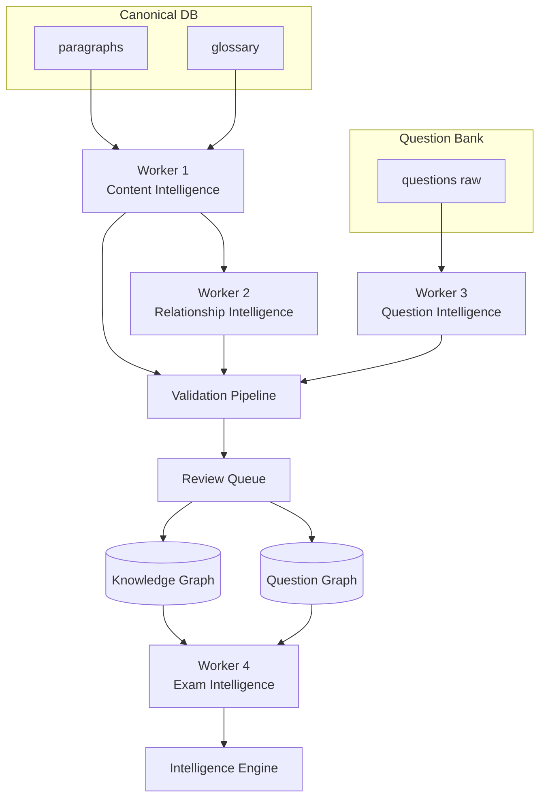

# AI Architecture v1 — Engineering ↔ AI Team Contract

| Field | Value |
|-------|-------|
| **Document** | `AI-00` |
| **Version** | 1.0 |
| **Status** | **Approved for implementation** |
| **Owner** | Principal Architect |
| **Audience** | AI Platform Team |
| **Last updated** | 2026-07-11 |

---

## 1. Purpose

This document is the **binding specification** between Engineering and the AI Team.

- AI Team implements **this architecture** — not ad-hoc prompts.
- Engineering provides **canonical inputs** and consumes **validated outputs**.
- **No AI output enters the student-facing database without validation + human review.**

Prompts are **implementation details** inside workers. They are versioned internally (`prompt_version` in `extraction_runs`) but are **not** the contract.

---

## 2. Business context

SarkariExamsAI is a **Knowledge Intelligence Platform** for government exam preparation (BPSC, UPSC, SSC, State PSC, Banking, Railways).

**Core IP:** Once this offline AI pipeline exists, adding UPSC, SSC, Banking, or new books = **ingest content + question banks** into the same intelligence engine — not rebuild the platform.

---

## 3. Full system diagram

```
================================================================================
                              CONTENT SOURCES
================================================================================
  NCERT │ Reference Books │ Govt Reports │ Class Notes │ Current Affairs
  Question Bank │ PYQs │ Mock Tests
                    (Source material only)
================================================================================
                              │
                              ▼
================================================================================
                    DETERMINISTIC PIPELINE  (NO AI)
================================================================================
  PDF → OCR (if needed) → Layout → Reading Order → Hierarchy
      → Paragraphs → Images → Tables → Validation → Canonical Loader
                              │
                              ▼
                    PostgreSQL — Canonical Store
                    books │ chapters │ sections │ paragraphs
                    figures │ tables │ activities │ glossary
================================================================================
                              │
                    (No AI until this point)
                              │
                              ▼
================================================================================
                         OFFLINE AI PIPELINE
                    (4 Domain Workers — batch only)
================================================================================
  Every paragraph (and question) enters AI pipeline OFFLINE

  Worker 1: Content Intelligence
      → Concepts, Atomic Facts, Entities, Keywords, Learning Objectives

  Worker 2: Relationship Intelligence
      → Relationships, Timeline, Geography, Synonyms, Cross-refs

  Worker 3: Question Intelligence  (SEPARATE INPUT: Question Bank)
      → Concept mapping, Pattern, Difficulty, Bloom, Explanation

  Worker 4: Exam Intelligence
      → Revision priority, PYQ frequency, weightage, recommendations

                              │
                              ▼
                    VALIDATION PIPELINE (4 levels)
                              │
                              ▼
                         REVIEW QUEUE (human)
                              │
                              ▼
              Knowledge Graph + Question Graph
                              │
                              ▼
                    INTELLIGENCE ENGINE (merge)
                              │
                              ▼
                    PostgreSQL — intelligence.*
================================================================================
                              │
                              ▼
================================================================================
                    STUDENT APIs  (SQL ONLY — NO LLM)
================================================================================
  GET /reader │ /concept │ /facts │ /timeline │ /pyqs │ /revision │ /practice
================================================================================
                              │
                              ▼
                         READER UI (PWA)
================================================================================
                              │
                              ▼
================================================================================
                    ONLINE AI TUTOR  (FUTURE ONLY)
================================================================================
  Student question → Retriever → KG + paragraphs + facts + QI → LLM → grounded answer
  (Only place LLM runs in production)
================================================================================
```

---

## 4. Boundary rules (non-negotiable)

| Rule | Description |
|------|-------------|
| **B-01** | Zero LLM calls in deterministic PDF pipeline |
| **B-02** | Zero LLM calls in Student API request path |
| **B-03** | All offline AI output → `staging` first, never direct to `published` |
| **B-04** | Every fact must cite `paragraph_id` or `question_id` |
| **B-05** | Human review required before `status = published` |
| **B-06** | Online tutor retrieves published intelligence only — no inventing syllabus |

---

## 5. Why four workers (not nine agents)

Early design considered nine micro-agents (Concept, Fact, Entity, Relation, Timeline, Geography, Keyword, Learning Objective, Difficulty).

**Decision: Four domain-oriented workers.**

| Problem with 9 agents | Solution with 4 workers |
|----------------------|-------------------------|
| 9× orchestration overhead | 4 clear ownership boundaries |
| 9× monitoring dashboards | 4 SLAs, 4 golden test suites |
| Context fragmentation | Workers share `TopicContext` within domain |
| Duplicate LLM calls | Batched structured extraction per worker |
| Hard to version | `worker_version` + `prompt_version` per worker |

This matches enterprise practice at Google, Microsoft, OpenAI, Anthropic: **capability-oriented workers**, not one agent per field.

### Mapping: 9 conceptual layers → 4 workers

| Original layer | Worker |
|----------------|--------|
| Concept Extraction | **Worker 1** — Content Intelligence |
| Atomic Fact Extraction | **Worker 1** |
| Entity Extraction | **Worker 1** |
| Keyword & Alias | **Worker 1** |
| Learning Objective | **Worker 1** |
| Relationship | **Worker 2** — Relationship Intelligence |
| Timeline | **Worker 2** |
| Geography | **Worker 2** |
| Difficulty (content) | **Worker 1** (initial) + **Worker 4** (aggregated) |
| Question extraction/mapping | **Worker 3** — Question Intelligence |
| Exam trends, revision | **Worker 4** — Exam Intelligence |

---

## 6. Processing unit

### Content pipeline: Paragraph

The atomic input for Workers 1 and 2 is **one paragraph** (`paragraph_id`).

```json
{
  "paragraph_id": "P00421",
  "section_id": "SEC_3_2",
  "chapter_id": "CH_3",
  "book_id": "hist_class10",
  "text": "Lothal was an important port city of the Harappan Civilization.",
  "page": 45
}
```

Workers 1–2 also receive **section-level context** (neighbour paragraphs, glossary) for disambiguation.

### Question pipeline: Question

The atomic input for Worker 3 is **one question** (`question_id` or import row).

---

## 7. Worker overview



| Worker | Input | Output | Spec doc |
|--------|-------|--------|----------|
| **W1** Content Intelligence | Paragraph + context | Concepts, Facts, Entities, Keywords, Learning Objectives | [01](./01-worker-content-intelligence.md) |
| **W2** Relationship Intelligence | W1 outputs + section scope | Relations, Timeline, Geography, Synonyms | [02](./02-worker-relationship-intelligence.md) |
| **W3** Question Intelligence | Question bank rows | Parsed Q, concept map, pattern, Bloom, difficulty | [03](./03-worker-question-intelligence.md) |
| **W4** Exam Intelligence | KG + QG | Revision priority, PYQ freq, weightage, trends | [04](./04-worker-exam-intelligence.md) |

**Execution order:** W1 → W2 (per book batch). W3 runs independently on question bank. W4 runs after KG + QG published.

---

## 8. Validation pipeline (summary)

No AI JSON enters DB directly.

```
AI Worker Output (JSON)
        ↓
Level 1: JSON parse + JSON Schema
        ↓
Level 2: Grounding (paragraph_id, no hallucinated facts)
        ↓
Level 3: Ontology (valid relation types, DAG for prerequisites)
        ↓
Level 4: Duplicate detection + confidence routing
        ↓
Review Queue (human)
        ↓
Approved → Publish Worker → intelligence.* tables
```

Full spec: [06-validation-layer.md](./06-validation-layer.md)

---

## 9. Knowledge Graph composition

After validation and publish, a **concept node** connects:

```
Concept
  ├── Atomic Facts (n)
  ├── Entities (n)
  ├── Relationships (n)
  ├── Timeline entries (n)
  ├── Geography (n)
  ├── Keywords / Aliases (n)
  ├── Learning Objectives (n)
  └── Difficulty metadata
```

Built by Workers 1 + 2. Detail: [07-knowledge-graph-and-question-graph.md](./07-knowledge-graph-and-question-graph.md)

---

## 10. Question Graph composition

Every question knows:

```
Question
  ├── Concepts tested
  ├── Facts tested
  ├── Book / Section / Paragraph (grounding)
  ├── Pattern (assertion, match, chronology…)
  ├── Difficulty
  └── Bloom level
```

Built by Worker 3.

---

## 11. Intelligence Engine

Merges Knowledge Graph × Question Graph:

**Per concept, compute:**

| Signal | Source |
|--------|--------|
| Mentioned in N books | KG cross-book |
| Paragraph count | KG |
| Atomic fact count | KG |
| PYQ count | QG |
| Question patterns | QG |
| Difficulty distribution | QG + KG |
| Common confusions | QG + traps |
| Revision priority | W4 |
| Related concepts | KG edges |
| Learning objectives | KG |

Detail: [08-intelligence-engine.md](./08-intelligence-engine.md)

---

## 12. Student APIs (Engineering owns — AI does not)

Everything served from SQL. **No LLM at request time.**

| Endpoint (target) | Data source |
|-------------------|-------------|
| `GET /api/courses/.../workspace` | canonical + intelligence |
| `GET /api/concepts/{id}` | intelligence.concepts |
| `GET /api/concepts/{id}/facts` | intelligence.atomic_facts |
| `GET /api/concepts/{id}/timeline` | intelligence.timeline |
| `GET /api/concepts/{id}/pyqs` | intelligence via QG |
| `GET /api/revision/today` | W4 output |
| `GET /api/practice/sessions` | questions + QG |

---

## 13. Online AI (future — out of scope v1)

Only production LLM use case:

```
Student asks → Retriever → KG + paragraphs + facts + QI → LLM → grounded answer
```

Spec: [09-online-ai-future.md](./09-online-ai-future.md)

---

## 14. Deliverables checklist (AI team)

| # | Deliverable | Acceptance criteria |
|---|-------------|---------------------|
| 1 | Worker 1 implementation | Processes 1000 paragraphs/hour; golden test pass |
| 2 | Worker 2 implementation | Relations pass DAG check; timeline dates grounded |
| 3 | Worker 3 implementation | 95% concept mapping on audited PYQ sample |
| 4 | Worker 4 implementation | Revision scores for all published concepts |
| 5 | Validation L1–L4 | 100% staging rows pass before review queue |
| 6 | JSON Schemas | One per worker output; CI validated |
| 7 | Staging schema migrations | Alembic `003_intelligence_staging` |
| 8 | Metrics dashboard | token cost, pass rate, hallucination rate |
| 9 | Golden fixtures | 20 paragraphs + 50 questions |
| 10 | Runbook | Re-extract, rollback pack version |

---

## 15. Timeline (suggested)

| Phase | Duration | Scope |
|-------|----------|-------|
| **Phase 1** | 8 weeks | W1 + W2 + validation for `hist_class10` CH_1–3 |
| **Phase 2** | 6 weeks | W3 on BPSC PYQ sample + QG |
| **Phase 3** | 4 weeks | W4 + Intelligence Engine |
| **Phase 4** | 4 weeks | Full book + review UI integration |

---

## 16. Open questions (workshop)

1. Paragraph vs section as W1 batch unit? (Spec: paragraph process, section aggregate)
2. Re-run W2 only when W1 changes, or full pipeline?
3. Current Affairs ingestion — same workers or extension?
4. Hindi content — separate model or multilingual?
5. Auto-approve confidence > 0.98 for facts only?

---

## 17. Related documents

- [AI README](./README.md)
- [Worker 1](./01-worker-content-intelligence.md) · [Worker 2](./02-worker-relationship-intelligence.md) · [Worker 3](./03-worker-question-intelligence.md) · [Worker 4](./04-worker-exam-intelligence.md)
- [Data Models](./05-data-models-and-storage.md) · [Validation](./06-validation-layer.md)
- [Backend canonical pipeline](../backend/02-ingestion-pipeline.md)
