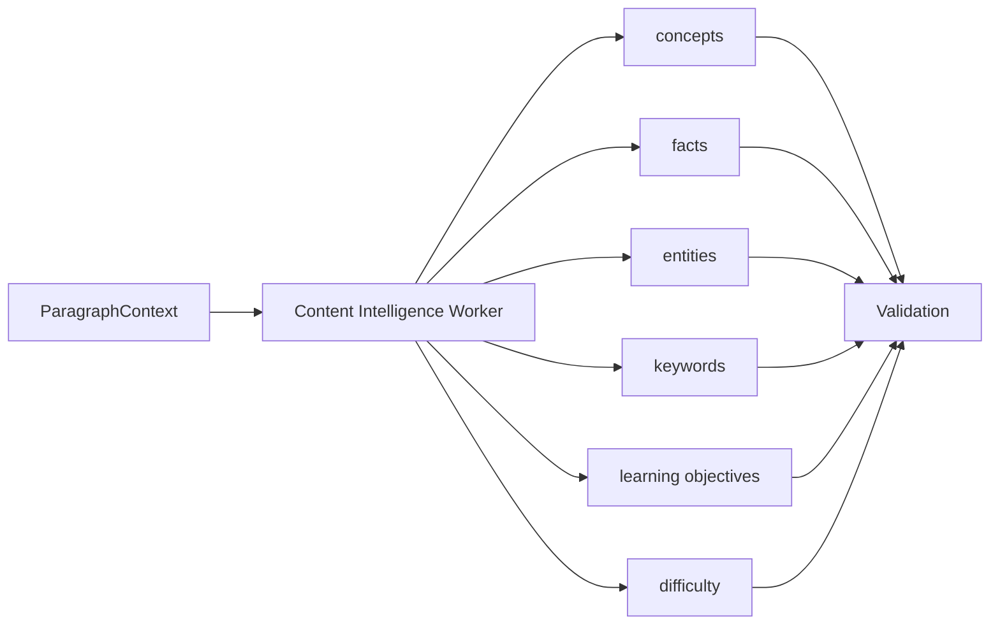

# Worker 1 — Content Intelligence Worker

| Field | Value |
|-------|-------|
| **Document** | `AI-01` |
| **Worker** | Content Intelligence |
| **Replaces** | Layers 1, 2, 3, 7, 8, 9 (conceptual) + partial difficulty |
| **Input** | `ParagraphContext` |
| **Output** | `ContentIntelligenceResult` |

---

## Purpose

Answer: **What is this paragraph about, and what must a student extract from it?**

One worker produces all **content-level** intelligence from canonical text.

---

## Input contract: `ParagraphContext`

```json
{
  "paragraph_id": "P00421",
  "section_id": "SEC_3_2",
  "section_title": "Harappan Cities",
  "book_id": "hist_class10",
  "exam_profile": { "primary": "BPSC", "stages": ["PRE", "MAINS_GS1"] },
  "text": "Lothal was an important port city of the Harappan Civilization. It was located in Gujarat and had a dockyard.",
  "page": 45,
  "glossary": [{ "term": "Harappan", "meaning": "Indus Valley Civilization" }],
  "sibling_paragraphs": ["P00420", "P00422"]
}
```

---

## Output contract: `ContentIntelligenceResult`

### 1. Concepts

**Question answered:** What is this paragraph talking about?

```json
{
  "concepts": [
    {
      "proposed_id": "CONCEPT_hist10_harappan_civ",
      "name": "Harappan Civilization",
      "category": "Civilization",
      "importance": "high",
      "description": "Bronze Age urban culture of the Indus Valley.",
      "source_paragraph_id": "P00421",
      "confidence": 0.95
    },
    {
      "proposed_id": "CONCEPT_hist10_lothal",
      "name": "Lothal",
      "category": "Archaeological Site",
      "importance": "medium",
      "description": "Harappan port city known for dockyard.",
      "source_paragraph_id": "P00421",
      "confidence": 0.92
    }
  ]
}
```

**Stored as:** `intelligence.concepts` (after publish)

| Field | Required | Notes |
|-------|----------|-------|
| `concept_id` | ✅ | Assigned on publish: `CONCEPT_{book}_{slug}` |
| `name` | ✅ | Display label |
| `aliases` | ⬜ | From keywords worker overlap |
| `category` | ✅ | Ontology enum (see below) |
| `description` | ✅ | 1–3 sentences, grounded |
| `importance` | ✅ | `high` / `medium` / `low` |
| `source_paragraph_id` | ✅ | Grounding |

**Category ontology:** `Civilization`, `Person`, `Event`, `Place`, `Institution`, `Process`, `Term`, `Period`, `Other`

---

### 2. Atomic Facts

**Question answered:** What exam-ready facts are in this paragraph?

Break paragraph into **atomic, testable statements**.

```json
{
  "atomic_facts": [
    {
      "statement": "Lothal was located in Gujarat.",
      "concept_ids": ["CONCEPT_hist10_lothal"],
      "source_paragraph_id": "P00421",
      "fact_type": "geographic",
      "confidence": 0.97
    },
    {
      "statement": "Lothal had a dockyard.",
      "concept_ids": ["CONCEPT_hist10_lothal"],
      "source_paragraph_id": "P00421",
      "fact_type": "feature",
      "confidence": 0.96
    },
    {
      "statement": "Lothal was part of the Harappan Civilization.",
      "concept_ids": ["CONCEPT_hist10_lothal", "CONCEPT_hist10_harappan_civ"],
      "source_paragraph_id": "P00421",
      "fact_type": "membership",
      "confidence": 0.98
    }
  ]
}
```

**Stored as:** `intelligence.atomic_facts`

| Field | Required |
|-------|----------|
| `fact_id` | ✅ `FACT_{uuid}` |
| `statement` | ✅ Single claim |
| `concept_ids` | ✅ ≥1 |
| `source_paragraph_id` | ✅ |
| `fact_type` | ✅ enum |
| `confidence` | ✅ |

**Rule:** Each fact must be verifiable as substring or logical decomposition of paragraph text.

---

### 3. Entities

**Question answered:** Who, what places, what organizations appear?

```json
{
  "entities": [
    { "name": "Lothal", "type": "place", "concept_id": "CONCEPT_hist10_lothal" },
    { "name": "Gujarat", "type": "state", "concept_id": null },
    { "name": "Harappan Civilization", "type": "civilization", "concept_id": "CONCEPT_hist10_harappan_civ" }
  ]
}
```

**Entity types:** `person`, `dynasty`, `river`, `place`, `state`, `country`, `organization`, `treaty`, `book`, `event`, `institution`

**Stored as:** `intelligence.entities`

---

### 4. Keywords & Aliases

```json
{
  "keywords": [
    { "term": "dockyard", "concept_id": "CONCEPT_hist10_lothal" },
    { "term": "port city", "concept_id": "CONCEPT_hist10_lothal" }
  ],
  "aliases": [
    {
      "canonical": "Harappan Civilization",
      "aliases": ["Indus Valley Civilization", "IVC", "Harappan Culture"]
    }
  ]
}
```

**Stored as:** `intelligence.keywords`, `intelligence.aliases`

**UI use:** Smart highlights, search, PYQ matching.

---

### 5. Learning Objectives

**Question answered:** After reading this paragraph, what should the student know?

```json
{
  "learning_objectives": [
    {
      "objective": "Identify Lothal as a Harappan port city with a dockyard.",
      "concept_ids": ["CONCEPT_hist10_lothal"],
      "bloom_level": "remember",
      "source_paragraph_id": "P00421"
    },
    {
      "objective": "Locate Lothal in Gujarat.",
      "concept_ids": ["CONCEPT_hist10_lothal"],
      "bloom_level": "remember",
      "source_paragraph_id": "P00421"
    }
  ]
}
```

**Stored as:** `intelligence.learning_objectives`

---

### 6. Content difficulty (initial estimate)

```json
{
  "paragraph_difficulty": {
    "level": "easy",
    "concept_complexity": 2,
    "memory_load": 2,
    "suggested_revision_days": 7
  }
}
```

**Note:** Final revision priority computed by **Worker 4** using PYQ data.

---

## Processing flow



**Implementation:** Single structured LLM call (temperature=0) with multi-section JSON schema, OR deterministic post-processors for facts (sentence split + NER).

---

## Validation rules (Worker 1 specific)

| ID | Rule |
|----|------|
| `W1-V01` | ≥1 concept per non-empty paragraph |
| `W1-V02` | Every fact cites same `paragraph_id` as input |
| `W1-V03` | No proper noun in fact absent from paragraph |
| `W1-V04` | Max 10 concepts per paragraph |
| `W1-V05` | Max 20 atomic facts per paragraph |
| `W1-V06` | Learning objectives use Bloom enum |

---

## Golden test example

**Input paragraph:**
> Lothal was an important port city of the Harappan Civilization.

**Expected:**
- 2 concepts (Lothal, Harappan Civilization)
- ≥2 atomic facts
- ≥1 entity (Lothal, place)
- Alias: Harappan = Indus Valley Civilization (if in glossary or paragraph)

---

## Next worker

Output feeds **Worker 2 — Relationship Intelligence** for cross-concept edges, timeline, geography.

→ [02-worker-relationship-intelligence.md](./02-worker-relationship-intelligence.md)
