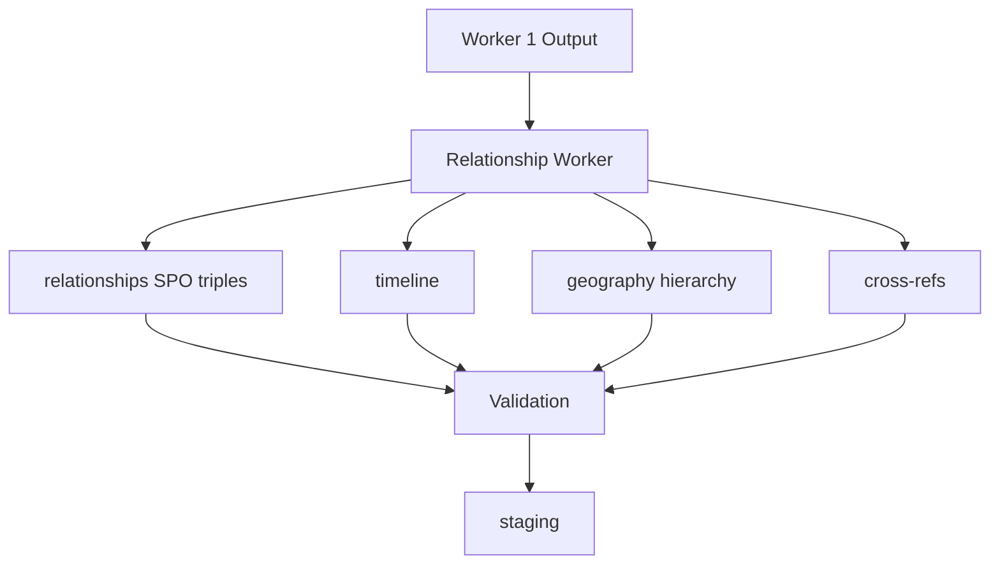

# Worker 2 — Relationship Intelligence Worker

| Field | Value |
|-------|-------|
| **Document** | `AI-02` |
| **Worker** | Relationship Intelligence |
| **Input** | Worker 1 outputs + section/book scope |
| **Output** | `RelationshipIntelligenceResult` |

---

## Purpose

Build the **Knowledge Graph edges** — how concepts, entities, places, and time connect.

Replaces conceptual layers: Relationship Agent, Timeline Agent, Geography Agent (partial), cross-references.

---

## Input contract

```json
{
  "book_id": "hist_class10",
  "section_id": "SEC_3_2",
  "concepts": [ "..." ],
  "atomic_facts": [ "..." ],
  "entities": [ "..." ],
  "paragraphs": [ "..." ],
  "neighbour_sections": ["SEC_3_1", "SEC_3_3"]
}
```

Worker 2 runs **after Worker 1** completes for a section (or full book batch).

---

## Output contract

### 1. Relationships (Subject — Predicate — Object)

```json
{
  "relationships": [
    {
      "subject_id": "CONCEPT_hist10_lothal",
      "subject_type": "concept",
      "predicate": "belongs_to",
      "object_id": "CONCEPT_hist10_harappan_civ",
      "object_type": "concept",
      "evidence": "Lothal was an important port city of the Harappan Civilization.",
      "source_paragraph_id": "P00421",
      "confidence": 0.94
    },
    {
      "subject_id": "ENT_gujarat",
      "subject_type": "entity",
      "predicate": "located_in",
      "object_id": "ENT_india",
      "object_type": "entity",
      "evidence": "It was located in Gujarat.",
      "source_paragraph_id": "P00421",
      "confidence": 0.91
    }
  ]
}
```

**Predicate ontology:**

| Predicate | Example |
|-----------|---------|
| `belongs_to` | Lothal → Harappan Civilization |
| `ruled` | Ashoka → Mauryan Empire |
| `capital_of` | Pataliputra → Mauryan Empire |
| `located_in` | Lothal → Gujarat |
| `caused` | Rowlatt Act → Satyagraha |
| `led_to` | Event chain |
| `part_of` | Sub-concept |
| `contrasts_with` | Movement comparison |
| `precedes` | Chronological order |
| `related_to` | Thematic link |

**Stored as:** `intelligence.relationships`

---

### 2. Timeline

```json
{
  "timeline_entries": [
    {
      "concept_id": "CONCEPT_hist10_harappan_civ",
      "start_date": "-2600",
      "end_date": "-1900",
      "era": "BCE",
      "period_label": "Mature Harappan period",
      "precision": "century",
      "source_paragraph_id": "P00418",
      "confidence": 0.88
    }
  ]
}
```

**Stored as:** `intelligence.timeline`

| Field | Required |
|-------|----------|
| `start_date` / `end_date` | At least one |
| `precision` | `year` / `century` / `period` / `era` |
| `source_paragraph_id` | ✅ |

**Rule:** Dates must appear in cited paragraph or be widely accepted with `confidence < 0.85` → mandatory review.

---

### 3. Geography

```json
{
  "geography": [
    {
      "entity_id": "ENT_lothal",
      "name": "Lothal",
      "type": "archaeological_site",
      "state": "Gujarat",
      "country": "India",
      "parent_chain": ["Gujarat", "India"],
      "source_paragraph_id": "P00421"
    }
  ]
}
```

**Hierarchy example:**
```
Lothal → Gujarat → India
```

**Stored as:** `intelligence.geography`

---

### 4. Synonyms & cross-references

```json
{
  "synonyms": [
    {
      "term_a": "Harappan Civilization",
      "term_b": "Indus Valley Civilization",
      "relation": "same_as",
      "source": "glossary"
    }
  ],
  "cross_references": [
    {
      "from_section_id": "SEC_3_2",
      "to_section_id": "SEC_4_1",
      "reason": "Urban planning对比 later Vedic period",
      "relation_type": "related_to",
      "confidence": 0.75
    }
  ]
}
```

**Stored as:** `intelligence.synonyms`, `intelligence.topic_relations`

---

## Processing flow



---

## Validation rules (Worker 2 specific)

| ID | Rule |
|----|------|
| `W2-V01` | `precedes` / `prerequisite` edges form DAG (no cycles) |
| `W2-V02` | Every relationship has `evidence` ≥ 20 chars |
| `W2-V03` | `subject_id` and `object_id` exist in W1 output or entities |
| `W2-V04` | Timeline dates grounded to paragraph when precision=year |
| `W2-V05` | Max 5 `related_to` cross-refs per section |
| `W2-V06` | No self-referential edges |

---

## Graph visualization (target state)

```
        [Harappan Civilization]
               ↑ belongs_to
            [Lothal] ──located_in──→ [Gujarat] ──→ [India]
               │
          has_feature
               ↓
           [Dockyard]

Timeline: 2600 BCE ────────── 1900 BCE
```

---

## Next

Relationships populate **Knowledge Graph** → feeds **Worker 4**.

→ [07-knowledge-graph-and-question-graph.md](./07-knowledge-graph-and-question-graph.md)
