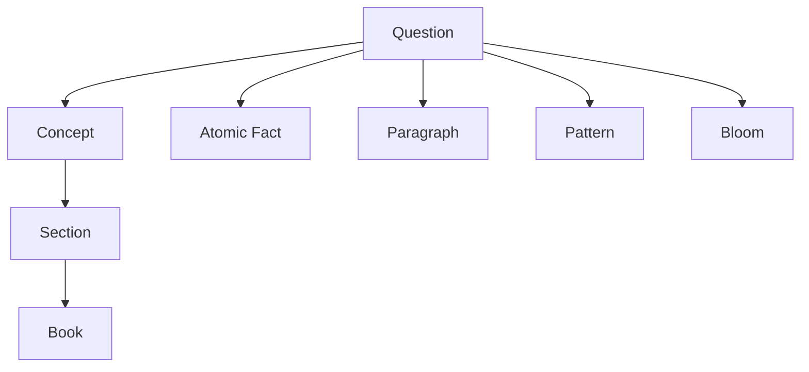

# Worker 3 — Question Intelligence Worker

| Field | Value |
|-------|-------|
| **Document** | `AI-03` |
| **Worker** | Question Intelligence |
| **Pipeline** | **Separate from content pipeline** |
| **Input** | Raw questions (PYQ bank, mock tests, generated drafts) |
| **Output** | `QuestionIntelligenceResult` |

---

## Purpose

Transform raw exam questions into structured **Question Graph** nodes linked to concepts, facts, books, and paragraphs.

**This pipeline is independent** — it runs on Question Bank input, not paragraphs.

---

## Pipeline diagram

```
Question Bank (CSV / DB / PDF)
        ↓
Question Parser (deterministic + AI assist)
        ↓
Question Intelligence Worker
   ├── Extraction (stem, options, answer)
   ├── Concept Mapping
   ├── Pattern Classification
   ├── Difficulty Estimation
   ├── Bloom Taxonomy
   └── Explanation generation (draft)
        ↓
Question Validation
        ↓
Review Queue
        ↓
Question Graph (published)
```

---

## Input contract: `RawQuestion`

```json
{
  "import_id": "IMP_bpsc_2022_42",
  "exam": "BPSC",
  "year": 2022,
  "stage": "PRE",
  "raw_text": "Lothal is famous for?\n(A) Steel production\n(B) Dockyard\n(C) Temple architecture\n(D) Coin minting",
  "correct_answer_hint": "B",
  "source_ref": "BPSC Prelims 2022 Q42"
}
```

---

## Output contract

### 1. Parsed question

```json
{
  "question_id": "Q_bpsc_hist_lothal_042",
  "stem": "Lothal is famous for?",
  "options": [
    { "id": "A", "text": "Steel production" },
    { "id": "B", "text": "Dockyard" },
    { "id": "C", "text": "Temple architecture" },
    { "id": "D", "text": "Coin minting" }
  ],
  "correct_option_id": "B",
  "explanation": "Lothal was a Harappan port city known for its dockyard structure.",
  "question_type": "pyq"
}
```

---

### 2. Concept mapping

**Purpose:** Link question → concepts in Knowledge Graph.

```json
{
  "concept_mappings": [
    {
      "question_id": "Q_bpsc_hist_lothal_042",
      "concept_id": "CONCEPT_hist10_lothal",
      "mapping_confidence": 0.96,
      "mapping_reason": "Question directly tests Lothal feature"
    }
  ]
}
```

**Also links to:**
- `atomic_fact_ids` (which facts this question tests)
- `section_ids` / `book_ids` (syllabus scope)
- `paragraph_ids` (grounding, when explanation cites text)

---

### 3. Pattern classification

**Purpose:** How does the exam ask this?

```json
{
  "pattern": {
    "type": "direct_fact",
    "sub_type": "feature_identification",
    "confidence": 0.93,
    "reason": "Single direct question on a known feature of a site"
  }
}
```

**Pattern taxonomy:**

| Type | Description |
|------|-------------|
| `direct_fact` | Straight recall |
| `statement` | Assertion true/false style |
| `match_the_following` | Column matching |
| `chronology` | Order events |
| `map` | Location-based |
| `analytical` | Multi-concept reasoning |
| `current_affairs_link` | Links static + recent |

---

### 4. Difficulty

```json
{
  "difficulty": {
    "level": "easy",
    "score": 2,
    "factors": ["single fact", "well-known site", "direct stem"]
  }
}
```

| Level | Score | Typical signal |
|-------|-------|----------------|
| Easy | 1–2 | Direct fact from one paragraph |
| Medium | 3 | Requires connecting 2 concepts |
| Hard | 4–5 | Obscure fact or multi-step reasoning |

---

### 5. Bloom taxonomy

```json
{
  "bloom": {
    "level": "remember",
    "confidence": 0.95
  }
}
```

**Levels:** `remember` → `understand` → `apply` → `analyze` → `evaluate`

---

### 6. Common confusions (for traps)

```json
{
  "confusions": [
    {
      "wrong_option_id": "C",
      "confusion_reason": "Students confuse Harappan sites with later temple architecture",
      "related_trap_id": "TRAP_harappan_temple"
    }
  ]
}
```

---

## Question Graph (published state)

Every question knows:

```
Question
  ↓ tests
Concept(s)
  ↓ grounded_in
Atomic Fact(s)
  ↓ from
Book → Section → Paragraph
  ↓ pattern
PYQ Pattern type
  ↓ bloom
Cognitive level
```



---

## Validation rules (Worker 3 specific)

| ID | Rule |
|----|------|
| `W3-V01` | Exactly 4 options, 1 correct (Prelims format) |
| `W3-V02` | `explanation` required, ≥ 50 chars |
| `W3-V03` | `concept_id` must exist in published KG (or staged batch) |
| `W3-V04` | Pattern type ∈ ontology |
| `W3-V05` | No duplicate stem (similarity < 0.92) |
| `W3-V06` | PYQ must have `exam` + `year` |

---

## Sub-agents (internal to Worker 3)

Worker 3 may implement internally as modules — **not separate deployable agents:**

| Module | Responsibility |
|--------|----------------|
| Question Parser | OCR cleanup, option split |
| Concept Mapper | Embed + match to KG concepts |
| Pattern Classifier | Exam pattern taxonomy |
| Difficulty Estimator | Heuristic + PYQ stats |
| Bloom Tagger | Cognitive level |
| Explanation Drafter | Grounded explanation from facts |

---

## Next

Question Graph merges with Knowledge Graph in **Intelligence Engine** and **Worker 4**.

→ [04-worker-exam-intelligence.md](./04-worker-exam-intelligence.md) · [08-intelligence-engine.md](./08-intelligence-engine.md)
