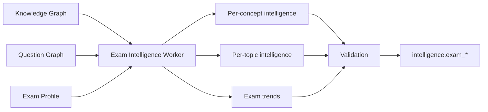

# Worker 4 — Exam Intelligence Worker

| Field | Value |
|-------|-------|
| **Document** | `AI-04` |
| **Worker** | Exam Intelligence |
| **Input** | Published Knowledge Graph + Question Graph + exam profile |
| **Output** | `ExamIntelligenceResult` |

---

## Purpose

Compute **exam-facing signals** that power revision, recommendations, and the Topic Learning Workspace intelligence rail.

This worker is **mostly deterministic analytics** over graphs — LLM optional for narrative summaries only.

---

## Input contract

```json
{
  "exam_profile": {
    "code": "BPSC",
    "stages": ["PRE", "MAINS_GS1"],
    "year_range": [2018, 2025]
  },
  "book_id": "hist_class10",
  "knowledge_graph_snapshot": "pack_version_3",
  "question_graph_snapshot": "pack_version_3"
}
```

---

## Output contract

### Per concept: `ConceptExamIntelligence`

```json
{
  "concept_id": "CONCEPT_hist10_lothal",
  "exam_code": "BPSC",
  "mentioned_in_books": 1,
  "paragraph_count": 3,
  "atomic_fact_count": 8,
  "pyq_count": 7,
  "pyq_years": [2019, 2020, 2022, 2023],
  "question_patterns": ["direct_fact", "match_the_following"],
  "difficulty_distribution": { "easy": 5, "medium": 2, "hard": 0 },
  "common_confusions": ["Confused with Dholavira features"],
  "revision_priority": 0.87,
  "importance_score": 0.82,
  "expected_question_types": ["direct_fact", "map"],
  "topic_weightage_percent": 2.4,
  "related_concepts": ["CONCEPT_hist10_harappan_civ", "CONCEPT_hist10_dholavira"],
  "learning_objectives": ["..."],
  "recommended_revision_days": 5
}
```

---

### Per section (topic): `TopicExamIntelligence`

Powers the **Reader UI intelligence rail**:

```json
{
  "section_id": "SEC_3_2",
  "exam_code": "BPSC",
  "why_it_matters": "Harappan sites are frequent BPSC Prelims MCQs; Lothal dockyard is a recurring trap.",
  "key_points": ["Lothal = Gujarat", "Dockyard feature", "Harappan port"],
  "exam_focus": ["Site-feature matching", "Map-based questions"],
  "pyq_patterns": [
    {
      "question": "Lothal is famous for?",
      "exam": "BPSC Pre",
      "type": "direct_fact",
      "tip": "Link site → unique feature"
    }
  ],
  "remember": [
    { "label": "Lothal", "hook": "L for Dockyard in Gujarat" }
  ],
  "avoid": [
    "Do not confuse Harappan dockyard with later port cities"
  ],
  "revision_priority": 0.85
}
```

**Maps to frontend type:** `ExamIntelligence` in `coursesTypes.ts`

---

### Aggregate: exam trends

```json
{
  "exam_code": "BPSC",
  "subject": "History",
  "trends": [
    {
      "concept_cluster": "Harappan Civilization",
      "pyq_frequency_trend": "stable_high",
      "last_asked_year": 2023,
      "predicted_relevance": 0.8
    }
  ],
  "top_revision_concepts_today": ["CONCEPT_hist10_lothal", "CONCEPT_hist10_rowlatt"]
}
```

---

## Computation logic (deterministic core)

| Signal | Formula (conceptual) |
|--------|---------------------|
| `pyq_count` | COUNT questions WHERE tests concept |
| `revision_priority` | weighted(pyq_freq, difficulty, days_since_read, importance) |
| `importance_score` | normalized(pyq_count, cross_book_mentions, centrality in graph) |
| `topic_weightage` | pyq_count_section / total_pyq_subject |
| `common_confusions` | aggregate from W3 `confusions` + trap table |

**LLM use (optional):** Generate `why_it_matters` narrative from structured signals — must be reviewed.

---

## Processing flow



---

## Student API surfaces (no LLM)

| API | Worker 4 output |
|-----|-----------------|
| `GET /api/revision/today` | `top_revision_concepts_today` |
| `GET /api/courses/.../workspace` | `TopicExamIntelligence` |
| `GET /api/analytics/weakness` | concept scores vs PYQ |
| `GET /api/concepts/{id}/pyqs` | pyq_count, patterns |

---

## Validation rules

| ID | Rule |
|----|------|
| `W4-V01` | `revision_priority` ∈ [0, 1] |
| `W4-V02` | `pyq_count` matches QG query (reconcilable) |
| `W4-V03` | `section_id` exists in canonical |
| `W4-V04` | Narrative fields reviewed if LLM-generated |

---

## Schedule

| Trigger | Action |
|---------|--------|
| After KG + QG publish | Full recompute for book |
| Nightly | Refresh revision priorities for active users (future) |
| New PYQ import | Incremental QG + W4 partial recompute |

---

## Next

→ [08-intelligence-engine.md](./08-intelligence-engine.md) — merge logic detail
