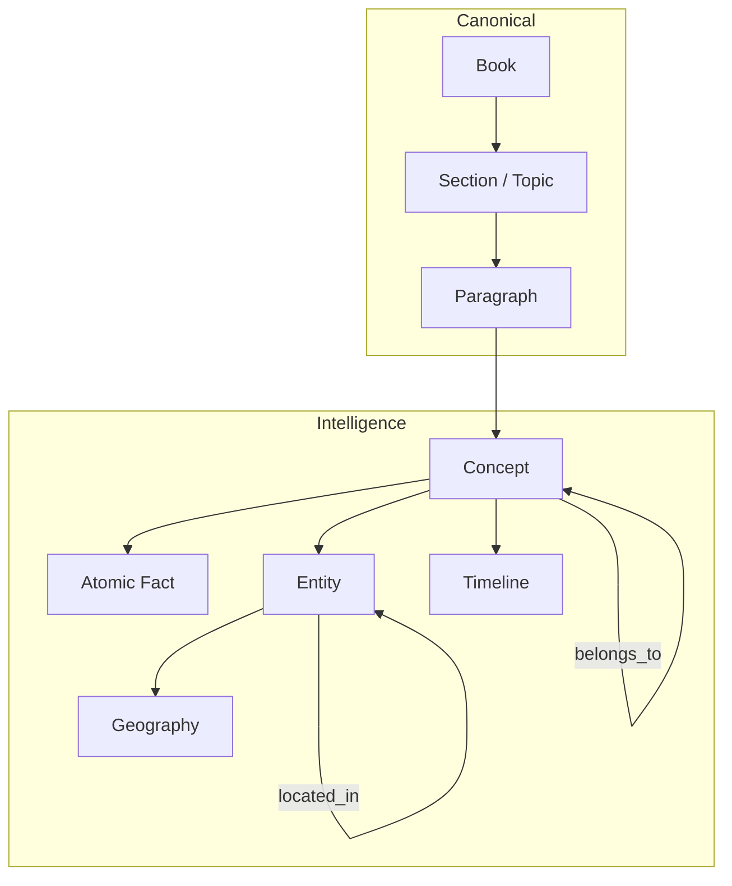
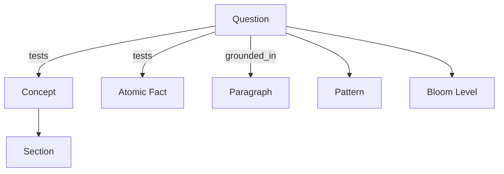

# Knowledge Graph & Question Graph

| Document | `AI-07` |
|----------|---------|

---

## Two graphs

| Graph | Built by | Nodes | Edges |
|-------|----------|-------|-------|
| **Knowledge Graph** | W1 + W2 | Concepts, Entities, Facts, Paragraphs, Sections | belongs_to, located_in, caused, precedes… |
| **Question Graph** | W3 | Questions | tests, maps_to, pattern, bloom |

They merge in the **Intelligence Engine** (Worker 4).

---

## Knowledge Graph diagram



---

## Question Graph diagram



---

## Cross-graph join (the power)

```sql
-- Concept: how often BPSC asks this
SELECT c.concept_id, c.name, COUNT(q.question_id) AS pyq_count
FROM intelligence.concepts c
JOIN intelligence.question_concept_links qcl ON qcl.concept_id = c.concept_id
JOIN intelligence.questions q ON q.question_id = qcl.question_id
WHERE q.exam_code = 'BPSC' AND q.status = 'published'
GROUP BY c.concept_id, c.name;
```

---

## Complete concept node (target)

```
Concept: Lothal
├── 8 Atomic Facts
├── 3 Entities (Lothal, Gujarat, India)
├── 5 Relationships
├── 1 Timeline entry
├── 1 Geography chain
├── 4 Keywords
├── 2 Learning Objectives
├── 7 PYQs (from Question Graph)
├── Patterns: direct_fact, map
├── Difficulty: mostly easy
├── Revision priority: 0.87
└── Related: Harappan Civilization, Dholavira
```

This is what makes SarkariExamsAI **exam intelligence**, not a PDF reader.
