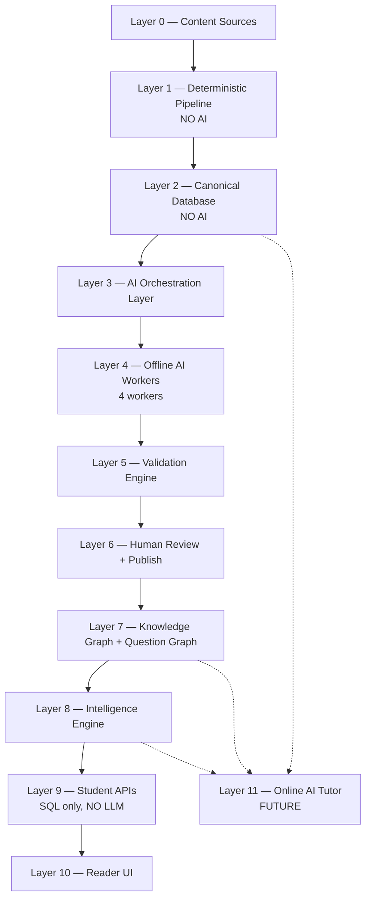
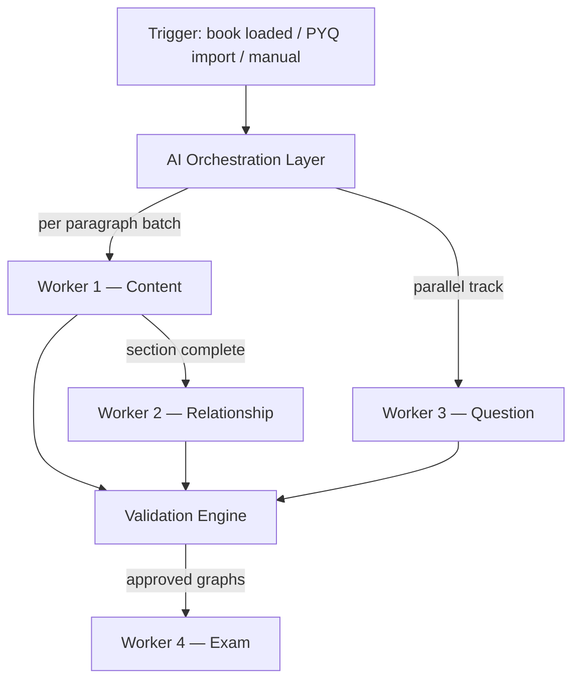
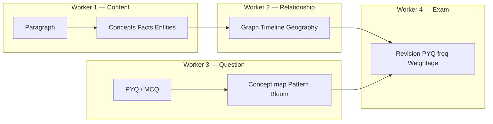
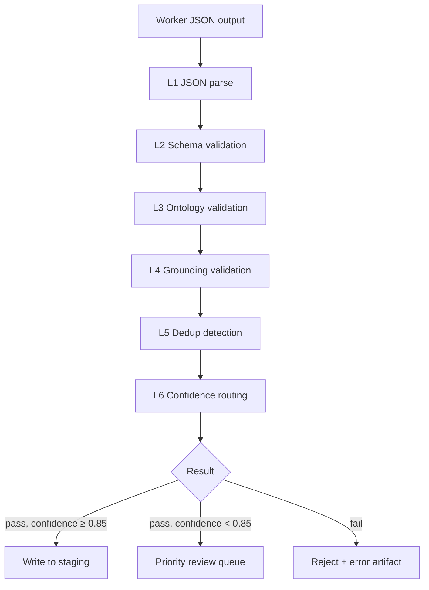

# SarkariExamsAI — AI Platform Guide

| Field | Value |
|-------|-------|
| **Document** | Single source of truth for AI architecture |
| **Audience** | AI Team, Engineering, Product |
| **Version** | 1.2 |
| **Status** | Approved for implementation |
| **Last updated** | 2026-07-11 |
| **Exam target** | **BPSC Prelims + BPSC Mains (GS-I)** — dual-stage |

> **This replaces** all split files in `docs/ai/01–09` and wiki AI docs `06`, `09`, `10`.  
> AI Team receives this **Architecture Specification** — not ad-hoc prompts.

---

## Part 1 — High-level platform layers

SarkariExamsAI is a **Knowledge Intelligence Platform**, not a chatbot. Content flows through **eleven layers**. **Layer 3–5** are the AI platform core (orchestration, workers, validation). **Layer 11** is the only future **online** LLM use.



### Layer summary table

| Layer | Name | Uses AI? | Owner | One-line purpose |
|-------|------|----------|-------|------------------|
| **0** | Content Sources | No | Content Ops | Raw material: NCERT, PYQs, notes |
| **1** | Deterministic Pipeline | **No** | Backend / Content Platform | PDF → structured text (reproducible) |
| **2** | Canonical Database | **No** | Data Platform | System of record: paragraphs, hierarchy |
| **3** | **AI Orchestration Layer** | No LLM | **AI Team** | Schedule, route, and coordinate all offline AI jobs |
| **4** | Offline AI Workers | **Yes (batch)** | **AI Team** | Extract concepts, facts, relations, questions |
| **5** | **Validation Engine** | No LLM | **AI Team** | Automated schema, ontology, grounding, dedup checks |
| **6** | Human Review + Publish | No | AI Team + Content Ops | Approve staging → publish to `intelligence.*` |
| **7** | Knowledge + Question Graph | No | Data Platform | Connected intelligence nodes |
| **8** | Intelligence Engine | Mostly deterministic | AI Team + Backend | Merge graphs → exam signals |
| **9** | Student APIs | **No LLM** | Backend | Serve SQL to PWA |
| **10** | Reader UI | No | Frontend | Topic Workspace, practice |
| **11** | Online AI Tutor | **Yes (real-time)** | AI Team (future) | Grounded Q&A only |

### BPSC dual-stage target (Prelims + Mains)

SarkariExamsAI is **BPSC-first**. Every worker receives an `exam_profile` with **both** stages in scope. Intelligence is produced **per stage** — Prelims MCQ patterns and Mains analytical prompts are never merged into one blob.

| Stage | Code | Question style | What W4 must produce |
|-------|------|----------------|------------------------|
| **BPSC Prelims** | `PRE` | MCQ (4 options, negative marking) | `prelims_intelligence`: PYQ MCQs, MCQ formats, traps, fact recall |
| **BPSC Mains GS-I** | `MAINS_GS1` | Descriptive (History, Geography) | `mains_intelligence`: analytical PYQs, answer frameworks, NCERT citations |

**Canonical `exam_profile` (all workers):**
```json
{
  "primary": "BPSC",
  "stages": ["PRE", "MAINS_GS1"],
  "bpsc_cycle": 68,
  "negative_marking_prelims": true,
  "mains_papers": ["GS1"],
  "language": ["en", "hi"]
}
```

**Rule:** `stage` is **required** on every PYQ, expected pattern, and stage-specific exam focus item.

---

## Part 2 — Every layer: purpose, input, output

### Layer 0 — Content Sources

| | |
|---|---|
| **Purpose** | Provide trustworthy source material. AI never invents content here. |
| **Input** | NCERT PDFs, reference books, PYQ papers, mock tests, class notes, current affairs |
| **Output** | Files ready for ingestion (PDF, CSV, DOC) |
| **AI role** | None |

---

### Layer 1 — Deterministic Pipeline

| | |
|---|---|
| **Purpose** | Convert PDFs to structured canonical JSON **without LLM** — same input always gives same output. |
| **Input** | PDF file, `book_id` |
| **Output** | `step10_canonical.json` → loaded to PostgreSQL |
| **AI role** | **None. Forbidden.** |

```
PDF → OCR → Layout → Reading Order → Hierarchy → Paragraphs
    → Images → Tables → Validation → Canonical JSON
```

**Why no AI:** Exam content must be factually exact. LLM PDF parsing hallucinates dates and names.

---

### Layer 2 — Canonical Database

| | |
|---|---|
| **Purpose** | Store **truth** — what the book actually says. All AI outputs must ground here. |
| **Input** | `step10_canonical.json` via load API |
| **Output** | PostgreSQL tables: `books`, `chapters`, `sections`, `paragraphs`, `figures`, `glossary_entries` |
| **AI role** | **None. AI reads from here; never writes canonical text.** |

**Key IDs:** `section_id` = topic (e.g. `SEC_2_1`), `paragraph_id` = e.g. `P00312`

---

### Layer 3 — AI Orchestration Layer ⭐ AI TEAM

| | |
|---|---|
| **Purpose** | **Coordinate all offline AI work** — when to run which worker, in what order, with what context, and how to recover from failure. Workers do not call each other directly; orchestration owns the DAG. |
| **Input** | Canonical load event (`book_id`, `version_id`), optional PYQ import event, manual re-run command |
| **Output** | Job execution plan, `extraction_run` records, worker invocations, aggregated run status |
| **AI role** | **No LLM.** Pure orchestration code (queue, DAG, retries, lineage). |



**Orchestration responsibilities:**

| Responsibility | Description |
|----------------|-------------|
| **Job DAG** | Enforce order: W1 → W2 per section; W3 parallel on question bank; W4 after KG+QG published |
| **Context assembly** | Build `ParagraphContext` / `TopicContext` from canonical DB before each worker call |
| **Batching** | Group paragraphs by `section_id`; token budget per batch |
| **Idempotency** | Re-run safe: same `extraction_run_id` + inputs → replace staging rows |
| **Retry policy** | Transient LLM/API failures: 3 retries with backoff; permanent failures → error artifact |
| **Lineage** | Log `book_id`, `pipeline_version`, `model_version`, `prompt_version` per run |
| **Concurrency** | Max N parallel sections; rate-limit LLM provider |
| **Trigger W4** | Only when validation pass rate ≥ threshold for book batch |

**Input example (orchestration job):**
```json
{
  "job_id": "JOB_hist_class10_v3",
  "trigger": "canonical_load_complete",
  "book_id": "hist_class10",
  "book_version_id": "6ba7b810-9dad-11d1-80b4-00c04fd430c8",
  "exam_profile": { "primary": "BPSC", "stages": ["PRE", "MAINS_GS1"] },
  "workers": ["W1", "W2", "W3", "W4"],
  "options": { "dry_run": false, "sections_filter": ["SEC_3_1", "SEC_3_2"] }
}
```

**Output example (orchestration status):**
```json
{
  "job_id": "JOB_hist_class10_v3",
  "status": "running",
  "extraction_run_id": "c9bf9e57-1685-4c89-bafb-ff5af1b7e21c",
  "progress": {
    "paragraphs_total": 842,
    "paragraphs_w1_done": 412,
    "sections_w2_done": 18,
    "questions_w3_done": 156,
    "validation_pass_rate": 0.94
  },
  "worker_status": {
    "W1": "in_progress",
    "W2": "pending",
    "W3": "completed",
    "W4": "pending"
  }
}
```

**Implementation:** `backend/jobs/orchestrator.py` + queue (Celery / ARQ / cloud batch — TBD).

---

### Layer 4 — Offline AI Workers ⭐ AI TEAM CORE

| | |
|---|---|
| **Purpose** | Transform canonical text + questions into **structured exam intelligence** (concepts, facts, graph, MCQ links). |
| **Runs** | Batch only, after canonical load. Temperature = 0. |
| **AI role** | **Full ownership — 4 domain workers** |



#### Worker 1 — Content Intelligence

| | |
|---|---|
| **Purpose** | Answer: *What is this paragraph about? What facts must a student know?* |
| **Input** | `ParagraphContext` (see below) |
| **Output** | Concepts, atomic facts, entities, keywords/aliases, learning objectives, paragraph difficulty |

**Input example:**
```json
{
  "paragraph_id": "P00421",
  "section_id": "SEC_3_2",
  "section_title": "Harappan Cities",
  "chapter_id": "CH_3",
  "chapter_title": "The Harappan Civilization",
  "subject": "History",
  "book_id": "hist_class10",
  "page": 45,
  "text": "Lothal was an important port city of the Harappan Civilization.",
  "figures": [{ "figure_id": "FIG_003", "caption": "Map of Harappan sites" }],
  "glossary": [{ "term": "Harappan", "meaning": "Indus Valley Civilization" }],
  "exam_profile": {
    "primary": "BPSC",
    "stages": ["PRE", "MAINS_GS1"],
    "negative_marking_prelims": true
  }
}
```

**Output example:**
```json
{
  "concepts": [
    { "name": "Harappan Civilization", "category": "Civilization", "importance": "high",
      "prelims_relevance": "high", "mains_relevance": "high",
      "source_paragraph_id": "P00421" },
    { "name": "Lothal", "category": "Archaeological Site", "importance": "medium",
      "prelims_relevance": "high", "mains_relevance": "medium",
      "source_paragraph_id": "P00421" }
  ],
  "atomic_facts": [
    { "statement": "Lothal was a port city of the Harappan Civilization.",
      "fact_type": "place",
      "prelims_relevance": "high",
      "mains_relevance": "medium",
      "source_paragraph_id": "P00421" }
  ],
  "dates": [],
  "entities": [{ "name": "Lothal", "type": "place" }],
  "keywords": [{ "term": "port city" }],
  "learning_objectives": [
    { "objective": "Identify Lothal as a Harappan port city", "bloom_level": "remember",
      "stage": "PRE" },
    { "objective": "Explain Harappan urban planning and trade using Lothal as example",
      "bloom_level": "analyze", "stage": "MAINS_GS1" }
  ],
  "bihar_relevance": {
    "applicable": false,
    "note": "Topic is pan-India; no direct Bihar site. For Bihar history topics, flag Patliputra/Magadha links."
  }
}
```

---

#### Worker 2 — Relationship Intelligence

| | |
|---|---|
| **Purpose** | Answer: *How do concepts connect? When? Where?* Build Knowledge Graph edges. |
| **Input** | Worker 1 output for a section + neighbour section metadata |
| **Output** | Relationships (SPO triples), timeline entries, geography hierarchy, synonyms, cross-topic links |

**Output example:**
```json
{
  "relationships": [
    {
      "subject": "Lothal", "predicate": "belongs_to", "object": "Harappan Civilization",
      "evidence": "Lothal was an important port city of the Harappan Civilization.",
      "source_paragraph_id": "P00421"
    }
  ],
  "timeline": [
    { "concept": "Harappan Civilization", "start": "-2600", "end": "-1900", "precision": "century" }
  ],
  "geography": [
    { "place": "Lothal", "state": "Gujarat", "country": "India", "chain": ["Gujarat", "India"] }
  ]
}
```

---

#### Worker 3 — Question Intelligence

| | |
|---|---|
| **Purpose** | Parse **BPSC Prelims MCQs** and **BPSC Mains descriptive questions**; link each to concepts and exam patterns. **Separate pipeline from paragraphs.** |
| **Input** | Raw question from question bank (CSV, PDF extract, manual entry) |
| **Output** | Parsed question (MCQ or descriptive), concept mappings, pattern type, difficulty, Bloom level, explanation draft, confusions |

**Prelims input example:**
```json
{
  "raw_text": "Consider the following statements about Lothal:\n1. It had a dockyard.\n2. It is in Rajasthan.\nWhich is/are correct?\n(A) 1 only (B) 2 only (C) Both (D) Neither",
  "exam": "BPSC",
  "bpsc_cycle": 68,
  "stage": "PRE",
  "paper": "General Studies",
  "question_number": 42,
  "year": 2022,
  "correct_hint": "A",
  "negative_marking": true,
  "language": "en",
  "source": "official"
}
```

**Mains input example:**
```json
{
  "raw_text": "Discuss the significance of Harappan urban planning with special reference to trade and craft production. (250 words, 15 marks)",
  "exam": "BPSC",
  "bpsc_cycle": 67,
  "stage": "MAINS_GS1",
  "paper": "General Studies Paper 1",
  "question_number": 3,
  "year": 2021,
  "marks": 15,
  "word_limit": 250,
  "language": "en",
  "source": "official"
}
```

**Prelims output example:**
```json
{
  "question_id": "Q_bpsc_hist_lothal_042",
  "stage": "PRE",
  "question_format": "statements",
  "stem": "Consider the following statements about Lothal…",
  "statements": [
    { "id": "1", "text": "It had a dockyard.", "is_correct": true },
    { "id": "2", "text": "It is in Rajasthan.", "is_correct": false }
  ],
  "options": [
    { "id": "A", "text": "1 only" },
    { "id": "B", "text": "2 only" },
    { "id": "C", "text": "Both" },
    { "id": "D", "text": "Neither" }
  ],
  "correct_option_id": "A",
  "negative_marking": true,
  "explanation": "Lothal had a Harappan dockyard and is in Gujarat, not Rajasthan.",
  "concept_mappings": [{ "concept_id": "CONCEPT_hist10_lothal", "confidence": 0.96 }],
  "pattern": { "type": "statements", "confidence": 0.93 },
  "bloom": { "level": "remember" },
  "difficulty": { "level": "easy", "score": 2 }
}
```

**Mains output example:**
```json
{
  "question_id": "Q_bpsc_hist_harappan_mains_003",
  "stage": "MAINS_GS1",
  "question_format": "analytical",
  "stem": "Discuss the significance of Harappan urban planning with special reference to trade and craft production.",
  "marks": 15,
  "word_limit": 250,
  "explanation": "Answer should cover grid planning, dockyard/trade (Lothal), craft specialisation, and conclusion on urbanism.",
  "answer_framework": [
    "Intro: mature Harappan urbanism",
    "Body: town planning, Lothal dockyard, trade routes, craft centres",
    "Conclusion: legacy of planned cities"
  ],
  "ncert_citations": ["hist_class10 CH_3, pp. 45–46"],
  "concept_mappings": [{ "concept_id": "CONCEPT_hist10_harappan_urbanism", "confidence": 0.94 }],
  "pattern": { "type": "analytical", "confidence": 0.91 },
  "bloom": { "level": "analyze" },
  "difficulty": { "level": "medium", "score": 6 }
}
```

**BPSC Prelims `question_format` enum:** `direct_fact` | `statements` | `assertion_reason` | `match_the_following` | `chronology` | `map_based` | `odd_one_out`

**BPSC Mains `question_format` enum:** `analytical` | `compare_contrast` | `cause_effect` | `evaluate_statement` | `map_based_descriptive`

---

#### Worker 4 — Exam Intelligence

| | |
|---|---|
| **Purpose** | Compute **stage-specific** exam signals for BPSC Prelims and BPSC Mains GS-I. Powers Reader intelligence rail. |
| **Input** | Published Knowledge Graph + Question Graph + `exam_profile` with `stages: ["PRE", "MAINS_GS1"]` |
| **Output** | Per-topic intelligence with **shared** + **prelims_intelligence** + **mains_intelligence** blocks |

**Output example (topic — powers Reader UI):**
```json
{
  "section_id": "SEC_3_2",
  "exam_code": "BPSC",
  "why_it_matters": "Harappan sites are frequent BPSC Prelims MCQs; urban planning and trade are common Mains GS-I analytical themes.",
  "key_points": ["Lothal = dockyard", "Gujarat location", "Grid town planning", "Trade & craft specialisation"],
  "exam_focus": {
    "prelims": [
      "Site → unique feature matching (Lothal = dockyard)",
      "Harappan site ↔ state/region",
      "Statement-based MCQs on urban features"
    ],
    "mains": [
      "Harappan urban planning as analytical theme",
      "Trade, dockyard, and craft production linkages",
      "Compare with contemporary Gangetic valley settlements"
    ]
  },
  "bihar_angle": "Indirect for this topic. For Bihar GS: contrast with later Gangetic urban centres when syllabus links ancient India to eastern India.",
  "prelims_intelligence": {
    "pyq_patterns": [
      {
        "question": "Lothal is famous for?",
        "type": "direct_fact",
        "exam": "BPSC",
        "year": 2022,
        "stage": "PRE",
        "bpsc_cycle": 68,
        "question_number": 42,
        "question_id": "Q_bpsc_hist_lothal_042",
        "tip": "Link site → unique feature (dockyard)"
      },
      {
        "question": "Which Harappan site is in Gujarat?",
        "type": "direct_fact",
        "exam": "BPSC",
        "year": 2019,
        "stage": "PRE",
        "bpsc_cycle": 65,
        "question_id": "Q_bpsc_hist_lothal_019",
        "tip": "Map + state recall"
      }
    ],
    "expected_patterns": [
      {
        "pattern": "match_site_to_feature",
        "stage": "PRE",
        "description": "Match Harappan site to its unique feature (dockyard, granary, citadel)",
        "sample_stem": "Match the Harappan site with its distinctive feature",
        "likelihood": "high",
        "reason": "BPSC repeats site-feature MCQs every 2–3 years; Lothal dockyard is high-frequency"
      },
      {
        "pattern": "map_based",
        "stage": "PRE",
        "description": "Locate Lothal / Dholavira on map of Gujarat",
        "sample_stem": "On the map, identify the Harappan port city in Gujarat",
        "likelihood": "medium",
        "reason": "Geography linkage common in Prelims when map questions appear"
      }
    ],
    "pyq_years_asked": [2018, 2019, 2022, 2023],
    "pyq_frequency": "high",
    "revision_priority": 0.87,
    "priority_reason": "High Prelims repeat rate on site-feature and state-location MCQs"
  },
  "mains_intelligence": {
    "pyq_patterns": [
      {
        "question": "Discuss the significance of Harappan urban planning with special reference to trade.",
        "type": "analytical",
        "exam": "BPSC",
        "year": 2021,
        "stage": "MAINS_GS1",
        "bpsc_cycle": 67,
        "marks": 15,
        "word_limit": 250,
        "question_id": "Q_bpsc_hist_harappan_mains_003",
        "tip": "Structure: planning → Lothal dockyard → trade/craft → conclusion"
      }
    ],
    "expected_patterns": [
      {
        "pattern": "analytical",
        "stage": "MAINS_GS1",
        "description": "Evaluate Harappan urbanism — planning, trade, craft",
        "sample_stem": "Examine the features of Harappan town planning. How did trade shape urban centres?",
        "likelihood": "high",
        "reason": "Mains GS-I frequently asks multi-part analytical questions on ancient urbanism"
      },
      {
        "pattern": "compare_contrast",
        "stage": "MAINS_GS1",
        "description": "Compare Harappan cities with later Vedic/Gangetic settlements",
        "sample_stem": "Compare town planning in the Harappan Civilization with later phases of Indian history",
        "likelihood": "medium",
        "reason": "Comparative framing is a standard BPSC Mains device for History GS-I"
      }
    ],
    "analytical_prompts": [
      {
        "question": "Discuss the significance of Harappan urban planning with special reference to trade and craft production.",
        "marks": 15,
        "word_limit": 250,
        "answer_framework": ["Intro: mature Harappan phase", "Body: grid planning, Lothal, trade", "Conclusion"],
        "ncert_citations": ["hist_class10 CH_3, pp. 45–46"]
      }
    ],
    "pyq_years_asked": [2019, 2021],
    "pyq_frequency": "medium",
    "revision_priority": 0.72,
    "priority_reason": "Moderate Mains frequency; high conceptual weight when ancient India is in the paper"
  },
  "remember": [{ "label": "Lothal", "hook": "L = Dockyard in Gujarat" }],
  "avoid": [
    "Do not confuse Lothal dockyard (Gujarat) with Dholavira's water management",
    "Prelims: Rajasthan is a common distractor for Gujarat sites",
    "Mains: do not write only site facts — link planning, trade, and craft"
  ]
}
```

**Field definitions — exam intelligence topic object:**

| Field | Type | Purpose |
|-------|------|---------|
| `exam_focus.prelims` | string[] | High-yield **Prelims** angles (MCQ traps, fact clusters) |
| `exam_focus.mains` | string[] | High-yield **Mains** angles (analytical themes, comparisons) |
| `prelims_intelligence` | object | All Prelims-specific PYQ + prediction signals |
| `mains_intelligence` | object | All Mains-specific PYQ + analytical prompts + frameworks |
| `prelims_intelligence.pyq_patterns[]` | array | **Past Prelims MCQs** — grounded in W3 |
| `mains_intelligence.pyq_patterns[]` | array | **Past Mains questions** — grounded in W3 |
| `pyq_patterns[].year` | int | Year the PYQ appeared (required for published PYQs) |
| `pyq_patterns[].stage` | enum | `PRE` or `MAINS_GS1` (required) |
| `pyq_patterns[].bpsc_cycle` | int | e.g. `68` for 68th BPSC |
| `expected_patterns[]` | array | **Future** patterns — max **3 per stage** |
| `expected_patterns[].stage` | enum | `PRE` or `MAINS_GS1` (required) |
| `expected_patterns[].sample_stem` | string | Example future question stem (for review) |
| `expected_patterns[].likelihood` | enum | `high` / `medium` / `low` |
| `mains_intelligence.analytical_prompts[]` | array | Practice Mains questions with marks, word limit, framework |
| `revision_priority` | float | Per-stage score (0–1); always pair with `priority_reason` |
| `bihar_angle` | string | Bihar-specific linkage when applicable |
| `pyq_years_asked` | int[] | Per-stage denormalized years for UI chips |
| `pyq_frequency` | enum | Per-stage: `high` / `medium` / `low` / `none` |

**Student API flattening (Layer 9):** APIs may expose a unified `pyqs[]` array for the Reader UI by merging `prelims_intelligence.pyq_patterns` + `mains_intelligence.pyq_patterns`, each item carrying `stage`. `exam_focus` may be returned as a flat list (Prelims first) for backward compatibility.

**Rule:** `pyq_patterns` must be grounded in real PYQs (W3 / licensed bank). `expected_patterns` and `analytical_prompts` are **predictions** — **always require human review** before publish.

**Execution order:** Orchestration runs W1 → W2 (per book). W3 runs on question bank in parallel. W4 runs after KG+QG published and validation passes.

---

### Layer 5 — Validation Engine ⭐ AI TEAM

| | |
|---|---|
| **Purpose** | **Automated firewall** — every worker output is validated before staging or review. No hallucinated fact passes through. |
| **Input** | Raw JSON from Workers 1–4 + canonical paragraphs from Layer 2 |
| **Output** | `ValidationReport` per item: pass/fail, errors[], warnings[], routing (auto-staging / priority-review / reject) |
| **AI role** | **No LLM.** Deterministic validators + optional embedding dedup. |



**Validation levels:**

| Level | Engine module | Checks |
|-------|---------------|--------|
| **L1 JSON** | `validators/json.py` | Parseable; matches worker JSON Schema |
| **L2 Schema** | `validators/schema.py` | Required fields, enums, ID regex |
| **L3 Ontology** | `validators/ontology.py` | Valid predicates; DAG for prerequisites; MCQ rules (1 correct) |
| **L4 Grounding** | `validators/grounding.py` | `paragraph_id` exists; facts in text; no new dates/names |
| **L5 Dedup** | `validators/dedup.py` | Near-duplicate questions (cosine > 0.92); duplicate concept slugs |
| **L6 Confidence** | `validators/confidence.py` | Route `< 0.70` → reject; `0.70–0.85` → priority review |

**Input example:**
```json
{
  "worker": "content_intelligence",
  "extraction_run_id": "c9bf9e57-…",
  "paragraph_id": "P00421",
  "payload": { "concepts": [...], "atomic_facts": [...] },
  "canonical_paragraphs": { "P00421": "Lothal was an important port city..." }
}
```

**Output example (`ValidationReport`):**
```json
{
  "worker": "content_intelligence",
  "paragraph_id": "P00421",
  "passed": true,
  "errors": [],
  "warnings": [
    { "level": "confidence", "check_id": "L6-001", "message": "Concept confidence 0.82 — priority review" }
  ],
  "routing": "priority_review",
  "metrics": { "concepts_validated": 2, "facts_validated": 3, "duration_ms": 45 }
}
```

**W4-specific validation (exam intelligence):**
| Check | Rule |
|-------|------|
| `V-W4-001` | Every `pyq_patterns[].year` required when `source=pyq` |
| `V-W4-002` | `expected_patterns[].reason` ≥ 20 chars |
| `V-W4-003` | `expected_patterns` must not cite fake PYQ years |
| `V-W4-004` | `pyq_years_asked` must match union of `pyq_patterns[].year` **per stage** |
| `V-W4-005` | `stage` required on every PYQ and expected pattern |
| `V-W4-006` | Max 3 `expected_patterns` per stage (`PRE`, `MAINS_GS1`) |
| `V-W4-007` | `revision_priority` must include `priority_reason` |
| `V-W4-008` | Mains `analytical_prompts` must include `answer_framework` or `ncert_citations` |
| `V-W4-009` | Prelims patterns must use Prelims `question_format` enum only |

---

### Layer 6 — Human Review + Publish

| | |
|---|---|
| **Purpose** | Content Ops approves staging rows — especially `expected_patterns`, low-confidence extractions, and new PYQ mappings. |
| **Input** | Staging rows that passed Validation Engine (or routed to priority review) |
| **Output** | `status = published` rows in `intelligence.*`; incremented `pack_version` |
| **AI role** | None. Human gate per ADR-002. |

**AI Team implements:** Review API + Publish Worker. Content Ops owns approval SLA.

---

### Layer 7 — Knowledge Graph + Question Graph

| | |
|---|---|
| **Purpose** | Store **connected** intelligence — not flat JSON files. |
| **Input** | Approved staging rows from Layer 4 |
| **Output** | Queryable graph in PostgreSQL `intelligence.*` |

**Knowledge Graph (from W1 + W2):**
```
Concept → Facts → Entities → Relationships → Timeline → Geography
```

**Question Graph (from W3):**
```
Question → tests → Concept → grounded_in → Paragraph
         → Pattern, Bloom, Difficulty
```

**AI role:** None at runtime — stores published AI output.

---

### Layer 8 — Intelligence Engine

| | |
|---|---|
| **Purpose** | Merge Knowledge Graph × Question Graph → per-concept exam intelligence. |
| **Input** | Both graphs + exam profile |
| **Output** | `revision_priority`, `pyq_count`, `importance_score`, smart highlight candidates, topic workspace bundle |

**Per concept, compute:**

| Signal | Source |
|--------|--------|
| Mentioned in N books | KG |
| Paragraph / fact count | KG |
| PYQ count & patterns | QG |
| Common confusions | QG + traps |
| Revision priority | W4 formula |
| Related concepts | KG 1-hop edges |

**AI role:** W4 + mostly SQL aggregations. Optional LLM for narrative `why_it_matters` (must be reviewed).

---

### Layer 9 — Student APIs

| | |
|---|---|
| **Purpose** | Serve intelligence to PWA. **Zero LLM.** |
| **Input** | HTTP requests (`topic_id`, `concept_id`, `user_id`) |
| **Output** | JSON from SQL joins on canonical + intelligence tables |

| Endpoint (target) | Returns |
|-------------------|---------|
| `GET /api/courses/.../workspace` | Reading + exam intelligence rail |
| `GET /api/concepts/{id}` | Concept node + facts |
| `GET /api/concepts/{id}/pyqs` | Linked PYQs |
| `GET /api/practice/sessions` | MCQs by topic/concept |
| `GET /api/revision/today` | Top revision concepts |

**AI role:** None.

---

### Layer 10 — Reader UI

| | |
|---|---|
| **Purpose** | Student experience: Topic Learning Workspace, highlights, practice. |
| **Input** | Student APIs JSON |
| **Output** | Rendered UI (no AI) |

**AI role:** None. Displays Layer 8 output — including Prelims + Mains intelligence rails: `pyq_patterns` (with `stage` + `year`), `expected_patterns`, `analytical_prompts`, highlights, traps.

---

### Layer 11 — Online AI Tutor (future)

| | |
|---|---|
| **Purpose** | Answer student doubts **grounded** in published knowledge. |
| **Input** | Student question + `user_id` |
| **Output** | Answer with citations (`paragraph_id`, `concept_id`, `fact_id`) |

```
Student question → Retriever (KG + paragraphs + facts + PYQs) → LLM → Grounded answer
```

**AI role:** **Only production LLM.** Must not invent facts. Build after Layers 3–8 are stable.

---

## Part 3 — AI input/output master table

| Component | Trigger | Input (from Engineering) | Output |
|-----------|---------|--------------------------|--------|
| **Orchestration** | Book loaded / manual | `book_id`, `version_id`, exam_profile, worker DAG | job status, `extraction_run_id`, worker invocations |
| **W1 Content** | Orchestrator dispatch | `paragraph_id`, `text`, `section_id`, `book_id`, glossary, `exam_profile` (both stages) | concepts, atomic_facts, entities, keywords, learning_objectives, `prelims_relevance`, `mains_relevance` |
| **W2 Relationship** | W1 section complete | W1 outputs + neighbour sections | relationships, timeline, geography, synonyms, cross_refs |
| **W3 Question** | PYQ import / batch | raw question, `stage` (`PRE` \| `MAINS_GS1`), exam, year, bpsc_cycle | parsed MCQ or descriptive Q, concept_mappings, pattern, bloom, difficulty, explanation |
| **W4 Exam** | KG + QG published | graphs + `exam_profile` | topic intelligence: `prelims_intelligence`, `mains_intelligence`, `exam_focus` per stage |
| **Validation Engine** | After each worker | worker JSON + canonical paragraphs | `ValidationReport`, routing, staging or reject |
| **Review + Publish** | Staging ready | staging rows | approved → `intelligence.*` published |

---

## Part 4 — Grounding rules (anti-hallucination)

Every AI output that contains a **fact** must satisfy:

| Rule | Meaning |
|------|---------|
| **G-001** | `source_paragraph_id` exists in canonical DB |
| **G-002** | Highlight/fact terms appear in source paragraph |
| **G-003** | Years in output ⊆ years in source text |
| **G-004** | No new proper nouns not in paragraph |
| **G-005** | MCQ explanation uses only mapped concept facts |
| **G-006** | Human review before `status = published` |

---

## Part 5 — Data stored after AI (key entities)

| Entity | ID pattern | Created by | Used by |
|--------|------------|------------|---------|
| Concept | `CONCEPT_{book}_{slug}` | W1 | Graph, practice, UI |
| Atomic Fact | `FACT_{uuid}` | W1 | MCQ grounding, tutor |
| Entity | `ENT_{slug}` | W1 | Graph, geography |
| Relationship | `REL_{...}` | W2 | Navigator, Mains linkages |
| Question | `Q_{exam}_{slug}_{seq}` | W3 | Practice engine |
| Highlight | `HL_{section}_{slug}` | W1/W4 | AnnotatedText UI |
| Trap | `TRAP_{section}_{slug}` | W1/W3 | "Avoid these traps" rail |
| PYQ Pattern | `PYQ_{exam}_{year}_{seq}` | W3/W4 | "How BPSC tests it" rail |
| Expected Pattern | `EXP_{section}_{slug}` | W4 | "What may be asked" rail |

**Schemas:** PostgreSQL `intelligence_staging.*` → review → `intelligence.*`

---

## Part 6 — What AI team owns vs does not own

### Owns ✅
- AI Orchestration Layer (job DAG, batching, lineage)
- 4 offline workers
- **Validation Engine** (L1–L6 automated validators)
- JSON schemas for structured LLM output
- Staging tables + extraction jobs
- Model pinning, metrics, golden tests
- Prompts (internal, versioned — not the contract)

### Does not own ❌
- PDF ingestion (Layer 1)
- Canonical schema (Layer 2)
- Student APIs (Layer 7)
- Reader UI (Layer 8)
- PYQ licensing (Product/Legal)

---

## Part 7 — Implementation phases

| Phase | Scope | Weeks |
|-------|-------|-------|
| **1** | Orchestration + W1 + W2 + Validation Engine for `hist_class10` CH 1–3 | 8 |
| **2** | W3 on BPSC PYQ sample (Prelims MCQ + Mains GS-I) + Question Graph | 6 |
| **3** | W4 (`prelims_intelligence` + `mains_intelligence`) + Intelligence Engine + API | 4 |
| **4** | Full book + review UI | 4 |

---

## Part 8 — End-to-end example (one paragraph)

**Canonical input (Layer 2):**
> "In April 1919, Gandhiji organised a satyagraha against the Rowlatt Act."

**W1 output:** Concepts `Rowlatt Act`, `Satyagraha`; Fact `"Rowlatt Act passed 1919"`; Entity `Gandhi`

**W2 output:** `Rowlatt Act` —caused→ `Satyagraha`; Timeline `1919`

**W3 output (Prelims PYQ):** "Rowlatt Act allowed detention without trial" → maps to `CONCEPT_rowlatt`; `stage: PRE`, `question_format: statements`

**W3 output (Mains PYQ):** "Discuss the causes and consequences of the Rowlatt Satyagraha" → `stage: MAINS_GS1`, `question_format: analytical`

**W4 output:** Topic intelligence — Prelims PYQ patterns with years `[2019, 2022]`; Mains analytical prompt with answer framework; `expected_patterns` per stage; `revision_priority` + `priority_reason` for each stage

**Student sees (Layer 10):** Highlight on "Rowlatt Act"; Prelims rail shows "Asked in BPSC Prelims 2019, 2022"; Mains rail shows analytical prompt + framework; expected Prelims pattern "match Act → provision"; expected Mains pattern "cause_effect"

---

## Part 9 — Related documents

| Doc | Location |
|-----|----------|
| Deterministic pipeline (Layer 1–2) | [`../backend/02-ingestion-pipeline.md`](../backend/02-ingestion-pipeline.md) |
| Canonical DB schema | [`../backend/03-canonical-database.md`](../backend/03-canonical-database.md) |
| Student APIs | [`../backend/04-student-apis.md`](../backend/04-student-apis.md) |
| Reader UI | [`../frontend/01-reader-ui.md`](../frontend/01-reader-ui.md) |
| ADR: No AI in ingestion | [`./adr/001-deterministic-ingestion-first.md`](./adr/001-deterministic-ingestion-first.md) |
| ADR: Human review gate | [`./adr/002-offline-extraction-human-review-gate.md`](./adr/002-offline-extraction-human-review-gate.md) |

---

## Appendix A — BPSC Prelims + Mains pattern taxonomy

Use these enums in W3 `question_format` and W4 `expected_patterns[].pattern`.

### Prelims (`stage: PRE`)

| Pattern | When BPSC uses it |
|---------|-------------------|
| `direct_fact` | Single correct answer — date, person, place, definition |
| `statements` | "Consider the following… Which is/are correct?" |
| `assertion_reason` | Assertion (A) + Reason (R) pairs |
| `match_the_following` | Column A ↔ Column B pairing |
| `chronology` | Arrange events in order |
| `map_based` | Locate site/river/state on map |
| `odd_one_out` | One option does not belong |
| `bihar_specific` | Bihar geography/history fact (when topic applies) |

### Mains GS-I (`stage: MAINS_GS1`)

| Pattern | When BPSC uses it |
|---------|-------------------|
| `analytical` | Multi-part descriptive — "Discuss / Examine / Explain" |
| `compare_contrast` | Germany vs Italy, Harappan vs later urbanism |
| `cause_effect` | Event → causes → consequences |
| `evaluate_statement` | "To what extent…" / critical evaluation |
| `map_based_descriptive` | Describe regional features with map context |

### What each stage needs from W4 (checklist)

| Signal | Prelims | Mains |
|--------|---------|-------|
| PYQ history | `prelims_intelligence.pyq_patterns` | `mains_intelligence.pyq_patterns` |
| Future patterns | `prelims_intelligence.expected_patterns` (≤3) | `mains_intelligence.expected_patterns` (≤3) |
| Practice prompts | MCQ-style via practice engine | `mains_intelligence.analytical_prompts` |
| Exam angles | `exam_focus.prelims` | `exam_focus.mains` |
| Traps | Option distractors, date/place confusion | Over-factual answers without analysis |
| Citations | Optional | `ncert_citations` required on analytical prompts |

---

## Appendix B — Why 4 workers, not 9 agents

Early design had 9 micro-agents (Concept, Fact, Entity, Relation, Timeline, Geography, Keyword, Learning Objective, Difficulty).

**We use 4 domain workers** because enterprise AI teams (Google, Microsoft, OpenAI, Anthropic) organize by **business capability**, not one agent per field:

| 9 agents problem | 4 workers solution |
|------------------|-------------------|
| 9× orchestration | Clear ownership |
| Fragmented context | Shared `ParagraphContext` |
| Hard to test/version | One golden suite per worker |
| Duplicate LLM calls | Batched structured extraction |

| Original agent | Worker |
|----------------|--------|
| Concept, Fact, Entity, Keyword, Learning Objective | **W1** |
| Relationship, Timeline, Geography | **W2** |
| Question parse, concept map, pattern, Bloom | **W3** |
| Difficulty, revision, weightage, trends | **W4** |
