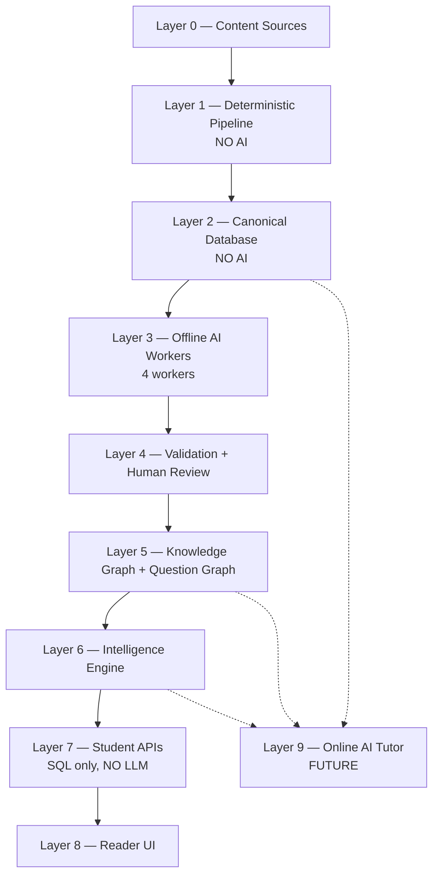
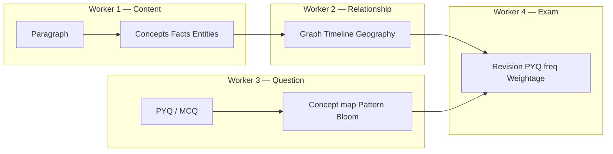

# SarkariExamsAI — AI Platform Guide

| Field | Value |
|-------|-------|
| **Document** | Single source of truth for AI architecture |
| **Audience** | AI Team, Engineering, Product |
| **Version** | 1.0 |
| **Status** | Approved for implementation |
| **Last updated** | 2026-07-11 |

> **This replaces** all split files in `docs/ai/01–09` and wiki AI docs `06`, `09`, `10`.  
> AI Team receives this **Architecture Specification** — not ad-hoc prompts.

---

## Part 1 — High-level platform layers

SarkariExamsAI is a **Knowledge Intelligence Platform**, not a chatbot. Content flows through **nine layers**. Only **Layer 3–4** use AI (offline, batch). **Layer 9** is the only future **online** LLM use.



### Layer summary table

| Layer | Name | Uses AI? | Owner | One-line purpose |
|-------|------|----------|-------|------------------|
| **0** | Content Sources | No | Content Ops | Raw material: NCERT, PYQs, notes |
| **1** | Deterministic Pipeline | **No** | Backend / Content Platform | PDF → structured text (reproducible) |
| **2** | Canonical Database | **No** | Data Platform | System of record: paragraphs, hierarchy |
| **3** | Offline AI Workers | **Yes (batch)** | **AI Team** | Extract concepts, facts, relations, questions |
| **4** | Validation + Review | AI assists, humans approve | AI Team + Content Ops | Block hallucinations before publish |
| **5** | Knowledge + Question Graph | No (stores AI output) | Data Platform | Connected intelligence nodes |
| **6** | Intelligence Engine | Mostly deterministic | AI Team + Backend | Merge graphs → exam signals |
| **7** | Student APIs | **No LLM** | Backend | Serve SQL to PWA |
| **8** | Reader UI | No | Frontend | Topic Workspace, practice |
| **9** | Online AI Tutor | **Yes (real-time)** | AI Team (future) | Grounded Q&A only |

---

## Part 2 — Every layer: purpose, input, output

### Layer 0 — Content Sources

| | |
|---|---|
| **Purpose** | Provide trustworthy source material. AI never invents content here. |
| **Input** | NCERT PDFs, reference books, PYQ papers, mock tests, class notes, current affairs |
| **Output** | Files ready for ingestion (PDF, CSV, DOC) |
| **AI role** | None |

---

### Layer 1 — Deterministic Pipeline

| | |
|---|---|
| **Purpose** | Convert PDFs to structured canonical JSON **without LLM** — same input always gives same output. |
| **Input** | PDF file, `book_id` |
| **Output** | `step10_canonical.json` → loaded to PostgreSQL |
| **AI role** | **None. Forbidden.** |

```
PDF → OCR → Layout → Reading Order → Hierarchy → Paragraphs
    → Images → Tables → Validation → Canonical JSON
```

**Why no AI:** Exam content must be factually exact. LLM PDF parsing hallucinates dates and names.

---

### Layer 2 — Canonical Database

| | |
|---|---|
| **Purpose** | Store **truth** — what the book actually says. All AI outputs must ground here. |
| **Input** | `step10_canonical.json` via load API |
| **Output** | PostgreSQL tables: `books`, `chapters`, `sections`, `paragraphs`, `figures`, `glossary_entries` |
| **AI role** | **None. AI reads from here; never writes canonical text.** |

**Key IDs:** `section_id` = topic (e.g. `SEC_2_1`), `paragraph_id` = e.g. `P00312`

---

### Layer 3 — Offline AI Workers ⭐ AI TEAM CORE

| | |
|---|---|
| **Purpose** | Transform canonical text + questions into **structured exam intelligence** (concepts, facts, graph, MCQ links). |
| **Runs** | Batch only, after canonical load. Temperature = 0. |
| **AI role** | **Full ownership — 4 domain workers** |



#### Worker 1 — Content Intelligence

| | |
|---|---|
| **Purpose** | Answer: *What is this paragraph about? What facts must a student know?* |
| **Input** | `ParagraphContext` (see below) |
| **Output** | Concepts, atomic facts, entities, keywords/aliases, learning objectives, paragraph difficulty |

**Input example:**
```json
{
  "paragraph_id": "P00421",
  "section_id": "SEC_3_2",
  "book_id": "hist_class10",
  "text": "Lothal was an important port city of the Harappan Civilization.",
  "glossary": [{ "term": "Harappan", "meaning": "Indus Valley Civilization" }],
  "exam_profile": { "primary": "BPSC" }
}
```

**Output example:**
```json
{
  "concepts": [
    { "name": "Harappan Civilization", "category": "Civilization", "importance": "high",
      "source_paragraph_id": "P00421" },
    { "name": "Lothal", "category": "Archaeological Site", "importance": "medium",
      "source_paragraph_id": "P00421" }
  ],
  "atomic_facts": [
    { "statement": "Lothal was a port city of the Harappan Civilization.",
      "source_paragraph_id": "P00421" }
  ],
  "entities": [{ "name": "Lothal", "type": "place" }],
  "keywords": [{ "term": "port city" }],
  "learning_objectives": [
    { "objective": "Identify Lothal as a Harappan port city", "bloom_level": "remember" }
  ]
}
```

---

#### Worker 2 — Relationship Intelligence

| | |
|---|---|
| **Purpose** | Answer: *How do concepts connect? When? Where?* Build Knowledge Graph edges. |
| **Input** | Worker 1 output for a section + neighbour section metadata |
| **Output** | Relationships (SPO triples), timeline entries, geography hierarchy, synonyms, cross-topic links |

**Output example:**
```json
{
  "relationships": [
    {
      "subject": "Lothal", "predicate": "belongs_to", "object": "Harappan Civilization",
      "evidence": "Lothal was an important port city of the Harappan Civilization.",
      "source_paragraph_id": "P00421"
    }
  ],
  "timeline": [
    { "concept": "Harappan Civilization", "start": "-2600", "end": "-1900", "precision": "century" }
  ],
  "geography": [
    { "place": "Lothal", "state": "Gujarat", "country": "India", "chain": ["Gujarat", "India"] }
  ]
}
```

---

#### Worker 3 — Question Intelligence

| | |
|---|---|
| **Purpose** | Parse PYQs/MCQs and link each question to concepts and exam patterns. **Separate pipeline from paragraphs.** |
| **Input** | Raw question from question bank (CSV, PDF extract, manual entry) |
| **Output** | Parsed MCQ, concept mappings, pattern type, difficulty, Bloom level, explanation draft, confusions |

**Input example:**
```json
{
  "raw_text": "Lothal is famous for?\n(A) Steel (B) Dockyard (C) Temple (D) Coins",
  "exam": "BPSC", "year": 2022, "correct_hint": "B"
}
```

**Output example:**
```json
{
  "question_id": "Q_bpsc_hist_lothal_042",
  "stem": "Lothal is famous for?",
  "options": [...],
  "correct_option_id": "B",
  "explanation": "Lothal had a Harappan dockyard.",
  "concept_mappings": [{ "concept_id": "CONCEPT_hist10_lothal", "confidence": 0.96 }],
  "pattern": { "type": "direct_fact", "confidence": 0.93 },
  "bloom": { "level": "remember" },
  "difficulty": { "level": "easy", "score": 2 }
}
```

---

#### Worker 4 — Exam Intelligence

| | |
|---|---|
| **Purpose** | Compute exam-facing signals: revision priority, PYQ frequency, topic weightage, trends. Powers Reader intelligence rail. |
| **Input** | Published Knowledge Graph + Question Graph + `exam_profile` (BPSC, UPSC…) |
| **Output** | Per-concept and per-topic intelligence for Student APIs |

**Output example (topic — powers Reader UI):**
```json
{
  "section_id": "SEC_3_2",
  "why_it_matters": "Harappan sites are frequent BPSC Prelims MCQs.",
  "key_points": ["Lothal = dockyard", "Gujarat location"],
  "pyq_patterns": [{ "question": "Lothal is famous for?", "type": "direct_fact" }],
  "remember": [{ "label": "Lothal", "hook": "L = Dockyard" }],
  "avoid": ["Do not confuse with Dholavira"],
  "revision_priority": 0.87
}
```

**Execution order:** W1 → W2 (per book). W3 runs on question bank independently. W4 runs after graphs are published.

---

### Layer 4 — Validation + Human Review

| | |
|---|---|
| **Purpose** | **Firewall** — no hallucinated fact reaches students. |
| **Input** | Raw JSON from Workers 1–4 |
| **Output** | Staging rows (pass) OR error report (fail) → human review queue → published rows |

**Validation levels:**

| Level | Checks |
|-------|--------|
| L1 JSON | Parseable, schema-valid |
| L2 Schema | Required fields, enums, ID formats |
| L3 Ontology | Valid predicates, DAG for prerequisites, MCQ rules |
| L4 Grounding | `paragraph_id` exists; facts derivable from text; no new dates/names |
| L5 Dedup | Near-duplicate questions/concepts |
| L6 Confidence | Route low confidence to priority review |

**AI role:** AI Team implements validators. Content Ops approves staging → publish.

---

### Layer 5 — Knowledge Graph + Question Graph

| | |
|---|---|
| **Purpose** | Store **connected** intelligence — not flat JSON files. |
| **Input** | Approved staging rows from Layer 4 |
| **Output** | Queryable graph in PostgreSQL `intelligence.*` |

**Knowledge Graph (from W1 + W2):**
```
Concept → Facts → Entities → Relationships → Timeline → Geography
```

**Question Graph (from W3):**
```
Question → tests → Concept → grounded_in → Paragraph
         → Pattern, Bloom, Difficulty
```

**AI role:** None at runtime — stores published AI output.

---

### Layer 6 — Intelligence Engine

| | |
|---|---|
| **Purpose** | Merge Knowledge Graph × Question Graph → per-concept exam intelligence. |
| **Input** | Both graphs + exam profile |
| **Output** | `revision_priority`, `pyq_count`, `importance_score`, smart highlight candidates, topic workspace bundle |

**Per concept, compute:**

| Signal | Source |
|--------|--------|
| Mentioned in N books | KG |
| Paragraph / fact count | KG |
| PYQ count & patterns | QG |
| Common confusions | QG + traps |
| Revision priority | W4 formula |
| Related concepts | KG 1-hop edges |

**AI role:** W4 + mostly SQL aggregations. Optional LLM for narrative `why_it_matters` (must be reviewed).

---

### Layer 7 — Student APIs

| | |
|---|---|
| **Purpose** | Serve intelligence to PWA. **Zero LLM.** |
| **Input** | HTTP requests (`topic_id`, `concept_id`, `user_id`) |
| **Output** | JSON from SQL joins on canonical + intelligence tables |

| Endpoint (target) | Returns |
|-------------------|---------|
| `GET /api/courses/.../workspace` | Reading + exam intelligence rail |
| `GET /api/concepts/{id}` | Concept node + facts |
| `GET /api/concepts/{id}/pyqs` | Linked PYQs |
| `GET /api/practice/sessions` | MCQs by topic/concept |
| `GET /api/revision/today` | Top revision concepts |

**AI role:** None.

---

### Layer 8 — Reader UI

| | |
|---|---|
| **Purpose** | Student experience: Topic Learning Workspace, highlights, practice. |
| **Input** | Student APIs JSON |
| **Output** | Rendered UI (no AI) |

**AI role:** None. Displays Layer 6 output (highlights, traps, PYQ patterns).

---

### Layer 9 — Online AI Tutor (future)

| | |
|---|---|
| **Purpose** | Answer student doubts **grounded** in published knowledge. |
| **Input** | Student question + `user_id` |
| **Output** | Answer with citations (`paragraph_id`, `concept_id`, `fact_id`) |

```
Student question → Retriever (KG + paragraphs + facts + PYQs) → LLM → Grounded answer
```

**AI role:** **Only production LLM.** Must not invent facts. Build after Layers 3–6 are stable.

---

## Part 3 — AI input/output master table

| Worker | Trigger | Input (from Engineering) | Output (to staging) |
|--------|---------|--------------------------|---------------------|
| **W1 Content** | Paragraph loaded | `paragraph_id`, `text`, `section_id`, `book_id`, glossary, exam_profile | concepts, atomic_facts, entities, keywords, learning_objectives |
| **W2 Relationship** | W1 complete for section | W1 outputs + neighbour sections | relationships, timeline, geography, synonyms, cross_refs |
| **W3 Question** | PYQ import / batch | raw question text, exam, year, answer hint | parsed MCQ, concept_mappings, pattern, bloom, difficulty, explanation |
| **W4 Exam** | KG + QG published | graphs + exam_profile | topic intelligence, concept scores, revision priority, trends |
| **Validation** | After each worker | worker JSON + canonical paragraphs | pass/fail report, staging rows |
| **Review** | Staging ready | staging rows | approved → `intelligence.*` published |

---

## Part 4 — Grounding rules (anti-hallucination)

Every AI output that contains a **fact** must satisfy:

| Rule | Meaning |
|------|---------|
| **G-001** | `source_paragraph_id` exists in canonical DB |
| **G-002** | Highlight/fact terms appear in source paragraph |
| **G-003** | Years in output ⊆ years in source text |
| **G-004** | No new proper nouns not in paragraph |
| **G-005** | MCQ explanation uses only mapped concept facts |
| **G-006** | Human review before `status = published` |

---

## Part 5 — Data stored after AI (key entities)

| Entity | ID pattern | Created by | Used by |
|--------|------------|------------|---------|
| Concept | `CONCEPT_{book}_{slug}` | W1 | Graph, practice, UI |
| Atomic Fact | `FACT_{uuid}` | W1 | MCQ grounding, tutor |
| Entity | `ENT_{slug}` | W1 | Graph, geography |
| Relationship | `REL_{...}` | W2 | Navigator, Mains linkages |
| Question | `Q_{exam}_{slug}_{seq}` | W3 | Practice engine |
| Highlight | `HL_{section}_{slug}` | W1/W4 | AnnotatedText UI |
| Trap | `TRAP_{section}_{slug}` | W1/W3 | "Avoid these traps" rail |

**Schemas:** PostgreSQL `intelligence_staging.*` → review → `intelligence.*`

---

## Part 6 — What AI team owns vs does not own

### Owns ✅
- 4 offline workers + validation pipeline
- JSON schemas for structured LLM output
- Staging tables + extraction jobs
- Model pinning, metrics, golden tests
- Prompts (internal, versioned — not the contract)

### Does not own ❌
- PDF ingestion (Layer 1)
- Canonical schema (Layer 2)
- Student APIs (Layer 7)
- Reader UI (Layer 8)
- PYQ licensing (Product/Legal)

---

## Part 7 — Implementation phases

| Phase | Scope | Weeks |
|-------|-------|-------|
| **1** | W1 + W2 + validation for `hist_class10` CH 1–3 | 8 |
| **2** | W3 on BPSC PYQ sample + Question Graph | 6 |
| **3** | W4 + Intelligence Engine + API wiring | 4 |
| **4** | Full book + review UI | 4 |

---

## Part 8 — End-to-end example (one paragraph)

**Canonical input (Layer 2):**
> "In April 1919, Gandhiji organised a satyagraha against the Rowlatt Act."

**W1 output:** Concepts `Rowlatt Act`, `Satyagraha`; Fact `"Rowlatt Act passed 1919"`; Entity `Gandhi`

**W2 output:** `Rowlatt Act` —caused→ `Satyagraha`; Timeline `1919`

**W3 output (PYQ):** "Rowlatt Act allowed detention without trial" → maps to `CONCEPT_rowlatt`

**W4 output:** Topic intelligence — "BPSC Prelims: cause-effect MCQ"; revision_priority 0.91

**Student sees (Layer 8):** Highlight on "Rowlatt Act" with popover; intelligence rail with PYQ pattern; practice MCQs

---

## Part 9 — Related documents

| Doc | Location |
|-----|----------|
| Deterministic pipeline (Layer 1–2) | [`../backend/02-ingestion-pipeline.md`](../backend/02-ingestion-pipeline.md) |
| Canonical DB schema | [`../backend/03-canonical-database.md`](../backend/03-canonical-database.md) |
| Student APIs | [`../backend/04-student-apis.md`](../backend/04-student-apis.md) |
| Reader UI | [`../frontend/01-reader-ui.md`](../frontend/01-reader-ui.md) |
| ADR: No AI in ingestion | [`./adr/001-deterministic-ingestion-first.md`](./adr/001-deterministic-ingestion-first.md) |
| ADR: Human review gate | [`./adr/002-offline-extraction-human-review-gate.md`](./adr/002-offline-extraction-human-review-gate.md) |

---

## Appendix — Why 4 workers, not 9 agents

Early design had 9 micro-agents (Concept, Fact, Entity, Relation, Timeline, Geography, Keyword, Learning Objective, Difficulty).

**We use 4 domain workers** because enterprise AI teams (Google, Microsoft, OpenAI, Anthropic) organize by **business capability**, not one agent per field:

| 9 agents problem | 4 workers solution |
|------------------|-------------------|
| 9× orchestration | Clear ownership |
| Fragmented context | Shared `ParagraphContext` |
| Hard to test/version | One golden suite per worker |
| Duplicate LLM calls | Batched structured extraction |

| Original agent | Worker |
|----------------|--------|
| Concept, Fact, Entity, Keyword, Learning Objective | **W1** |
| Relationship, Timeline, Geography | **W2** |
| Question parse, concept map, pattern, Bloom | **W3** |
| Difficulty, revision, weightage, trends | **W4** |
