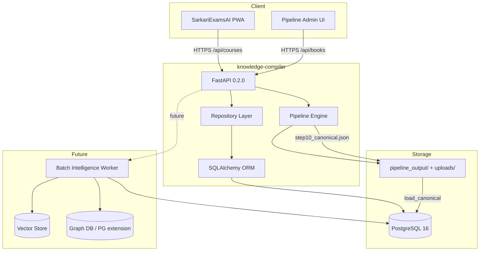

# 01 — System Architecture

| Field | Value |
|-------|-------|
| **Document ID** | WIKI-01 |
| **Owner** | Platform Architecture |
| **Status** | Draft v1 |
| **Last updated** | 2026-07-10 |

---

## Overview

This document describes the **logical and physical architecture** of SarkariExamsAI as an enterprise Knowledge Intelligence Platform. It explains component boundaries, communication patterns, deployment topology, and the rationale behind key decisions.

---

## Business Goal

Deliver a **trustworthy, scalable** exam-prep platform where:
1. Book content is **deterministically ingested** (reproducible, auditable).
2. Students consume **curated topic workspaces** via a fast PWA.
3. Future AI layers **read from canonical truth**, never replace it.

---

## Architecture

### Layered architecture

```
┌─────────────────────────────────────────────────────────────────┐
│ L7  Experience Layer     │ SarkariExamsAI PWA (React + MUI)     │
├─────────────────────────────────────────────────────────────────┤
│ L6  Student API Layer    │ /api/courses, /api/practice (future) │
├─────────────────────────────────────────────────────────────────┤
│ L5  Intelligence Layer   │ KG, PYQ, Exam Intel (offline jobs)   │
├─────────────────────────────────────────────────────────────────┤
│ L4  Canonical Store      │ PostgreSQL (books → paragraphs)    │
├─────────────────────────────────────────────────────────────────┤
│ L3  Ingestion Pipeline   │ Steps 1–10 (deterministic Python)    │
├─────────────────────────────────────────────────────────────────┤
│ L2  Admin / Ops          │ Pipeline UI, DB admin, monitoring    │
├─────────────────────────────────────────────────────────────────┤
│ L1  Source Assets        │ NCERT PDFs, figure binaries          │
└─────────────────────────────────────────────────────────────────┘
```

### Why layered (not microservices on day one)

- **Team size:** 20 engineers over 2 years does not justify 15 services on day one.
- **Data locality:** Ingestion and canonical store are tightly coupled; co-locating in `knowledge-compiler` reduces network hops and transaction complexity.
- **Evolution path:** Layers map cleanly to future service extraction (Ingestion Worker, Student API, Intelligence Worker).

### Component diagram



---

## Data Flow

### Flow A — New book ingestion (admin)

| Step | Actor | Action | Output |
|------|-------|--------|--------|
| 1 | Content Ops | Upload PDF | `uploads/{book_id}.pdf` |
| 2 | Admin UI | POST step1…step10 | `pipeline_output/{book_id}/step*.json` |
| 3 | Step 9 | Validation | Pass/fail + error report |
| 4 | Admin UI | POST canonical/load | Rows in PostgreSQL |
| 5 | QA | Spot-check via `/api/courses` | Approved for student API |

### Flow B — Student reads a topic

| Step | Actor | Action | Output |
|------|-------|--------|--------|
| 1 | Student | Open `/learn?book=&chapter=&topic=` | — |
| 2 | PWA saga | `GET /api/courses/{book}/chapters/{ch}/topics/{topic}/intro` + steps + next | JSON payloads |
| 3 | PWA | Compose `TopicWorkspaceResponse` | Render workspace |
| 4 | Student | Complete topic | `topic_completions` (future) |

### Flow C — Mock mode (current production default)

| Step | Action |
|------|--------|
| 1 | `VITE_USE_MOCK_COURSES=true` (default) |
| 2 | `coursesApi.ts` returns `mockCourses.ts` |
| 3 | No backend round-trip; instant UI |

**Why mock default:** Supabase latency and incomplete exam-intelligence in live API would degrade demo UX. Mock preserves API contract while enabling rapid UI iteration.

---

## ER Diagram

See [03 — Canonical Database Schema](./03-canonical-database-schema.md) for full ERD and per-table documentation.

---

## Folder Structure

### knowledge-compiler

```
knowledge-compiler/
├── backend/
│   ├── main.py                 # FastAPI entry
│   ├── routers/                # HTTP surface
│   │   ├── books.py
│   │   ├── pipeline.py         # Steps 1–10 API
│   │   ├── canonical.py        # DB load + query
│   │   ├── courses.py          # Student contract
│   │   └── admin_db.py
│   ├── pipeline/               # Pure ingestion (no FastAPI)
│   │   ├── step01_pdf_reader.py
│   │   └── … step10_canonical_json.py
│   ├── db/
│   │   ├── models.py           # ORM
│   │   ├── loader.py           # step10 → Postgres
│   │   └── repository.py
│   └── services/
├── ingestion/scripts/          # CLI batch runners
├── frontend/                   # Admin pipeline UI
├── pipeline_output/            # Per-book artifacts
├── exports/supabase/           # Cloud DB import
└── alembic/                    # Migrations
```

### sarkariexamsAI

```
sarkariexamsAI/
├── src/
│   ├── app/                    # Redux store wiring
│   ├── features/               # Feature modules (pages + state)
│   │   ├── learn/              # TopicWorkspace
│   │   ├── courses/
│   │   └── …
│   ├── data/api/               # API client + mocks
│   ├── components/             # Shared UI
│   └── routes/AppRoutes.tsx
├── public/                     # PWA, _redirects
└── netlify.toml
```

---

## Naming Standards

| Layer | Convention | Example |
|-------|------------|---------|
| Book ID | `{subject}_class{N}` | `hist_class10` |
| Chapter ID | `CH_{roman}` | `CH_III` |
| Section ID | `SEC_{ch}_{n}` | `SEC_2_3` |
| Paragraph ID | `P{n:05d}` | `P00042` |
| Block ID | `B{n:05d}` | `B00128` |
| API routes | kebab-case paths, snake_case JSON | `/api/courses/{book_id}` |
| Redux slices | camelCase | `learnSlice`, `workspaceStatus` |

---

## Validation Rules

| Boundary | Rule |
|----------|------|
| Pipeline → step10 | Step 9 must pass; pipeline aborts on failure |
| step10 → DB | Full book replace (CASCADE delete + reload) |
| API → UI | Response must match `coursesTypes.ts` (TypeScript contract) |
| PDF input | Embedded text only; scanned PDFs rejected at Step 1/2 |

---

## Example Records

**Book:** `hist_class10` — India and the Contemporary World II  
**Pipeline artifact:** `pipeline_output/hist_class10/step10_canonical.json`  
**DB row count (typical):** ~12 chapters, ~80 sections, ~2000 paragraphs

---

## Deployment topology (current + target)

### Current (2026-07-10)

| Component | Host | URL |
|-----------|------|-----|
| Reader PWA | Netlify | https://guileless-crepe-c5261c.netlify.app |
| Backend API | Local / Supabase (dev) | Not in production path for students |
| PostgreSQL | Docker local / Supabase | Dev + staging |

### Target production

```
                    ┌──────────────┐
   Students ──────►│ CDN (Netlify)│──► PWA static assets
                    └──────────────┘
                            │
                            ▼
                    ┌──────────────┐
                    │ API Gateway  │──► FastAPI (ECS/Cloud Run)
                    └──────────────┘
                            │
              ┌─────────────┼─────────────┐
              ▼             ▼             ▼
        PostgreSQL     Object Store    Redis (cache)
        (Supabase/RDS) (figures)       (sessions)
```

---

## Future Enhancements

| Enhancement | Why |
|-------------|-----|
| Separate ingestion workers | Scale PDF processing off API request path |
| Read replicas | Student read load vs admin write load |
| API versioning (`/api/v1`) | Safe contract evolution |
| Event bus (SQS/Kafka) | Decouple ingestion completion → intelligence jobs |
| CDN for figure assets | Faster image load in Reader |

---

## Risks

| Risk | Severity | Mitigation |
|------|----------|------------|
| Monolith scaling limits | Medium | Extract pipeline worker first |
| Single Postgres bottleneck | Medium | Read replicas; partition by book_id if needed |
| Netlify-only frontend | Low | Portable static build |
| CORS misconfiguration | High | Explicit allowlist for production domain |
| Secret leakage in PWA | Medium | No DB credentials in frontend; API keys server-only |

---

## Open Questions

1. Single region (ap-south-1) or multi-region for disaster recovery?
2. Supabase as all-in-one (Auth + DB + Storage) vs split stack?
3. When to introduce API gateway vs direct FastAPI?
4. Figure storage: DB blob vs S3 + signed URLs?

---

## Team ownership

| Component | Team | On-call |
|-----------|------|---------|
| FastAPI + Student APIs | Backend Platform | PagerDuty rotation TBD |
| Ingestion pipeline | Content Platform | Business hours |
| PostgreSQL | Data Platform | Shared infra |
| SarkariExamsAI PWA | Frontend | PagerDuty rotation TBD |
| Netlify deploy | Frontend / DevOps | Low urgency |

---

## Testing strategy

| Level | Scope | Tooling |
|-------|-------|---------|
| Unit | Pipeline steps 1–10 | pytest |
| Integration | canonical load → courses API | pytest + test DB |
| Contract | API ↔ TypeScript types | OpenAPI codegen or manual contract tests |
| E2E | Learn flow | Playwright (planned) |
| Load | `/api/courses` hot paths | k6 (planned) |

---

## API references

- Live Swagger: `http://localhost:8000/docs`
- Student contract: [04 — Student APIs](./04-student-apis.md)
- Canonical query API: `backend/routers/canonical.py`

---

## Migration strategy (architecture evolution)

| Phase | Change | Migration approach |
|-------|--------|-------------------|
| Phase 0 (now) | Mock-backed PWA | Feature flag `VITE_USE_MOCK_COURSES` |
| Phase 1 | Live API cutover | Staged rollout per subject; fallback to mock |
| Phase 2 | Server progress | Dual-write localStorage + API; then API-only |
| Phase 3 | Intelligence worker | New tables; backfill from canonical |
| Phase 4 | Service split | Strangler fig: extract ingestion worker first |
