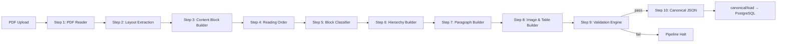

# 02 — Deterministic Ingestion Pipeline

| Field | Value |
|-------|-------|
| **Document ID** | WIKI-02 |
| **Owner** | Content Platform Engineering |
| **Status** | Implemented (v1) |
| **Last updated** | 2026-07-10 |

---

## Overview

The ingestion pipeline transforms **NCERT PDFs** into **canonical JSON** (`step10_canonical.json`) suitable for PostgreSQL load. It is **fully deterministic** — no LLM calls, no probabilistic extraction. The same PDF always produces the same output given the same pipeline version.

**Why deterministic:** Government exam content demands factual accuracy. LLM-based PDF parsing introduces hallucination risk unacceptable for canonical reading material. AI enrichment happens **after** canonical truth is established (offline, reviewable).

---

## Business Goal

Enable Content Ops to onboard a new NCERT book in **< 4 hours** (upload → validate → load → QA) with **auditable lineage** and **stable IDs** for downstream MCQ, embeddings, and knowledge graph work.

---

## Architecture



### Design principles

| Principle | Implementation |
|-----------|----------------|
| Pure functions per step | `backend/pipeline/step*.py` — no FastAPI imports |
| Immutable artifacts | Each step writes JSON to `pipeline_output/{book_id}/` |
| Fail fast | Step 9 blocks Step 10 on validation errors |
| Stable IDs | IDs assigned in Step 6/7/8, preserved through load |
| Replayable | Re-run any step from prior artifact |

---

## Data Flow

### Per-step inputs/outputs

| Step | Name | Input | Output artifact | Key transformation |
|------|------|-------|-----------------|-------------------|
| 1 | PDF Reader | PDF file | `step01_pdf_reader.json` | Page count, dimensions, rotation |
| 2 | Layout Extractor | Step 1 | `step02_layout.json` | Raw blocks: text, image, table, line, shape |
| 3 | Content Block Builder | Step 2 | `step03_content_blocks.json` | Semantic content blocks from layout |
| 4 | Reading Order | Step 3 | `step04_reading_order.json` | Global order: page → y → x |
| 5 | Block Classifier | Step 4 | `step05_classified.json` | Roles: heading, paragraph, activity, caption |
| 6 | Hierarchy Builder | Step 5 | `step06_hierarchy.json` | Book → Chapter → Section → Subsection tree |
| 7 | Paragraph Builder | Step 6 | `step07_paragraphs.json` | Merged paragraph text from blocks |
| 8 | Image & Table Builder | Step 7 | `step08_media.json` | Figures, tables, activities, glossary |
| 9 | Validation Engine | Steps 1–8 | `step09_validation.json` | Cross-step integrity checks |
| 10 | Canonical JSON | All above | `step10_canonical.json` | Unified canonical document |

### Orchestration paths

1. **Admin UI:** `POST /api/books/{book_id}/pipeline/step{N}` per step
2. **CLI:** `python -m ingestion.scripts.run_pipeline {book_id}`
3. **Batch:** Future CI job on PDF upload to S3

---

## Folder Structure

```
backend/pipeline/
├── models.py              # Pydantic models per step
├── step01_pdf_reader.py
├── step02_layout_extractor.py
├── step03_content_block_builder.py
├── step04_reading_order_builder.py
├── step05_block_classifier.py
├── step06_hierarchy_builder.py
├── step07_paragraph_builder.py
├── step08_image_table_builder.py
├── step09_validation_engine.py
└── step10_canonical_json.py

pipeline_output/{book_id}/
├── step01_pdf_reader.json
├── …
└── step10_canonical.json
```

---

## Naming Standards

| Entity | Pattern | Example |
|--------|---------|---------|
| Step artifact | `step{NN}_{name}.json` | `step06_hierarchy.json` |
| Book ID | `{subject}_class{level}` | `hist_class10` |
| Chapter ID | `CH_{ROMAN}` | `CH_III` |
| Section ID | `SEC_{chapter}_{index}` | `SEC_2_3` |
| Block ID | `B{5-digit}` | `B00128` |
| Paragraph ID | `P{5-digit}` | `P00042` |
| Figure ID | `F{5-digit}` | `F00012` |

**Why stable IDs:** MCQ explanations, PYQ tags, graph edges, and student progress all reference `section_id` / `paragraph_id`. Regenerating IDs on re-ingest would break downstream data.

---

## Validation Rules (Step 9)

| Check | Severity | Description |
|-------|----------|-------------|
| Page count match | Error | Step 1 page count == PDF |
| Orphan blocks | Error | Every block assigned to hierarchy |
| Empty paragraphs | Warning | Paragraphs with zero text flagged |
| Duplicate reading order | Error | No two blocks share same global order |
| Chapter coverage | Error | All printed chapters detected |
| Figure without caption | Warning | Editorial follow-up |
| Table dimensions | Error | Row/col count matches cells |
| Hierarchy depth | Warning | Unexpected nesting flagged |

**Pipeline behavior:** Any **Error** fails Step 9 → Step 10 blocked.

---

## Example Records

### step10_canonical.json (excerpt)

```json
{
  "book_id": "hist_class10",
  "title": "India and the Contemporary World - II",
  "subject": "History",
  "class_level": "10",
  "chapters": [
    {
      "chapter_id": "CH_III",
      "number": 3,
      "roman": "III",
      "title": "Nationalism in India",
      "sections": [
        {
          "section_id": "SEC_3_2",
          "number": "3.2",
          "title": "The Non-Cooperation Movement",
          "paragraphs": [
            {
              "paragraph_id": "P00042",
              "text": "In January 1921, the Non-Cooperation Movement was launched…",
              "page": 32,
              "order": 420
            }
          ]
        }
      ]
    }
  ]
}
```

---

## Versioning

| Artifact | Version field | Location |
|----------|---------------|----------|
| Pipeline code | Git tag / `pipeline_version` | `ingestion_runs.pipeline_version` |
| step10 schema | Implicit in Pydantic models | `backend/pipeline/models.py` |
| Book content | `book_versions` table | One active version per book |

**Re-ingestion policy:** Loading a new step10 for the same `book_id` **replaces** all content rows (CASCADE). Prior version archived via `book_versions` + `ingestion_runs`.

---

## Constraints

| Constraint | Reason |
|------------|--------|
| Embedded text PDFs only | OCR not in v1 pipeline |
| Single book per pipeline run | Simplifies artifact paths |
| English NCERT first | Hindi pipeline TBD |
| Max PDF size TBD | Worker memory limits |

---

## Future Enhancements

| Enhancement | Priority | Notes |
|-------------|----------|-------|
| OCR pipeline (separate) | P2 | Scanned legacy books |
| Parallel page processing | P2 | Step 2 bottleneck |
| Diff-based re-ingest | P3 | Avoid full CASCADE reload |
| Pipeline DAG orchestrator | P2 | Airflow / Temporal |
| Human-in-loop correction UI | P1 | Fix misclassified blocks before load |
| Hindi / bilingual books | P2 | Script detection in Step 2 |

---

## Risks

| Risk | Mitigation |
|------|------------|
| NCERT layout changes break rules | Versioned classifiers; golden-file tests per book |
| Long pipeline runtime | Async workers; progress webhooks |
| Artifact storage growth | S3 lifecycle; compress old steps |
| Mis-hierarchy on edge-case books | Manual override UI + re-run from Step 6 |

---

## Open Questions

1. Retain all step artifacts forever or only step10 + source PDF?
2. Automated pipeline on upload vs manual step-by-step?
3. How to handle NCERT errata / reprints?
4. Image binary storage: inline base64 in JSON vs separate object store?

---

## Team ownership

| Role | Responsibility |
|------|----------------|
| Content Platform Eng | Pipeline steps, validation rules |
| Content Ops | PDF sourcing, QA sign-off |
| Data Platform | canonical/load, DB performance |
| QA | Golden-file regression per book |

---

## Testing strategy

| Test | Coverage today | Target |
|------|----------------|--------|
| `test_step01_pdf_reader.py` | Step 1 only | All steps |
| Golden-file comparison | Manual | CI per book fixture |
| Validation rule unit tests | None | 100% of Step 9 rules |
| End-to-end load test | Manual | Automated in CI |
| Performance benchmark | None | < 10 min per 200-page book |

---

## API references

| Method | Path | Purpose |
|--------|------|---------|
| POST | `/api/books/upload` | Register PDF |
| POST | `/api/books/{book_id}/pipeline/step{N}` | Run step N |
| GET | `/api/books/{book_id}/pipeline/step{N}/summary` | Step summary |
| GET | `/api/books/{book_id}/pipeline/step10/canonical` | Preview canonical JSON |
| POST | `/api/books/{book_id}/canonical/load` | Load to Postgres |

Full inventory: `backend/routers/pipeline.py`, `backend/routers/canonical.py`

---

## Migration strategy

| Scenario | Approach |
|----------|----------|
| New pipeline version | Bump `pipeline_version`; parallel run; compare diff |
| Schema change in step10 | Alembic migration + loader update; re-load all books |
| Legacy `compiler.py` flow | Deprecated; do not extend; migrate books to 10-step |
