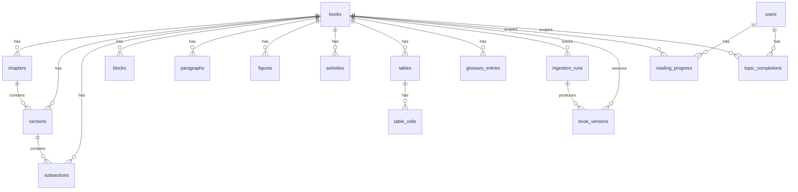

# 03 — Canonical Database Schema

| Field | Value |
|-------|-------|
| **Document ID** | WIKI-03 |
| **Owner** | Data Platform Engineering |
| **Status** | Implemented (Alembic 001, 002) |
| **Last updated** | 2026-07-10 |
| **Source of truth** | `knowledge-compiler/backend/db/models.py` |

---

## Overview

The canonical database is the **system of record** for all ingested book content. It stores the hierarchy (Book → Chapter → Section → Subsection) and atomic content entities (paragraphs, figures, tables, activities, glossary). It also tracks ingestion lineage and (future) student progress.

**Engine:** PostgreSQL 14+ (16 in Docker)  
**ORM:** SQLAlchemy 2.x  
**Migrations:** Alembic (`alembic/versions/`)

---

## Business Goal

Provide **stable, queryable, exam-ready content** with:
- Sub-100ms topic reads for Student APIs
- Full-text search across paragraphs
- Version lineage for content updates
- Foreign-key integrity for progress and future MCQ linkage

---

## Architecture



### Schema domains

| Domain | Tables | Purpose |
|--------|--------|---------|
| **Content hierarchy** | `books`, `chapters`, `sections`, `subsections` | Navigation tree |
| **Content entities** | `blocks`, `paragraphs`, `figures`, `activities`, `tables`, `table_cells`, `glossary_entries` | Reading material |
| **Governance** | `ingestion_runs`, `book_versions` | Lineage & rollback |
| **Learner state** | `users`, `reading_progress`, `topic_completions` | Progress tracking |

---

## Data Flow

```
step10_canonical.json
        ↓
backend/db/loader.py (transactional replace)
        ↓
PostgreSQL tables
        ↓
backend/db/repository.py
        ↓
/api/courses + /api/canonical/*
```

**Load semantics:** DELETE all rows for `book_id` (CASCADE) → INSERT fresh. **Why:** Simpler than upsert for full re-ingest; IDs are stable so downstream refs survive if content unchanged.

---

## Table reference

---

### `books`

| Attribute | Detail |
|-----------|--------|
| **Purpose** | Root entity for one NCERT/reference book |
| **Responsibilities** | Metadata, validation status, aggregate counts, load timestamp |
| **PK** | `book_id` VARCHAR(64) |
| **Relationships** | Parent to all content + governance tables |
| **Indexes** | PK only (low cardinality) |
| **Future scalability** | Partition not needed; expect < 500 books |
| **Versioning** | Via `book_versions` + `ingestion_runs` |
| **Constraints** | `title`, `subject`, `class_level`, `filename`, `total_pages` NOT NULL |
| **Team ownership** | Data Platform |
| **Testing** | Loader integration test; count assertions post-load |

**Columns:**

| Column | Type | Description |
|--------|------|-------------|
| `book_id` | VARCHAR(64) | Stable slug, e.g. `hist_class10` |
| `title` | VARCHAR(512) | Full book title |
| `subject` | VARCHAR(128) | History, Geography, etc. |
| `class_level` | VARCHAR(32) | e.g. `10` |
| `filename` | VARCHAR(512) | Source PDF filename |
| `total_pages` | INTEGER | Page count |
| `counts` | JSONB | `{chapters, sections, paragraphs, …}` |
| `validation_passed` | BOOLEAN | From Step 9 |
| `validation_errors` | JSONB | Error list if failed |
| `loaded_at` | TIMESTAMPTZ | Last successful load |
| `source_path` | VARCHAR(1024) | step10 path |
| `created_at`, `updated_at` | TIMESTAMPTZ | Audit |

**Example record:**
```json
{
  "book_id": "hist_class10",
  "title": "India and the Contemporary World - II",
  "subject": "History",
  "class_level": "10",
  "total_pages": 128,
  "validation_passed": true,
  "counts": {"chapters": 5, "sections": 24, "paragraphs": 412}
}
```

**Migration strategy:** Add columns via Alembic; never rename `book_id`.

---

### `chapters`

| Attribute | Detail |
|-----------|--------|
| **Purpose** | Top-level division within a book (NCERT chapter) |
| **Responsibilities** | Chapter number, roman numeral, printed page range, sort order |
| **PK** | `chapter_id` VARCHAR(64) |
| **FK** | `book_id` → `books` ON DELETE CASCADE |
| **Relationships** | `chapters` 1:N `sections` |
| **Indexes** | `ix_chapters_book`; UNIQUE (`book_id`, `number`) |
| **Future scalability** | ~5–20 per book; no concern |
| **Constraints** | `printed_start` ≤ `printed_end` (app-level) |

**Example:** `CH_III`, number=3, roman=`III`, title=`Nationalism in India`

**API reference:** `GET /api/courses/{book_id}` returns chapter list

---

### `sections`

| Attribute | Detail |
|-----------|--------|
| **Purpose** | **Topic** level — primary unit of student reading |
| **Responsibilities** | Topic number, title, overview flag, ordering |
| **PK** | `section_id` VARCHAR(128) |
| **FK** | `book_id` CASCADE; `chapter_id` CASCADE |
| **Relationships** | 1:N `subsections`; scopes `paragraphs`, `figures` |
| **Indexes** | `ix_sections_book_chapter` |
| **Future scalability** | Hot path for `/api/courses/.../topics/...` |
| **Versioning** | ID stable across re-ingest |

**Why `is_overview`:** NCERT chapter intros are sections but not exam-heavy; UI may collapse them.

**Example:** `SEC_3_2`, number=`3.2`, title=`The Non-Cooperation Movement`

**Student API:** `topic_id` in courses API maps to `section_id`.

---

### `subsections`

| Attribute | Detail |
|-----------|--------|
| **Purpose** | **Subtopic** within a section |
| **PK** | `subsection_id` VARCHAR(128) |
| **FK** | `book_id`, `chapter_id`, `section_id` CASCADE |
| **Indexes** | `ix_subsections_book_section` |
| **Future** | Finer-grained progress + MCQ tagging |

---

### `blocks`

| Attribute | Detail |
|-----------|--------|
| **Purpose** | Atomic layout blocks — lowest-level ingestion artifact in DB |
| **Responsibilities** | Role, content_type, page, reading_order, coordinates, denormalized hierarchy labels |
| **PK** | `block_id` VARCHAR(32) |
| **FK** | `book_id` CASCADE; hierarchy FKs SET NULL on delete |
| **Indexes** | `ix_blocks_book_chapter`, `ix_blocks_book_section`, `ix_blocks_book_role`, `ix_blocks_book_page` |
| **Future scalability** | Largest table (~10k–50k per book); page index supports pagination |
| **API** | `GET /api/books/{book_id}/canonical/blocks?page=&limit=` |

**Why keep blocks:** Enables PDF-coordinate overlay, admin debugging, re-paragraphization without re-running full pipeline.

**Roles (examples):** `heading`, `paragraph`, `activity`, `caption`, `footnote`

---

### `paragraphs`

| Attribute | Detail |
|-----------|--------|
| **Purpose** | Merged reading text — primary content for Reader UI |
| **PK** | `paragraph_id` VARCHAR(32) |
| **FK** | `book_id` CASCADE; hierarchy SET NULL |
| **Indexes** | `ix_paragraphs_book_chapter`, `ix_paragraphs_book_section`, `ix_paragraphs_book_subsection` |
| **Future** | `tsvector` column for FTS; embedding column for semantic search |
| **API** | Composed into `ReadingStep.paragraphs` in `/api/courses/.../steps` |

**Example:**
```json
{
  "paragraph_id": "P00042",
  "text": "In January 1921, the Non-Cooperation Movement was launched…",
  "page": 32,
  "order": 420,
  "source_block_ids": ["B00128", "B00129"]
}
```

**Migration strategy:** Add `search_vector TSVECTOR` + GIN index in Alembic 003.

---

### `figures`

| Attribute | Detail |
|-----------|--------|
| **Purpose** | Images with captions extracted from PDF |
| **PK** | `figure_id` VARCHAR(32) |
| **Indexes** | `ix_figures_book_chapter` |
| **Future** | `image_url` column pointing to CDN; thumbnail variants |
| **Constraints** | `image_id`, `block_id` NOT NULL |

---

### `activities`

| Attribute | Detail |
|-----------|--------|
| **Purpose** | NCERT "Activity" boxes |
| **PK** | `activity_id` VARCHAR(32) |
| **Future** | Link to practice questions derived from activities |

---

### `tables` + `table_cells`

| Attribute | Detail |
|-----------|--------|
| **Purpose** | Structured tabular content |
| **PK** | `tables.table_id`; `table_cells.id` SERIAL |
| **Constraints** | UNIQUE (`table_id`, `row`, `col`) on cells |
| **Indexes** | `ix_table_cells_table` |
| **Future** | Render as HTML in Reader; export for MCQ source |

---

### `glossary_entries`

| Attribute | Detail |
|-----------|--------|
| **Purpose** | Term definitions extracted from book |
| **PK** | `entry_id` VARCHAR(64) |
| **Indexes** | `ix_glossary_book_chapter`, `ix_glossary_book_word` |
| **Future** | Powers smart highlights + exam intelligence notes |
| **Student API** | Future: `TextHighlight` sourced from this table |

**Example:**
```json
{
  "entry_id": "GLO_00012",
  "word": "swaraj",
  "meaning": "Self-rule or independence",
  "page": 31
}
```

---

### `ingestion_runs`

| Attribute | Detail |
|-----------|--------|
| **Purpose** | Audit trail for each pipeline execution |
| **PK** | `run_id` SERIAL |
| **FK** | `book_id` CASCADE |
| **Indexes** | `ix_ingestion_runs_book`, `ix_ingestion_runs_status` |
| **Statuses** | `started`, `completed`, `failed` |
| **Future** | Webhook on completion → intelligence jobs |

---

### `book_versions`

| Attribute | Detail |
|-----------|--------|
| **Purpose** | Track which ingestion run is active for a book |
| **PK** | `version_id` VARCHAR(64) |
| **FK** | `book_id`, `run_id` CASCADE |
| **Indexes** | `ix_book_versions_book`, `ix_book_versions_active` |
| **Constraint** | Only one `is_active=true` per book (app-enforced) |
| **Future** | Blue/green content rollout |

---

### `users`

| Attribute | Detail |
|-----------|--------|
| **Purpose** | Learner identity |
| **PK** | `user_id` VARCHAR(64) |
| **Unique** | `external_ref` (Supabase Auth UID) |
| **Status** | Schema ready; auth not wired |

---

### `reading_progress`

| Attribute | Detail |
|-----------|--------|
| **Purpose** | Resume reading position per user per book |
| **PK** | `id` SERIAL |
| **Unique** | (`user_id`, `book_id`) |
| **Indexes** | `ix_reading_progress_user`, `ix_reading_progress_book` |
| **API** | `GET /api/courses/{book_id}/continue` (placeholder today) |

---

### `topic_completions`

| Attribute | Detail |
|-----------|--------|
| **Purpose** | Record completed topics/subtopics |
| **PK** | `id` SERIAL |
| **Unique** | (`user_id`, `book_id`, `section_id`, `subsection_id`) |
| **Indexes** | `ix_topic_completions_user_book` |
| **Source** | `app`, `import`, `admin` |

---

## Naming Standards

See [07 — Naming Standards](./07-naming-standards-and-governance.md).

---

## Validation Rules

| Rule | Enforced by |
|------|-------------|
| All content FKs reference same `book_id` | Loader |
| Hierarchy FK chain consistent | Loader + Step 9 |
| No duplicate paragraph order within scope | Step 9 |
| `validation_passed=true` before student publish | Content Ops gate |

---

## Future Enhancements

| Table (planned) | Purpose |
|-----------------|---------|
| `concepts` | Extracted knowledge units |
| `concept_edges` | Graph relationships |
| `pyq_questions` | Previous year questions |
| `pyq_topic_tags` | PYQ ↔ section_id mapping |
| `exam_intelligence` | Authored intelligence per topic |
| `text_highlights` | Smart highlight annotations |
| `mcq_questions` | Generated/curated MCQs |
| `paragraph_embeddings` | Vector search |

---

## Risks

| Risk | Mitigation |
|------|------------|
| Full CASCADE reload downtime | Blue/green via `book_versions` |
| FTS performance | GIN index + materialized views |
| Large JSONB `counts` drift | Recompute on load |
| Orphan progress after re-ingest | Stable `section_id` policy |

---

## Open Questions

1. Soft-delete vs hard-delete for content rows?
2. Multi-tenant isolation (coaching institutes) — separate schema or `tenant_id`?
3. Read replica lag acceptable for student reads?
4. Store figure binaries in DB vs object storage?

---

## Team ownership

| Table domain | Owner |
|--------------|-------|
| Content hierarchy + entities | Data Platform |
| Governance | Content Platform |
| Learner state | Backend + Auth team |

---

## Testing strategy

| Test | Description |
|------|-------------|
| Loader round-trip | step10 fixture → load → row counts |
| FK integrity | `alembic upgrade` on clean DB |
| Repository queries | Topic steps return ordered paragraphs |
| Search | FTS returns expected paragraphs |
| Migration rollback | Downgrade script verified in staging |

---

## API references

| Endpoint | Tables read |
|----------|-------------|
| `GET /api/courses` | `books`, `chapters`, `sections` |
| `GET /api/courses/{book_id}/.../steps` | `paragraphs`, `figures`, `sections`, `subsections` |
| `GET /api/books/{book_id}/canonical/search` | `paragraphs` |
| `GET /api/books/{book_id}/canonical/content` | All content entities |

---

## Migration strategy

| Migration | File | Contents |
|-----------|------|----------|
| 001 | `001_initial.py` | Core content tables |
| 002 | `002_data_governance_progress.py` | Governance + user progress |
| 003 (planned) | FTS + exam intelligence tables | Search + highlights |
| 004 (planned) | Knowledge graph tables | concepts, edges |

**Supabase path:** `exports/supabase/01_schema.sql` mirrors Alembic schema for cloud import.
