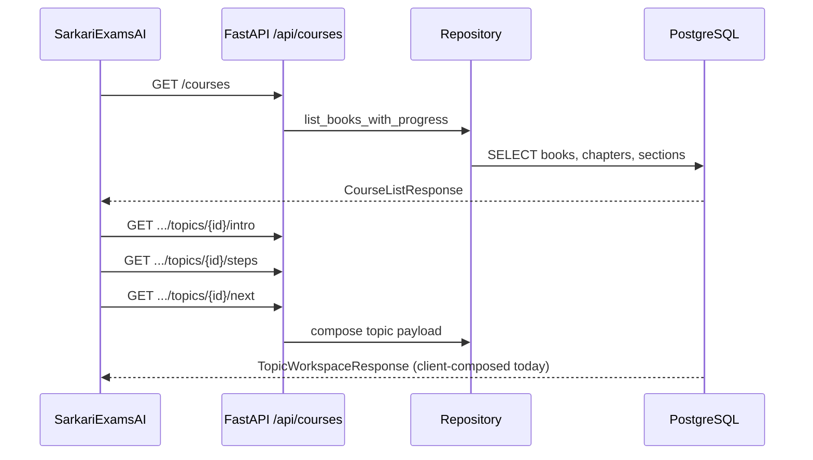

# 04 — Student APIs

| Field | Value |
|-------|-------|
| **Document ID** | WIKI-04 |
| **Owner** | Backend Platform Engineering |
| **Status** | Partial (courses implemented; practice/progress planned) |
| **Last updated** | 2026-07-10 |
| **OpenAPI** | `http://localhost:8000/docs` |

---

## Overview

Student APIs are the **contract between canonical knowledge and the learner PWA**. They translate low-level database rows into **screen-ready payloads** — optimized for the Topic Learning Workspace, not raw CRUD.

**Base path:** `/api/courses`  
**Implementation:** `knowledge-compiler/backend/routers/courses.py`  
**TypeScript mirror:** `sarkariexamsAI/src/data/api/coursesTypes.ts`

---

## Business Goal

Enable the Reader UI to:
1. List subjects and chapters in **one call**
2. Load a **complete topic workspace** with minimal round-trips
3. Support **on-demand step loading** for bandwidth-constrained users
4. Track **progress and continuation** across sessions (future)

---

## Architecture



### API design principles

| Principle | Why |
|-----------|-----|
| Screen-oriented responses | Reduces client glue code |
| Stable IDs in URLs | Cacheable, bookmarkable `/learn?topic=` |
| Pagination on heavy endpoints | `steps/{step_index}` for on-demand |
| No internal block IDs in student API | Leakage of ingestion complexity |
| Version header (future) | `X-API-Version: 1` |

---

## Data Flow

### Topic workspace composition (target)

```
GET /intro     → title, summary, cover, estimated_minutes
GET /steps     → ReadingStep[] (paragraphs, figures, highlights)
GET /next      → next topic ref + progress percent
[intelligence] → from exam_intelligence table (future)
               → today: derived from takeaways (API) or mock (UI)
```

**Current state:** Frontend `fetchTopicWorkspace()` composes intro + steps + next client-side. Backend does not yet expose a single `/workspace` endpoint.

---

## Endpoint reference

### `GET /api/courses`

| Field | Value |
|-------|-------|
| **Purpose** | Courses home — list all available books/subjects |
| **Auth** | Public (future: optional user context for progress) |
| **Response** | `CourseListResponse` |

**Example response:**
```json
{
  "courses": [
    {
      "book_id": "hist_class10",
      "title": "India and the Contemporary World - II",
      "subject": "History",
      "class_level": "10",
      "chapters_total": 5,
      "topics_total": 24,
      "progress_percent": 0
    }
  ]
}
```

**Tables:** `books`, `chapters`, `sections`, `reading_progress` (future)

---

### `GET /api/courses/{book_id}`

| Purpose | Chapter list with nested topic summaries |
| Response | `CourseDetailResponse` |
| Tables | `chapters`, `sections` |

---

### `GET /api/courses/{book_id}/chapters/{chapter_id}/topics/{topic_id}/intro`

| Purpose | Topic header card data |
| Response | `TopicIntroResponse` |

**Fields:**
| Field | Source |
|-------|--------|
| `title`, `topic_number` | `sections` |
| `summary` | First paragraph or overview text |
| `estimated_minutes` | Computed from paragraph word count |
| `cover_image_url` | First figure in topic (future) |
| `breadcrumb` | chapter + section titles |

---

### `GET /api/courses/{book_id}/chapters/{chapter_id}/topics/{topic_id}/steps`

| Purpose | Full reading content for topic |
| Response | `ReadingStepsResponse` |

**ReadingStep structure:**
```json
{
  "step_index": 1,
  "title": "The movement in the towns",
  "page_label": "pp. 32–35",
  "estimated_minutes": 3,
  "paragraphs": [
    {"paragraph_id": "P00042", "text": "…", "page": 32, "order": 1}
  ],
  "figures": [
    {"figure_id": "F00012", "caption": "Mahatma Gandhi", "image_url": "/figures/…"}
  ],
  "highlights": [
    {"term": "swaraj", "note": "Self-rule…", "kind": "term"}
  ],
  "takeaway": "Boycott of foreign goods hit British trade."
}
```

**Note:** `highlights` not yet served from API; sourced from `glossary_entries` + exam_intelligence in future.

---

### `GET /api/courses/.../steps/{step_index}`

| Purpose | Single step load (on-demand mode) |
| Indexing | 1-based `step_index` |
| Why | Mobile bandwidth; progressive reading |

---

### `GET /api/courses/.../topics/{topic_id}/next`

| Purpose | Next topic in canonical reading order |
| Response | `NextTopicResponse` with `has_next`, `next` ref |

---

### `GET /api/courses/{book_id}/continue`

| Purpose | Dashboard "continue reading" card |
| Status | **Placeholder** — returns first incomplete topic |
| Future | Uses `reading_progress` table |

---

## Planned endpoints (not implemented)

| Method | Path | Purpose |
|--------|------|---------|
| GET | `/api/courses/.../workspace` | Single-call TopicWorkspaceResponse |
| POST | `/api/courses/.../complete` | Record topic completion |
| GET | `/api/practice/sessions` | Start practice for topic |
| POST | `/api/practice/sessions/{id}/answer` | Submit MCQ answer |
| GET | `/api/analysis/root-causes` | Mistake analysis |

---

## Naming Standards

| Concept | URL param | DB column |
|---------|-----------|-----------|
| Book | `book_id` | `books.book_id` |
| Chapter | `chapter_id` | `chapters.chapter_id` |
| Topic | `topic_id` | `sections.section_id` |
| Subtopic | (internal) | `subsections.subsection_id` |

**Why `topic_id` not `section_id` in URL:** Student-facing vocabulary alignment.

---

## Validation Rules

| Rule | HTTP code |
|------|-----------|
| Unknown `book_id` | 404 |
| `topic_id` not in `chapter_id` | 404 |
| `step_index` out of range | 404 |
| Invalid UUID/path injection | 400 |

---

## Example Records

See `sarkariexamsAI/src/data/api/mockCourses.ts` for full authored examples including `ExamIntelligence`.

---

## Future Enhancements

| Enhancement | API impact |
|-------------|------------|
| `GET /workspace` | Reduces 3 calls → 1 |
| ETag caching | `If-None-Match` on steps |
| `?include=intelligence` | Optional exam intel payload |
| GraphQL federation | If mobile clients diversify |
| WebSocket progress sync | Real-time dashboard |

---

## Risks

| Risk | Mitigation |
|------|------------|
| Mock/API drift | Contract tests against OpenAPI |
| Large step payloads | Step pagination; figure CDN URLs |
| CORS in production | Netlify domain allowlist |
| Slow Supabase queries | Connection pooling; read replicas |

---

## Open Questions

1. Single `/workspace` endpoint vs keep granular endpoints?
2. Image URLs: relative vs signed S3 URLs?
3. Rate limiting per IP vs per user?
4. Cache TTL for immutable book content?

---

## Team ownership

| Endpoint group | Owner |
|----------------|-------|
| `/api/courses` | Backend Platform |
| `/api/practice` (future) | Assessment team |
| TypeScript types | Frontend (consumer) + Backend (publisher) |

---

## Testing strategy

| Test | Tool |
|------|------|
| OpenAPI schema validation | pytest + schemathesis |
| Response shape vs `coursesTypes.ts` | Contract test script |
| Topic order correctness | Fixture book golden test |
| Load test 100 concurrent topic reads | k6 |
| Mock parity test | Compare mock vs API for flagship topics |

---

## Migration strategy

| Phase | Action |
|-------|--------|
| Now | `VITE_USE_MOCK_COURSES=true` in production |
| Phase 1 | Deploy API to Supabase/RDS; CORS for Netlify |
| Phase 2 | Flip flag per subject after parity audit |
| Phase 3 | Add `/workspace`; deprecate 3-call compose |
| Phase 4 | `v2` API with intelligence + highlights from DB |

---

## API references

- Router: `knowledge-compiler/backend/routers/courses.py`
- Service: `knowledge-compiler/backend/services/courses_service.py` (if exists)
- Types: `sarkariexamsAI/src/data/api/coursesTypes.ts`
- Client: `sarkariexamsAI/src/data/api/coursesApi.ts`
