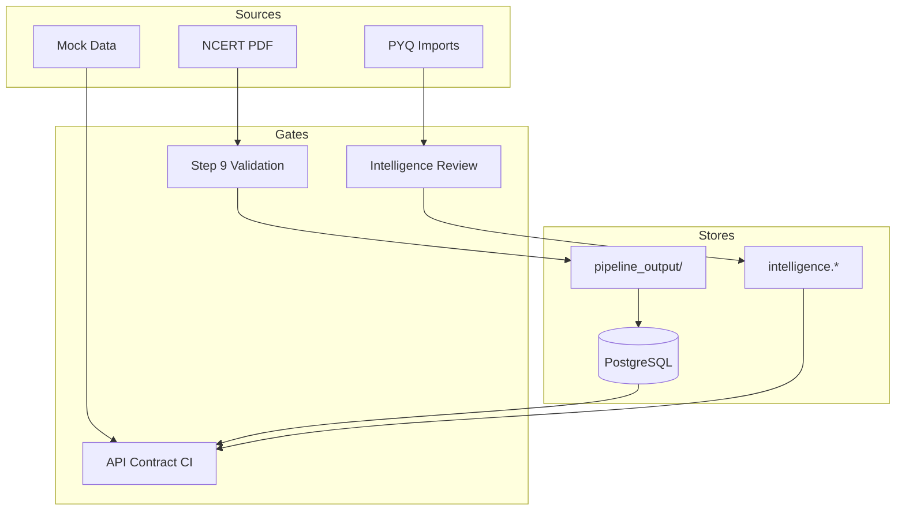

# 07 — Naming Standards & Data Governance

| Field | Value |
|-------|-------|
| **Document ID** | WIKI-07 |
| **Owner** | Platform Architecture |
| **Reviewers** | All Engineering Leads, Content Ops |
| **Status** | Draft v1 (enforced in new code) |
| **Last updated** | 2026-07-10 |
| **Applies to** | `knowledge-compiler/`, `sarkariexamsAI/`, `docs/wiki/` |

---

## Overview

This document defines **naming conventions, ID schemes, validation rules, versioning policy, and data governance** for SarkariExamsAI. Consistency here is not cosmetic — stable IDs propagate from PDF ingestion through PostgreSQL, knowledge graph edges, MCQ linkage, and client caches. A renamed ID breaks student progress, PYQ mappings, and bookmarks.

**Governance principle:** *IDs are immutable contracts; display labels may change.*

---

## Business Goal

Enable a 20-engineer organization to work in parallel without:
- Breaking API contracts between frontend and backend
- Forking content when books are re-ingested
- Losing audit trail when intelligence is updated
- Creating untraceable mock data that diverges from production schema

---

## Architecture

### Governance layers



### RACI (data governance)

| Activity | Content Ops | Data Platform | Backend | Frontend | Product |
|----------|-------------|---------------|---------|----------|---------|
| Book onboarding | **A** | R | C | I | C |
| ID scheme changes | C | **A** | R | R | C |
| Canonical load approval | **A** | R | C | I | I |
| Intelligence publish | **A** | C | R | I | C |
| API contract changes | I | C | **A** | R | C |
| Mock data maintenance | C | I | C | **A** | I |

*A = Accountable, R = Responsible, C = Consulted, I = Informed*

---

## Data Flow

### ID lifecycle

```
1. Step 6 Hierarchy Builder assigns section_id (e.g. SEC_2_1)
2. Step 7 assigns paragraph_id (e.g. P00312)
3. Step 10 embeds IDs in canonical JSON
4. Loader INSERT uses same PKs → PostgreSQL
5. Intelligence layer references section_id (never renames)
6. Student API exposes topic_id = section_id
7. Frontend caches by topic_id in progressStorage / Redux
8. Book re-ingest: DELETE+INSERT same IDs → progress preserved
```

**Breaking change protocol:** If an ID must change, create `id_mappings` table entry and migration script — never silent rename.

---

## Naming Standards

### Canonical content IDs

| Entity | Pattern | Regex | Example | Assigned in |
|--------|---------|-------|---------|-------------|
| `book_id` | `{subject}_class{n}` or `{subject}_{slug}` | `^[a-z][a-z0-9_]{2,63}$` | `hist_class10` | Upload / Step 1 |
| `chapter_id` | `CH_{roman\|number}` | `^CH_[A-Z0-9_]+$` | `CH_II` | Step 6 |
| `section_id` | `SEC_{ch}_{seq}` | `^SEC_[0-9]+_[0-9]+$` | `SEC_2_1` | Step 6 |
| `subsection_id` | `SUBSEC_{ch}_{s}_{ss}` | `^SUBSEC_` | `SUBSEC_2_1_1` | Step 6 |
| `paragraph_id` | `P{5-digit}` | `^P[0-9]{5}$` | `P00312` | Step 7 |
| `figure_id` | `FIG_{book}_{seq}` | `^FIG_` | `FIG_hist10_003` | Step 8 |
| `block_id` | `BLK_{page}_{seq}` | `^BLK_` | `BLK_032_014` | Step 3 |
| `run_id` | UUID v4 | UUID | `f47ac10b-…` | Ingestion run |
| `version_id` | UUID v4 | UUID | `6ba7b810-…` | book_versions |

**Why `SEC_` not `TOPIC_`:** Canonical pipeline predates product vocabulary. Student API maps `section_id` → `topic_id` in JSON responses only.

### Intelligence IDs (planned — WIKI-06)

| Entity | Pattern | Example |
|--------|---------|---------|
| `concept_id` | `CONCEPT_{book}_{slug}` | `CONCEPT_hist10_satyagraha` |
| `question_id` | `Q_{exam}_{subject}_{slug}_{seq}` | `Q_bpsc_hist_rowlatt_001` |
| `trap_id` | `TRAP_{section_id}_{slug}` | `TRAP_SEC_2_1_dates` |
| `highlight_id` | `HL_{section_id}_{slug}` | `HL_SEC_2_1_rowlatt` |
| `pattern_id` | `PYQ_{exam}_{year}_{seq}` | `PYQ_BPSC_2022_014` |

### API naming

| Rule | Good | Bad |
|------|------|-----|
| REST plural nouns | `/api/courses` | `/api/course` |
| Nested resources reflect hierarchy | `/courses/{book_id}/chapters/{chapter_id}/topics/{topic_id}` | `/api/getTopic` |
| Actions as sub-resources | `POST /practice/sessions` | `POST /startPractice` |
| snake_case in JSON | `topic_id`, `estimated_minutes` | `topicId` |
| Version in header (future) | `X-API-Version: 1` | `/api/v1/v2/courses` |

### Python (knowledge-compiler)

| Item | Convention | Example |
|------|------------|---------|
| Modules | `snake_case` | `step06_hierarchy_builder.py` |
| Classes | `PascalCase` + suffix | `SectionRow`, `CoursesService` |
| Functions | `snake_case` | `load_canonical_document` |
| Constants | `SCREAMING_SNAKE` | `MAX_BLOCKS_PER_PAGE` |
| Pipeline steps | `step{NN}_*.py` two-digit | `step10_canonical_json.py` |
| Routers | Plural resource | `routers/courses.py` |

### TypeScript (sarkariexamsAI)

| Item | Convention | Example |
|------|------------|---------|
| Components | `PascalCase.tsx` | `TopicWorkspace.tsx` |
| Hooks | `use` prefix | `usePrefersReducedMotion.ts` |
| Redux slices | `{feature}Slice.ts` | `learnSlice.ts` |
| Sagas | `{feature}Saga.ts` | `learnSaga.ts` |
| API types | `{Entity}Response` | `TopicWorkspaceResponse` |
| Feature folders | `src/features/{name}/` | `features/learn/` |
| Path alias | `@/` → `src/` | `import { palette } from "@/theme/tokens"` |

### File & artifact naming

| Artifact | Path pattern |
|----------|--------------|
| Pipeline output | `pipeline_output/{book_id}/step{N}_{name}.json` |
| Uploaded PDF | `uploads/{book_id}/{original_filename}` |
| SQL export | `exports/supabase/{NN}_{purpose}.sql` |
| Alembic migration | `{NNN}_{slug}.py` |
| Wiki doc | `{NN}-{kebab-title}.md` |
| ADR | `adr/{NNN}-{kebab-title}.md` |

### Git conventions

| Item | Convention |
|------|------------|
| Branch | `{type}/{ticket}-{slug}` — e.g. `feat/SEAI-142-workspace-api` |
| Commit | Conventional Commits: `feat(learn): add AnnotatedText highlights` |
| PR title | Same as squash commit message |
| Wiki changes | `docs(wiki): add WIKI-06 knowledge graph` |

---

## Validation Rules

### Canonical (Step 9 — enforced today)

| Rule ID | Description | On failure |
|---------|-------------|------------|
| `V-CAN-001` | Every section has ≥ 1 paragraph | Block Step 10 |
| `V-CAN-002` | `printed_start <= printed_end` for chapters | Block Step 10 |
| `V-CAN-003` | No orphan blocks (all blocks referenced or classified) | Warning / block |
| `V-CAN-004` | Figure files exist on disk | Block Step 10 |
| `V-CAN-005` | Hierarchy numbers monotonic within chapter | Block Step 10 |
| `V-CAN-006` | `book_id` matches across all entities | Block load |

### Database (enforced on load)

| Rule ID | Description |
|---------|-------------|
| `V-DB-001` | All FKs resolvable within same `book_id` |
| `V-DB-002` | `sort_order` unique per parent |
| `V-DB-003` | `validation_passed = true` before student API serves book |

### API contract (CI — target)

| Rule ID | Description |
|---------|-------------|
| `V-API-001` | OpenAPI response shapes match `coursesTypes.ts` |
| `V-API-002` | No breaking field removal without version bump |
| `V-API-003` | `topic_id` in responses equals `section_id` in DB |

### Intelligence (planned — WIKI-06)

| Rule ID | Description |
|---------|-------------|
| `V-INT-001` | Published MCQ has exactly one correct option |
| `V-INT-002` | Highlight `term` substring exists in paragraph |
| `V-INT-003` | `PREREQUISITE` graph is DAG |
| `V-INT-004` | Max 12 highlights per section |

### Mock data (frontend)

| Rule ID | Description |
|---------|-------------|
| `V-MOCK-001` | `mockCourses.ts` IDs must exist in canonical seed OR be tagged `synthetic: true` |
| `V-MOCK-002` | Mock response shapes must match `coursesTypes.ts` exactly |
| `V-MOCK-003` | Feature flag `VITE_USE_MOCK_COURSES` documented in `.env.example` |

---

## Versioning

### Book content versioning

| Field | Table | Purpose |
|-------|-------|---------|
| `run_id` | `ingestion_runs` | One pipeline execution |
| `version_id` | `book_versions` | Immutable snapshot metadata |
| `is_active` | `book_versions` | Which version Student API serves |
| `pipeline_version` | `ingestion_runs` | Git tag of pipeline code |

**Re-ingest policy:** New run → new `version_id` → QA → flip `is_active`. Old version retained 90 days for rollback.

### Intelligence versioning

| Field | Table | Purpose |
|-------|-------|---------|
| `pack_version` | `intelligence_packs` | Monotonic per book |
| `status` | all intelligence tables | `draft` / `published` / `archived` |

### API versioning

| Phase | Strategy |
|-------|----------|
| Now (v0.x) | No version prefix; breaking changes coordinated via deploy |
| Beta (v1) | `X-API-Version: 1` header; 6-month deprecation window |
| Scale (v2+) | `/api/v2/` only if header model insufficient |

### Schema migrations

- **Tool:** Alembic only — no manual prod DDL
- **Naming:** `00N_{verb}_{object}.py`
- **Review:** Data Platform + one domain owner
- **Rollback:** Every migration must document downgrade path or explicit "non-reversible" with backup plan

---

## Example Records

### book_id registry (excerpt)

| book_id | title | subject | class_level | status |
|---------|-------|---------|-------------|--------|
| `hist_class10` | India and the Contemporary World – II | History | 10 | loaded |
| `civics_class10` | Democratic Politics – II | Civics | 10 | planned |
| `geo_class10` | Contemporary India – II | Geography | 10 | planned |

### User-facing vs internal mapping

| UI label | API field | DB column |
|----------|-----------|-----------|
| Course | `book_id` | `books.book_id` |
| Chapter | `chapter_id` | `chapters.chapter_id` |
| Topic | `topic_id` | `sections.section_id` |
| Subtopic | `subsection_id` | `subsections.subsection_id` |

### Environment variable naming

| Prefix | Scope | Example |
|--------|-------|---------|
| `VITE_` | Frontend build-time | `VITE_USE_MOCK_COURSES` |
| `DATABASE_` | Backend DB | `DATABASE_URL` |
| `SUPABASE_` | Import scripts | `SUPABASE_DB_PASSWORD` |
| `OPENAI_` | Legacy AI path | `OPENAI_API_KEY` |

**Rule:** Never commit secrets. `.env.example` documents all vars with placeholder values.

---

## Folder Structure

```
Product/
├── docs/wiki/                    # Engineering wiki (this document set)
│   ├── adr/                      # Architecture Decision Records
│   ├── 00-…09-*.md
│   └── README.md
├── knowledge-compiler/
│   ├── alembic/versions/         # Schema migrations (numbered)
│   ├── backend/
│   │   ├── db/models.py          # Canonical ORM (naming reference)
│   │   ├── pipeline/step{NN}_*.py
│   │   └── routers/
│   ├── exports/supabase/         # SQL dumps (numbered)
│   └── pipeline_output/{book_id}/  # Per-book artifacts
└── sarkariexamsAI/
    └── src/
        ├── data/api/             # API types (contract mirror)
        └── features/{feature}/   # Feature modules
```

---

## Migration strategy

### Existing code alignment (2026 Q3)

| Area | Action | Owner |
|------|--------|-------|
| Mock IDs | Audit `mockCourses.ts` against `hist_class10` seed | Frontend |
| API field names | Ensure snake_case in all responses | Backend |
| Legacy AI schema | Mark `backend/models/schemas.py` as deprecated in README | Architecture |
| File store + DB | Document `books.json` as pipeline-only registry | Content Platform |

### ID mapping table (when unavoidable)

```sql
-- Planned: alembic 004_id_mappings.sql
CREATE TABLE id_mappings (
  old_id VARCHAR(128) PRIMARY KEY,
  new_id VARCHAR(128) NOT NULL,
  entity_type VARCHAR(32) NOT NULL,
  migrated_at TIMESTAMPTZ NOT NULL DEFAULT now()
);
```

---

## Future Enhancements

| Enhancement | Purpose |
|-------------|---------|
| JSON Schema for `step10_canonical.json` in CI | Validate artifacts before load |
| `openapi-typescript` codegen | Eliminate TS/Python drift |
| Lint rule: ID regex in pipeline tests | Catch bad IDs at Step 6 |
| Content Ops ID preview in admin UI | Show assigned IDs before load |
| Global slug registry | Prevent `book_id` collisions across subjects |

---

## Risks

| Risk | Mitigation |
|------|------------|
| Mock IDs diverge from DB | `V-MOCK-001` CI check |
| Informal renames in Content Ops | Publish checklist requires ID diff review |
| Multiple naming docs | This wiki is SSOT; deprecate scattered READMEs |
| Cross-repo renames | ADR required for any ID scheme change |

---

## Open Questions

1. Standardize `book_id` for non-NCERT sources (Lucent, Spectrum)?
2. Adopt monorepo tool (Nx/Turborepo) or keep polyrepo with shared types package?
3. Publish JSON Schema artifacts to npm for third-party integrators?
4. Hindi UI labels — separate `display_title_hi` column or i18n file?

---

## Related documents

- [WIKI-02 Deterministic Ingestion Pipeline](./02-deterministic-ingestion-pipeline.md)
- [WIKI-03 Canonical Database Schema](./03-canonical-database-schema.md)
- [WIKI-06 Knowledge Graph & Question Intelligence](./06-knowledge-graph-and-question-intelligence.md)
- [WIKI-08 Team Ownership, Testing & Operations](./08-team-ownership-testing-and-operations.md)
