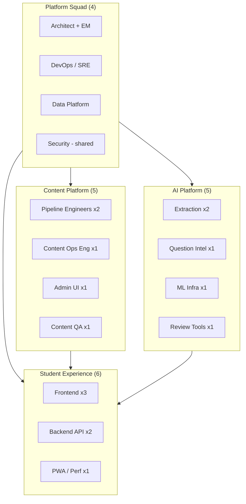
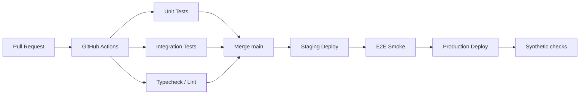

# 08 — Team Ownership, Testing & Operations

| Field | Value |
|-------|-------|
| **Document ID** | WIKI-08 |
| **Owner** | Engineering Operations / EM |
| **Reviewers** | Principal Architect, Engineering Leads |
| **Status** | Draft v1 |
| **Last updated** | 2026-07-10 |
| **Planning horizon** | 24 months, ~20 engineers |

---

## Overview

This document defines **how we organize teams, own services, test, deploy, and operate** SarkariExamsAI at production scale. It assumes growth from the current 2-repo monolith to a multi-squad platform without losing the *deterministic truth first* principle.

**Operational north star:** Students experience < 2s topic load p95; Content Ops can ingest a book without engineering on-call; deployments are reversible within 5 minutes.

---

## Business Goal

Ship reliably while parallelizing across:
- Content ingestion (pipeline + canonical store)
- Student experience (PWA + APIs)
- Intelligence (graph, MCQ, future tutor)
- Infrastructure (Postgres, CDN, jobs)

**Cost of failure:** Wrong facts in canonical path → reputational damage worse than downtime.

---

## Architecture

### Target squad model (20 engineers)



### Service ownership matrix

| Component | Primary squad | On-call | Repo path |
|-----------|---------------|---------|-----------|
| Ingestion pipeline Steps 1–10 | Content Platform | Content (business hours) | `knowledge-compiler/backend/pipeline/` |
| Canonical DB + migrations | Data Platform | Platform | `knowledge-compiler/backend/db/` |
| Canonical load API | Content Platform | Platform | `routers/canonical.py` |
| Student `/api/courses` | Student Experience (BE) | Student | `routers/courses.py` |
| `/api/practice` (planned) | Intelligence + Student BE | Student | `routers/practice.py` |
| Intelligence schema + jobs | AI Platform | AI Platform | `backend/intelligence/` |
| SarkariExamsAI PWA | Student Experience (FE) | Student | `sarkariexamsAI/` |
| Pipeline Admin UI | Content Platform | Content | `knowledge-compiler/frontend/` |
| PostgreSQL (Supabase/prod) | Platform / DevOps | Platform | External |
| Netlify CDN (PWA) | Student FE + DevOps | Student | External |
| Engineering wiki | Platform Architecture | N/A | `docs/wiki/` |

### Escalation path

```
L1: Squad on-call (15 min response)
        ↓
L2: Platform SRE + Squad lead (30 min)
        ↓
L3: Principal Architect + EM (1 hr)
        ↓
L4: Incident commander + Product (SEV-1 only)
```

---

## Data Flow

### Deployment flow (target CI/CD)



### Current state vs target

| Step | Current (2026-07) | Target (2026 Q4) |
|------|-------------------|------------------|
| Backend tests | `tests/test_step01_pdf_reader.py` only | pytest suite per router + pipeline |
| Frontend tests | Manual + build | Vitest + Playwright smoke |
| Deploy PWA | Manual `netlify deploy` | GitHub → Netlify on `main` |
| Deploy API | Manual / local | Railway or Fly.io + GH Actions |
| DB migrations | Manual Alembic | CI migrate staging → prod gate |
| Feature flags | `VITE_USE_MOCK_COURSES` | + server-side flags (future) |

---

## Environments

| Environment | Purpose | Frontend | Backend DB | Data |
|-------------|---------|----------|------------|------|
| **local** | Dev | `localhost:5173` | Docker Postgres | `pipeline_output/` + seed |
| **staging** | Pre-prod QA | `staging.*.netlify.app` | Supabase staging | Anonymized seed |
| **production** | Students | `guileless-crepe-c5261c.netlify.app` | Supabase prod | Full canonical |

**Rule:** No production writes from local machines except break-glass with EM approval.

---

## Testing strategy

### Test pyramid by layer

```
                    ┌─────────┐
                    │  E2E    │  Few, critical paths
                   ┌┴─────────┴┐
                   │ Integration│  API + DB, pipeline steps
                  ┌┴───────────┴┐
                  │    Unit     │  Pure functions, validators
                  └─────────────┘
```

### Layer-by-layer matrix

| Layer | What to test | Owner | Tool | CI gate |
|-------|--------------|-------|------|---------|
| **Pipeline Step 1** | PDF page count, text extraction | Content | pytest | ✅ exists |
| **Pipeline Steps 2–9** | Golden file diff per step | Content | pytest + fixtures | 🔲 add |
| **Step 10 canonical** | JSON Schema validation | Content | jsonschema | 🔲 add |
| **DB loader** | Transactional replace, FK integrity | Data | pytest + testcontainers | 🔲 add |
| **Repository** | Topic tree queries | Data | pytest | 🔲 add |
| **Courses API** | Response shape, 404 cases | Student BE | pytest + httpx | 🔲 add |
| **OpenAPI ↔ TS** | Contract drift | Student FE+BE | openapi-typescript | 🔲 add |
| **Redux slices** | Reducer pure logic | Student FE | Vitest | 🔲 add |
| **Sagas** | Mock API integration | Student FE | redux-saga-test-plan | 🔲 add |
| **TopicWorkspace** | Render with mock workspace | Student FE | Vitest + RTL | 🔲 add |
| **AnnotatedText** | Highlight regex, a11y | Student FE | Vitest | 🔲 add |
| **E2E happy path** | Landing → course → topic → complete | QA | Playwright | 🔲 add |
| **Intelligence publish** | DAG check, MCQ rules | AI | pytest | 🔲 planned |
| **Load** | 100 RPS `/workspace` | Platform | k6 | 🔲 quarterly |

### Critical user journeys (E2E must cover)

| ID | Journey | Priority |
|----|---------|----------|
| E2E-01 | Open PWA → select History → open topic → see workspace | P0 |
| E2E-02 | Tap smart highlight → popover appears | P0 |
| E2E-03 | Complete topic → next topic CTA | P1 |
| E2E-04 | Toggle mock off → live API loads topic | P1 |
| E2E-05 | Practice session start → submit → score | P1 (when API exists) |
| E2E-06 | Admin upload PDF → pipeline step 1 runs | P2 |

### Test data strategy

| Dataset | Location | Refresh |
|---------|----------|---------|
| Golden pipeline fixtures | `knowledge-compiler/tests/fixtures/{book_id}/` | Per pipeline version bump |
| DB seed (minimal) | `tests/seed/minimal_hist_class10.sql` | Weekly from exports |
| Frontend mock | `sarkariexamsAI/src/data/api/mockCourses.ts` | On API contract change |
| E2E env | Staging Supabase branch | Nightly reset |

---

## API references (operational)

| Service | Health check | Logs |
|---------|--------------|------|
| FastAPI | `GET /api/health` | stdout / Cloud provider |
| PostgreSQL | `GET /api/admin/db/health` | Supabase dashboard |
| Netlify PWA | `HEAD /` 200 | Netlify deploy logs |
| Pipeline | Step summary endpoints | `pipeline_output/` + admin UI |

### SLOs (production — target)

| Metric | SLO | Measurement |
|--------|-----|-------------|
| Topic workspace load (p95) | < 2.0s | RUM / Playwright |
| API availability | 99.5% monthly | Uptime check on `/api/health` |
| PWA availability | 99.9% monthly | Netlify + CDN |
| Pipeline step failure rate | < 5% per book | Ingestion run logs |
| Deploy rollback time | < 5 min | Drill quarterly |

---

## Release process

### Frontend (Netlify)

1. PR merged to `main` with passing CI
2. Netlify auto-build from `sarkariexamsAI/`
3. Deploy preview on PR; production on `main`
4. Verify: E2E-01 on production URL
5. Rollback: Netlify "Publish deploy" → previous deploy

### Backend (API)

1. PR merged with migration review if applicable
2. Deploy to staging; run integration tests
3. Alembic upgrade on staging
4. Manual QA sign-off (Content Ops for ingestion changes)
5. Production deploy + migrate
6. Rollback: redeploy previous image; downgrade migration only if safe

### Content (canonical load)

1. Pipeline Steps 1–10 pass Step 9
2. Content QA sign-off checklist
3. `POST /canonical/load` on staging
4. Student API smoke on 3 flagship topics
5. Production load during low-traffic window
6. Rollback: flip `book_versions.is_active` to previous version

### Feature flags

| Flag | Default (prod today) | Owner |
|------|----------------------|-------|
| `VITE_USE_MOCK_COURSES` | `true` | Student FE |
| `VITE_API_BASE_URL` | empty (relative) | Student FE |

**Cutover checklist for live API:** See WIKI-04 Open Questions.

---

## Monitoring & alerting (target)

| Signal | Tool | Alert |
|--------|------|-------|
| API 5xx rate | Provider APM | > 1% for 5 min |
| API latency p95 | APM | > 3s for 10 min |
| DB connections | Supabase | > 80% pool |
| Netlify build fail | Netlify notify | Any failure on `main` |
| Ingestion validation fail | Custom metric | Any Step 9 fail in prod load |
| Error boundary (FE) | Sentry (future) | New issue spike |

---

## Security & compliance

| Area | Policy |
|------|--------|
| Secrets | Vault / provider env vars; never in git |
| PII | Phone auth only; minimal retention |
| API auth | JWT (future); public read for catalog only after review |
| Admin routes | IP allowlist + auth in production |
| Dependencies | Dependabot weekly |
| NCERT content | Internal use; confirm licensing for public deployment |

---

## Incident severity

| SEV | Definition | Example | Response |
|-----|------------|---------|----------|
| SEV-1 | Product down or wrong canonical content live | Incorrect dates served to all users | Immediate rollback + comms |
| SEV-2 | Major feature broken | Topics won't load | Fix within 4 hrs |
| SEV-3 | Degraded | Highlights broken, reading works | Fix within 24 hrs |
| SEV-4 | Minor | Typo in mock data | Next sprint |

---

## Folder Structure (ops-relevant)

```
.github/workflows/          # Planned — ci.yml, deploy.yml
knowledge-compiler/
├── tests/                  # Backend tests
├── alembic/                # Migrations (review required)
└── exports/supabase/       # Disaster recovery SQL

sarkariexamsAI/
├── netlify.toml            # CDN deploy config
└── e2e/                    # Planned Playwright tests

docs/wiki/
├── adr/                    # Decision records
└── runbooks/               # Planned — incident playbooks
```

---

## Onboarding checklist (new engineer)

| Day | Task | Doc |
|-----|------|-----|
| 1 | Read WIKI-00, WIKI-01 | Vision + architecture |
| 1 | Clone repos, local docker up, run PWA | README files |
| 2 | Run pipeline Step 1 on sample PDF | WIKI-02 |
| 2 | Load canonical seed, hit `/api/courses` | WIKI-03, WIKI-04 |
| 3 | Trace LearnPage → TopicWorkspace | WIKI-05 |
| 5 | Pick squad; read squad-specific WIKI | 06–09 |
| 10 | First PR with test | This doc § Testing |

---

## Future Enhancements

| Enhancement | Squad |
|-------------|-------|
| GitHub Actions full CI | Platform |
| Staging environment auto-deploy | DevOps |
| Sentry + RUM | Student FE |
| Runbooks in `docs/wiki/runbooks/` | Eng Ops |
| Quarterly game days (rollback drills) | Platform |
| Status page for students | Product + DevOps |

---

## Risks

| Risk | Mitigation |
|------|------------|
| Single maintainer for pipeline | Bus factor doc + pair onboarding |
| No staging API | Prioritize staging in Q3 |
| Manual Netlify deploys | Wire CI this quarter |
| Mock prod default hides API bugs | Synthetic live-API check weekly |
| 20 engineers without CODEOWNERS | Add `.github/CODEOWNERS` per squad |

---

## Open Questions

1. Backend hosting: Railway vs Fly.io vs AWS ECS?
2. Single GitHub org vs mono-repo for `Product/`?
3. Dedicated QA headcount or squad-embedded QA?
4. On-call compensation / rotation for pre-PMF stage?
5. Supabase production tier and backup RPO/RTO targets?

---

## Related documents

- [WIKI-01 System Architecture](./01-system-architecture.md)
- [WIKI-04 Student APIs](./04-student-apis.md)
- [WIKI-07 Naming Standards & Data Governance](./07-naming-standards-and-governance.md)
- [ADR-001 Deterministic Ingestion First](./adr/001-deterministic-ingestion-first.md)
