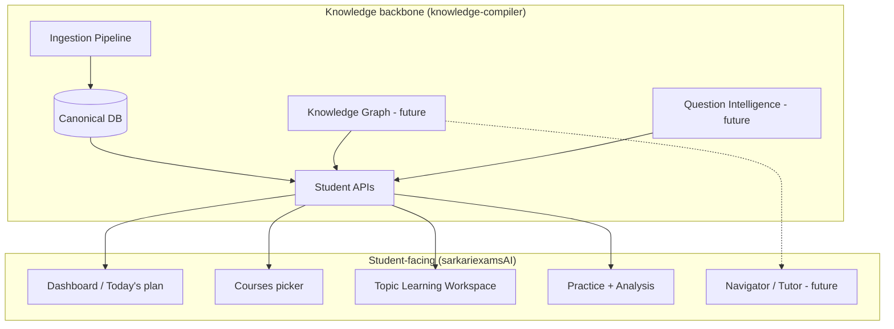
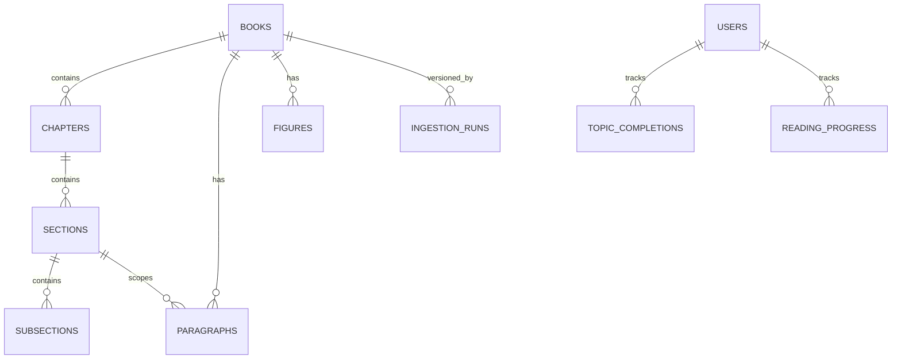

# 00 — Platform Vision & Product Strategy

| Field | Value |
|-------|-------|
| **Document ID** | WIKI-00 |
| **Owner** | Product (PM) + Principal Architect |
| **Reviewers** | Engineering Leads, Content Ops |
| **Status** | Draft v1 |
| **Last updated** | 2026-07-10 |

---

## Overview

SarkariExamsAI transforms government exam preparation from **content consumption** into **exam intelligence**. Students do not scroll endless PDFs or chat with a generic bot. They enter a **Topic Learning Workspace** — one screen that answers: *What is this? Why does BPSC ask it? What must I remember? What traps exist? What do I read next?*

The platform is built as a **Knowledge Intelligence Pipeline**, not a chat wrapper.

---

## Business Goal

### Primary goal
Help aspirants **pass government exams** (starting with BPSC Prelims + Mains) by delivering **canonical NCERT-aligned knowledge** with **exam-specific intelligence** at the topic level.

### Success metrics (12-month horizon)

| Metric | Target | Why it matters |
|--------|--------|----------------|
| Topic completion rate | > 60% of started topics | Measures workspace stickiness |
| D7 retention | > 35% | Habit formation |
| Practice accuracy lift | +15% after reading a topic | Proves read → practice loop |
| Time-to-first-topic | < 90 seconds | Onboarding friction |
| Content coverage | 3 subjects × full NCERT classes | Minimum viable catalog |
| PYQ tag coverage | > 80% of flagship topics | Exam intelligence credibility |

### Non-goals (explicit)

- We are **not** building a general-purpose AI tutor first.
- We are **not** cloning Unacademy/Byju's content library model (video-first).
- We are **not** allowing LLM-generated facts in the canonical reading path without human/validation gates.

---

## Product positioning

```
Traditional ed-tech          SarkariExamsAI
──────────────────          ──────────────────────────────
Video lectures               Canonical book truth
Chatbot answers              Exam intelligence workspace
Feature clutter              One Goal → One Screen → One Decision
Generic MCQ banks            PYQ-pattern-aware practice (planned)
```

### Target user persona: **Serious BPSC aspirant (Priya, 24)**

- Reads NCERT but forgets dates and linkages.
- Buys test series but doesn't know *why* she got PYQs wrong.
- Wants a **single screen** that tells her what matters for *her* exam.
- Uses phone 80% of the time; installs PWA to home screen.

### Jobs-to-be-done

1. **When** I open a topic, **I want** instant exam context, **so I** know what to focus on.
2. **When** I read, **I want** key terms highlighted, **so I** don't miss trap-worthy facts.
3. **When** I finish a topic, **I want** the next topic queued, **so I** maintain momentum.
4. **When** I practice, **I want** questions tied to what I just read, **so I** retain better.
5. **When** I review mistakes, **I want** root-cause analysis, **so I** fix gaps not symptoms.

---

## Architecture (product lens)

From the student's perspective, the product is four experiences powered by one knowledge backbone:



**Why this order matters:**  
The Reader UI is only as good as canonical data. Exam intelligence (PYQs, traps, memory anchors) must be **grounded in stable topic IDs** from ingestion — not invented per request.

---

## Data Flow (end-to-end)

```
1. Content Ops uploads NCERT PDF
2. Pipeline Steps 1–10 produce step10_canonical.json (deterministic)
3. Validation gate (Step 9) must pass before load
4. Canonical load → PostgreSQL (stable IDs: CH_I, SEC_1_2, P00042)
5. Offline jobs (future) extract concepts, link PYQs, build graph edges
6. Student API composes TopicWorkspace payload per topic_id
7. Reader UI renders reading + intelligence rail + smart highlights
8. Progress events → topic_completions (server, future)
9. Practice engine pulls question sets by topic_id + difficulty
```

---

## ER Diagram (conceptual — full detail in WIKI-03)



---

## Folder Structure (product-relevant)

```
Product/
├── knowledge-compiler/     # Ingestion + APIs + admin
├── sarkariexamsAI/         # Learner PWA
└── docs/wiki/              # This wiki
```

---

## Naming Standards (product)

| Concept | User-facing term | Internal ID |
|---------|------------------|-------------|
| Book | Course / Subject | `book_id` (e.g. `hist_class10`) |
| Chapter | Chapter | `chapter_id` (e.g. `CH_III`) |
| Section | Topic | `section_id` |
| Subsection | Subtopic | `subsection_id` |
| Reading step | Section (in workspace) | `step_index` |

**Why:** NCERT uses "chapter" and "section" differently than our UI. We expose **Topic** to students while preserving canonical hierarchy in APIs.

---

## Validation Rules (product)

| Rule | Enforcement |
|------|-------------|
| A topic must have ≥ 1 paragraph before publish | Pipeline Step 9 + editorial gate |
| Exam intelligence required for flagship topics | Content Ops checklist |
| PYQ references must cite exam + year when available | Manual review until automated |
| Images must have caption or alt text | Pipeline Step 8 |
| No topic ships with broken next-link | API integration test |

---

## Example Records (student view)

**Topic:** Non-Cooperation Movement (`section_id: SEC_2_3`)

Student sees:
- **What matters:** 2 bullet key points
- **Read:** 2 sections with smart highlights on *swaraj*, *Rowlatt Act*, *1920*
- **How BPSC tests it:** Prelims MCQ pattern + Mains analytical frame
- **Remember:** Memory anchors
- **Avoid:** Common traps (e.g. confusing Khilafat timeline)
- **Up next:** Civil Disobedience Movement

---

## Future Enhancements

| Phase | Capability | Business value |
|-------|------------|----------------|
| P1 | Live API + server progress | Cross-device continuity |
| P1 | BPSC PYQ bank linked to topics | Credibility |
| P2 | Adaptive practice | Personalization |
| P2 | Knowledge graph visualizer | Deep understanding |
| P3 | Grounded AI tutor (Navigator) | Doubt resolution without hallucination |
| P3 | Offline PWA reading | Low-connectivity users |
| P4 | Multi-exam packs (UPSC, SSC) | Revenue expansion |

---

## Risks

| Risk | Impact | Mitigation |
|------|--------|------------|
| Mock data diverges from API | Broken production UX | Contract tests; staged API cutover |
| Over-reliance on AI for facts | Student trust loss | Offline extraction + human review |
| NCERT copyright / licensing | Legal | Use licensed sources; attribute figures |
| Scope creep (10 exam types) | Delayed BPSC excellence | BPSC-first GTM |
| Pipeline fails on scanned PDFs | Content gaps | Embedded-text-only policy; OCR as separate project |

---

## Open Questions

1. Freemium vs subscription — which topics are free?
2. Do we brand as "SarkariExamsAI" or exam-specific sub-brands (BPSC AI)?
3. Community features (notes, discussions) — in scope or not?
4. Hindi UI — parallel content or translation layer?
5. Who owns exam intelligence authoring — Content Ops or ML team?

---

## Team ownership

| Area | DRI | Backup |
|------|-----|--------|
| Product vision & roadmap | PM | Principal Architect |
| Exam intelligence content | Content Ops Lead | Subject Matter Experts |
| Reader UX | Frontend Lead | Product Design |
| API contracts | Backend Lead | Platform Architect |

---

## Testing strategy (product acceptance)

| Test type | Owner | Frequency |
|-----------|-------|-----------|
| Topic workspace smoke (5 flagship topics) | QA | Every release |
| Mobile PWA install + read flow | QA | Every release |
| Exam intelligence completeness audit | Content Ops | Per subject onboard |
| Student journey funnel (signup → topic complete) | Product Analytics | Weekly |
