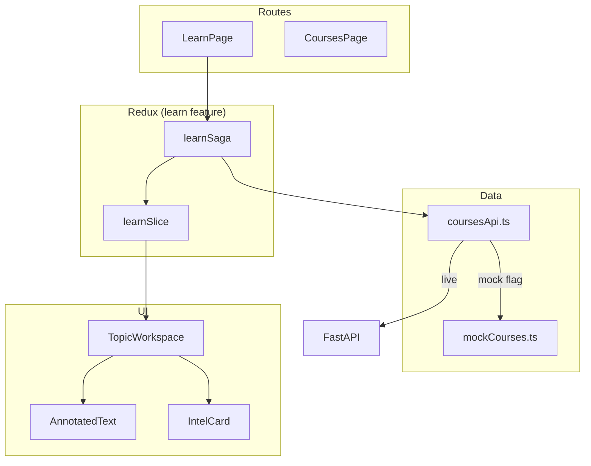

# 05 — Reader UI Architecture

| Field | Value |
|-------|-------|
| **Document ID** | WIKI-05 |
| **Owner** | Frontend Engineering |
| **Status** | Implemented (mock-backed, deployed) |
| **Production URL** | https://guileless-crepe-c5261c.netlify.app |
| **Last updated** | 2026-07-10 |

---

## Overview

The Reader UI is the **primary student experience** in SarkariExamsAI. It is not a PDF viewer or chat interface. The flagship screen is the **Topic Learning Workspace** — a single view combining canonical reading, exam intelligence, smart highlights, and next-step navigation.

**Stack:** React 18, TypeScript 5.6, MUI v6, Redux Toolkit, redux-saga, Vite 5, PWA

---

## Business Goal

Deliver *One Goal → One Screen → One Decision*:
- Student opens a topic and immediately knows **what matters for BPSC**
- Reading is **guided** (highlights, takeaways), not passive
- Completing a topic leads to **one clear next action**

---

## Architecture



### Feature module pattern

```
src/features/learn/
├── pages/LearnPage.tsx          # Route orchestration
├── components/
│   ├── TopicWorkspace.tsx       # Main workspace layout
│   └── AnnotatedText.tsx        # Smart highlights
└── state/
    ├── learnSlice.ts            # workspace state
    └── learnSaga.ts               # fetchTopicWorkspace
```

**Why feature-sliced:** Each screen owns its Redux slice. Cross-feature wiring only in `app/rootReducer.ts` and `app/rootSaga.ts`.

---

## Data Flow

### Page load sequence

```
1. User navigates to /learn?book=hist_class10&chapter=CH_III&topic=SEC_3_2
2. LearnPage dispatches loadTopicWorkspace({ bookId, chapterId, topicId })
3. learnSaga calls fetchTopicWorkspace()
4. If VITE_USE_MOCK_COURSES=true → mockCourses.ts
   Else → parallel GET intro + steps + next from API
5. loadTopicWorkspaceSuccess(workspace) → TopicWorkspace renders
```

### TopicWorkspace layout

```
┌─────────────────────────────────────────────────────────────┐
│ Header: breadcrumb, title, progress, back                   │
├──────────────────────────────┬──────────────────────────────┤
│ LEFT: Read the topic         │ RIGHT: Exam intelligence    │
│  - Hint: tap glowing terms   │  - How BPSC tests it (PYQs) │
│  - Section 1 (AnnotatedText) │  - Why it matters           │
│  - Figures                   │  - Remember this            │
│  - Section 2                 │  - Avoid these traps        │
│  - Takeaway chips            │  - Up next                  │
├──────────────────────────────┴──────────────────────────────┤
│ Footer: Mark complete | Practice | Back to courses          │
└─────────────────────────────────────────────────────────────┘
```

---

## Key components

### `TopicWorkspace`

| Responsibility | Detail |
|----------------|--------|
| Layout | 2-column desktop; stacked mobile |
| Intelligence rail | Color-coded `IntelCard` components |
| Navigation | Scroll-to-section refs; complete & advance |
| Figures | `FigureBlock` with lazy load + error fallback |

### `AnnotatedText` (Smart Highlights)

| Attribute | Detail |
|-----------|--------|
| **Purpose** | Inline exam-critical terms with micro-popovers |
| **UX pattern** | Highlighter marker + pulse-on-view + tooltip |
| **Accessibility** | `prefers-reduced-motion` disables pulse; keyboard focusable |
| **Data** | `TextHighlight[]` per `ReadingStep` |
| **Kinds** | `date`, `term`, `person`, `fact` — color-coded |

**Why pulse-on-view (not continuous blink):** Industry best practice (Duolingo, Notion) — attention cue without fatigue or motion-sickness risk.

### State: `TopicWorkspaceResponse`

```typescript
interface TopicWorkspaceResponse {
  book_id, chapter_id, topic_id: string;
  title, summary, breadcrumb: string[];
  sections: ReadingStep[];
  intelligence: ExamIntelligence;
  has_next: boolean;
  next: NextTopicRef | null;
  progress: { topics_completed, topics_total, percent_complete };
}
```

---

## Folder Structure

```
sarkariexamsAI/src/
├── app/                         # Store, root saga
├── features/learn/              # Reader feature
├── data/api/
│   ├── coursesApi.ts            # fetch + mock flag
│   ├── coursesTypes.ts          # API contract types
│   └── mockCourses.ts           # Authored content (~1600 lines)
├── components/
│   ├── layout/AppLayout.tsx     # Shell + nav
│   └── ui/SectionCard.tsx
├── theme/tokens.ts              # Design system
└── routes/AppRoutes.tsx
```

---

## Naming Standards

| Item | Convention |
|------|------------|
| Components | PascalCase (`TopicWorkspace`) |
| Redux actions | camelCase verb (`loadTopicWorkspace`) |
| Saga handlers | `handle` + action name |
| CSS | MUI `sx` prop; tokens from `palette.*` |
| Routes | `/learn` with query params |

---

## Validation Rules

| Rule | Enforcement |
|------|-------------|
| Required query params for LearnPage | Redirect to `/courses` if missing |
| Workspace null during load | `LinearProgress` skeleton |
| Error state | `Alert` with retry |
| Image load failure | Placeholder in `FigureBlock` |
| Empty highlights array | `AnnotatedText` renders plain text |

---

## Example Records

Flagship mock topic: **Non-Cooperation Movement** (`SEC_3_2` in History Class 10)

Intelligence payload:
```json
{
  "key_points": ["Boycott hit British trade in towns", "Peasants joined with own swaraj meanings"],
  "why_it_matters": "BPSC asks cause-effect and Gandhian strategy distinctions.",
  "exam_focus": ["1920–22 timeline", "Khilafat merger", "Withdrawal after Chauri Chaura"],
  "pyqs": [{"question": "…", "exam": "BPSC Prelims", "type": "MCQ"}],
  "remember": [{"label": "Jan 1921 launch", "hook": "After Jallianwala + Rowlatt"}],
  "avoid": ["Don't confuse with Civil Disobedience 1930"]
}
```

---

## Deployment

| Setting | Value |
|---------|-------|
| Host | Netlify |
| Build | `npm run build` → `dist/` |
| SPA | `_redirects` + `netlify.toml` |
| Mock flag | Default `true` (no backend dependency) |
| Node | 20 |

---

## Future Enhancements

| Feature | Priority |
|---------|----------|
| Live API cutover | P0 |
| Server progress sync | P0 |
| Offline reading (service worker cache) | P1 |
| Audio narration per section | P3 |
| Student notes on highlights | P2 |
| Graph mini-map per topic | P2 |
| Hindi UI | P2 |

---

## Risks

| Risk | Mitigation |
|------|------------|
| Mock diverges from API | Contract tests |
| Large bundle size | Manual chunks (react, mui, redux, motion) |
| MUI not RN-compatible | Documented migration path in README |
| Tooltip UX on mobile | `enterTouchDelay={0}` |

---

## Open Questions

1. Collapse intelligence rail on mobile into tabs vs accordion?
2. Show PYQ cards before or after reading?
3. Gamification (streaks) on topic complete?
4. Dark mode default for reading?

---

## Team ownership

| Area | Owner |
|------|-------|
| TopicWorkspace UX | Frontend + Product Design |
| AnnotatedText / highlights | Frontend |
| Mock content authoring | Content Ops |
| API integration | Frontend + Backend |

---

## Testing strategy

| Test | Status |
|------|--------|
| TypeScript strict | ✅ `tsc -b` |
| ESLint | Configured |
| Unit tests (AnnotatedText) | Planned |
| Visual regression (Chromatic) | Planned |
| E2E Learn flow (Playwright) | Planned |
| a11y audit (axe) | Planned |

---

## API references

- Consumer: `src/data/api/coursesApi.ts`
- Types: `src/data/api/coursesTypes.ts`
- Backend contract: [04 — Student APIs](./04-student-apis.md)

---

## Migration strategy

| Step | Action |
|------|--------|
| 1 | Deploy API; set `VITE_API_BASE_URL` in Netlify env |
| 2 | `VITE_USE_MOCK_COURSES=false` for staging |
| 3 | Parity audit: 5 flagship topics mock vs API |
| 4 | Production cutover per subject |
| 5 | Move exam intelligence from mock to DB table |
