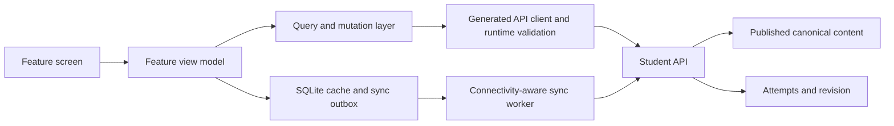
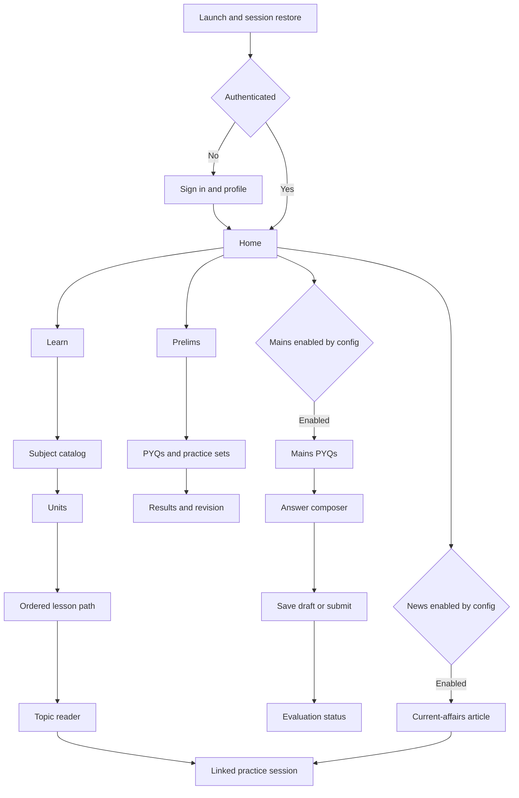
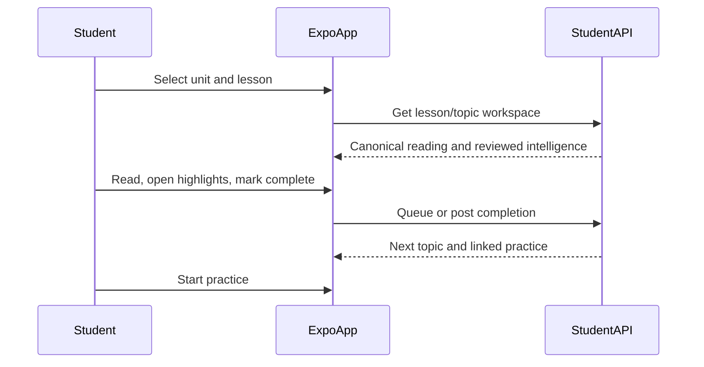

# 01 — Expo UI Architecture

| Field | Value |
|---|---|
| Status | Production architecture decision record |
| Client | Separate Expo / React Native application |
| Target | iOS and Android |
| API source | SarkariExamsAI Student APIs |
| Release scope | Production core: authenticated Home → Learn → Prelims → revision |
| Related plan | [Mobile MVP Production Plan](./functional-requirement-planning.md) |

## Architecture principles

1. Build an original, BPSC-first mobile UI; use supplied screenshots only as internal interaction-pattern references.
2. Keep one dominant action per screen and do not surface unavailable features as active destinations.
3. Treat the app as an API client: never access ingestion, AI-worker, validation, or database internals directly.
4. Separate server state, durable device state, and transient UI state; do not introduce a global store for server data.
5. Make reading, completion, and in-progress practice resilient to unreliable connectivity.
6. Render only published, human-reviewed, source-backed content and exam intelligence.
7. Use progressive delivery, privacy-safe telemetry, and an explicit rollback path for every production release.

## Production client stack

| Concern | Decision | Rationale |
|---|---|---|
| Runtime and native delivery | Expo managed workflow with development builds and EAS Build/Submit | Keeps native surface controlled while supporting real-device QA and store delivery; Expo Go is not a production test environment |
| App shell and routing | Expo Router with typed routes and protected route groups | File-based navigation, deep links, and authenticated/unauthenticated boundaries |
| Server state | TanStack Query with persisted query metadata only where safe | Centralises retries, cancellation, cache invalidation, and stale-data handling without duplicating API data in a global store |
| API contract | OpenAPI-generated TypeScript client plus runtime response validation at the boundary | Prevents web/mobile contract drift and rejects malformed or unpublished payloads before feature code uses them |
| Device credentials | Expo SecureStore | OS-backed storage for refresh/session credentials; tokens never enter Redux, analytics, or logs |
| Durable local data | SQLite for reading cache, sync outbox, resumable practice state, and Mains drafts | Supports transactional, queryable offline state and survives process termination |
| Network and sync | Connectivity-aware outbox worker with idempotency keys and backoff | Makes completion, answer, and draft retries safe instead of best-effort UI retries |
| Form state | Local component state with schema-validated form models | Keeps answer writing and validation isolated from navigation/global state |
| Observability | OpenTelemetry-compatible event interface plus crash/error reporting | Maintains vendor portability while capturing privacy-safe funnel, performance, and failure evidence |
| Remote configuration | Versioned `GET /api/mobile/config` feature flags and kill switches | Allows Mains, News, and risky flows to be enabled or disabled without a new binary |
| Updates | EAS Update for compatible JavaScript/assets; store release for native/runtime changes | Avoids delivering an incompatible OTA update to an older native binary |

These are architectural decisions for implementation. Exact package versions are selected when the Expo project is created and must be pinned in its lockfile.

## Architecture boundaries and state model



| State type | Owner | Storage rule | Examples |
|---|---|---|---|
| Server state | TanStack Query | Cache is disposable and revalidated by `content_version`/ETag | Home, catalog, topic workspace, result, revision queue |
| Durable device state | SQLite | Versioned, encrypted where sensitive, and reconciled with the server | Opened reading cache, outbox records, selected answer, Mains draft |
| Session state | Session provider | Tokens in SecureStore; only derived authenticated status is in memory | signed-in state, learner ID, expiry/refresh state |
| Transient UI state | Feature-local component state | Never persist unless the product requirement explicitly needs recovery | modal visibility, current tab, unsaved field focus |
| Remote configuration | Config provider | Cache with expiry; retain last known safe configuration | enabled destinations, maintenance mode, kill switches |

### Module rules

- A feature may call only its own view model/hooks; screens do not call `fetch` directly.
- The generated API client is the only HTTP entry point. Feature code consumes domain-shaped adapters, not raw response payloads.
- Shared UI primitives cannot import feature code or API clients.
- A durable mutation is written to the outbox before network submission. The UI reflects `queued`, `syncing`, `synced`, or `failed` state.
- Completion remains monotonic, submitted MCQ answers remain immutable, and Mains drafts use server revision checks.

## Navigation map



Production core exposes Home, Learn, and Prelims. Mains is visible only after its API/content readiness gate passes. News remains disabled until reviewed source-linked current-affairs content is operational. A disabled feature must not appear as a broken navigation destination.

## Screen specification

| Screen | Primary action | Required data | Important states | Functional requirement |
|---|---|---|---|---|
| Launch/auth | Restore session or sign in | session expiry, learner profile, app config | signed out, expired, refresh failed, maintenance | FR-01–03 |
| Home | Resume one task | continuation, daily plan, weak topics, enabled destinations | first-time, empty plan, stale cache, unavailable capability | FR-04–06 |
| Subject catalog | Choose a subject | published books/subjects and progress | loading, unavailable subject, no published content | FR-07 |
| Units | Choose a unit | grouped units, progress, search index | search empty, soft prerequisite state | FR-07, FR-11 |
| Lesson path | Start/resume a lesson | lesson ordering, durations, practice checkpoints | incomplete, completed, offline | FR-07, FR-09–11 |
| Topic reader | Read and mark complete | canonical paragraphs, figures, highlights, citations, content version | step loading, unavailable figures, offline copy, stale content | FR-08–10 |
| Prelims hub | Start selected practice | PYQs, MCQs, revision areas, practice configuration | no questions for filter, service unavailable | FR-12–14 |
| Practice session | Answer one question | question, source, stage, timer/marking policy, attempt state | queued answer, network interruption, submitted, session expired | FR-14–15 |
| Results/revision | Choose next revision | accuracy, mistakes, related topics, reason code | insufficient data, results pending | FR-16–17 |
| Mains hub/PYQs | Select a question | stages, papers, filters, feature enabled flag | hidden when disabled, empty filter result | FR-18 |
| Answer composer | Save draft or submit | question, word/mark guidance, draft revision | offline draft, conflict, submit failure | FR-19 |
| Evaluation status | See reviewed feedback state | evaluation status, rubric/citations when approved | pending, unavailable, not enabled | FR-20 |
| News/article | Read current affairs | source, tags, article, practice links, feature enabled flag | hidden when disabled, stale content, source unavailable | Fast follow |

## Learn flow

The high-value learning sequence is a mobile translation of the current Topic Learning Workspace, not a raw PDF reader:



## API, caching, and sync architecture

### Contract boundary

1. Generate the API client from the versioned Student API schema in CI; do not hand-copy web types.
2. Validate critical responses at runtime before they enter feature state: session/profile, app configuration, workspace, practice session, result, revision, and Mains draft.
3. Require stable IDs, `content_version`, `updated_at`, stage, and source/citation fields where the backend contract requires them.
4. Convert transport responses to feature-owned domain models in an adapter layer. UI components must not depend on endpoint-specific field names.
5. Treat an invalid or unpublished response as a recoverable content/API error, record a request ID, and never render it as learner-facing truth.

### Read policy

| Data | Cache policy | Offline policy |
|---|---|---|
| Mobile configuration | Short TTL; retain last known safe config | Default to the safe feature set when config cannot refresh |
| Catalog and topic metadata | Versioned cache with revalidation | Render previously published metadata with offline timestamp |
| Reading steps and figures | Cache by topic/step/content version | Render only previously opened, versioned content |
| Home and progress | Short-lived server cache | Clearly label stale data; never fabricate progress |
| Practice question set | Server session is authoritative | Persist active session and answer selection locally; resume when possible |
| Results/revision | Server-authoritative result cache | Show last fetched result as stale; do not recompute score locally |

### Mutation/outbox policy

| Mutation | Device record | Retry and conflict rule |
|---|---|---|
| Topic completion | topic ID, mutation ID, created time | Idempotent; completion is monotonic |
| MCQ answer | session ID, question ID, selected answer, mutation ID | Persist before submit; never retry a final answer without the original idempotency key |
| Mains draft | attempt ID, encrypted draft, local revision | Reconcile against server revision; prompt before overwriting newer remote draft |
| Mains submit | attempt ID, draft revision, mutation ID | Stop automatic retry on validation conflict; require learner confirmation |

The outbox worker runs on app foreground, connectivity restoration, explicit retry, and safe background opportunities supported by the operating system. It must use bounded exponential backoff and surface a visible recoverable failure after the retry limit.

## Design system guidance

- Support light and dark themes from the start; do not inherit another product’s colors, icons, or visual brand.
- Use semantic tokens: `surface`, `surfaceRaised`, `textPrimary`, `textMuted`, `accent`, `success`, `warning`, `danger`, and `focus`.
- Use a readable Devanagari-capable font fallback when Hindi is enabled; never use image text for learning content.
- Keep navigation labels stable: Home, Learn, Prelims, Mains, News.
- Provide touch targets of at least 44 × 44 points, visible focus states for external keyboards, and accessible screen-reader labels.
- Do not rely on color alone for correct/incorrect MCQ feedback or practice strength.

## Offline and recovery behavior

| Scenario | Required behavior |
|---|---|
| Recently opened lesson offline | Render cached canonical content with an “offline copy” timestamp |
| Completion action offline | Queue idempotent completion event; reconcile on next connection |
| MCQ submission interrupted | Persist selected option and attempt state locally; prevent duplicate submit |
| Mains draft offline | Save encrypted/local draft, clearly show it is not submitted |
| Cached content changes | Revalidate with version/ETag; invalidate stale content safely |
| API error | Show retry with screen-specific fallback, not a blank application state |

## Recommended feature structure

```text
mobile/
├── app/                  # Expo Router routes, protected groups, deep links
│   ├── (public)/         # sign-in and profile completion
│   ├── (app)/            # authenticated Home, Learn, Prelims
│   └── _layout.tsx       # providers, error boundary, navigation shell
├── src/
│   ├── core/
│   │   ├── auth/         # session restore, refresh, SecureStore adapter
│   │   ├── config/       # feature flags, kill switches, maintenance mode
│   │   ├── contracts/    # generated client, runtime validators, adapters
│   │   ├── network/      # request policy, connectivity, request IDs
│   │   └── observability/ # telemetry and crash/error reporting boundary
│   ├── features/
│   │   ├── home/
│   │   ├── learn/
│   │   ├── prelims/
│   │   ├── mains/        # conditional feature flag
│   │   ├── news/         # fast-follow feature flag
│   │   └── profile/
│   ├── shared/
│   │   ├── components/   # accessible UI primitives only
│   │   ├── theme/        # tokens, typography, motion
│   │   └── accessibility/ # labels, focus, semantic helpers
│   ├── storage/
│   │   ├── cache/        # versioned content cache
│   │   ├── outbox/       # durable mutations and sync worker
│   │   └── migrations/   # SQLite schema migrations
│   └── test/
│       ├── fixtures/     # contract-valid API fixtures
│       └── helpers/
├── tests/
│   ├── integration/      # feature + mocked contract tests
│   └── e2e/              # device journeys and offline recovery
└── .github/workflows/    # typecheck, tests, contract validation, build gates
```

## Security, observability, and delivery

### Security rules

- Store refresh/session credentials in SecureStore only; never in SQLite, AsyncStorage, screenshots, or telemetry.
- Do not bundle backend secrets, service-role keys, provider private keys, or content-access enforcement logic in the app.
- Require server-side authorization for learner progress, sessions, Mains drafts, and entitlements.
- Encrypt sensitive local drafts where the platform supports it; clear protected local data on explicit sign-out.
- Redact answer text, phone numbers, tokens, and personally identifiable information before error reporting.

### Observability rules

- Emit privacy-safe funnel events defined in the production plan: activation, Home next-action exposure, lesson open/complete, practice start/submit, revision action, and conditional Mains draft/submit.
- Attach app version, runtime version, network state, API request ID, and feature-flag snapshot to errors; do not attach raw learner content.
- Track crash-free sessions, authentication refresh failures, contract-validation failures, outbox age, retry exhaustion, and API latency/error rate.
- Alert on a material increase in crashes, authentication failures, answer-sync failures, or unpublished-content responses before expanding a staged rollout.

### Delivery rules

| Release surface | Required control |
|---|---|
| Pull request | Typecheck, lint, unit/integration tests, contract-fixture validation, and accessibility checks |
| Internal build | Development build distributed to QA with test environment configuration |
| Closed beta | Production-like API, approved content set, telemetry/consent review, and device-journey tests |
| Store release | Versioned native build, changelog, privacy/store metadata, rollback owner, and staged rollout configuration |
| OTA update | Compatible runtime only; no native-module, permission, or schema-breaking assumption |
| Emergency rollback | Disable feature via remote config where possible, halt rollout, preserve the outbox, and communicate recovery status |

## QA acceptance criteria

- Contract tests verify all production-core screens against generated types and runtime validation fixtures.
- A learner can restore a session, complete Home → lesson → topic completion → linked Prelims practice → revision action using only a phone.
- Lesson ordering, stable IDs, content versions, citations, and next-topic behavior match the canonical API hierarchy.
- Prelims questions always show their selected/submitted state correctly after interruption, retry, app restart, and stale-cache recovery.
- Mains drafts are never silently lost; conflicting server revisions require a learner decision.
- Dynamic font size, screen-reader labels, dark theme, keyboard focus, slow-network, offline, and API-error states are covered by QA.
- Feature flags correctly hide or safely disable Mains and News when their production readiness gates are not met.
- No raw answer text, tokens, or personal data appear in analytics and error-reporting test captures.
