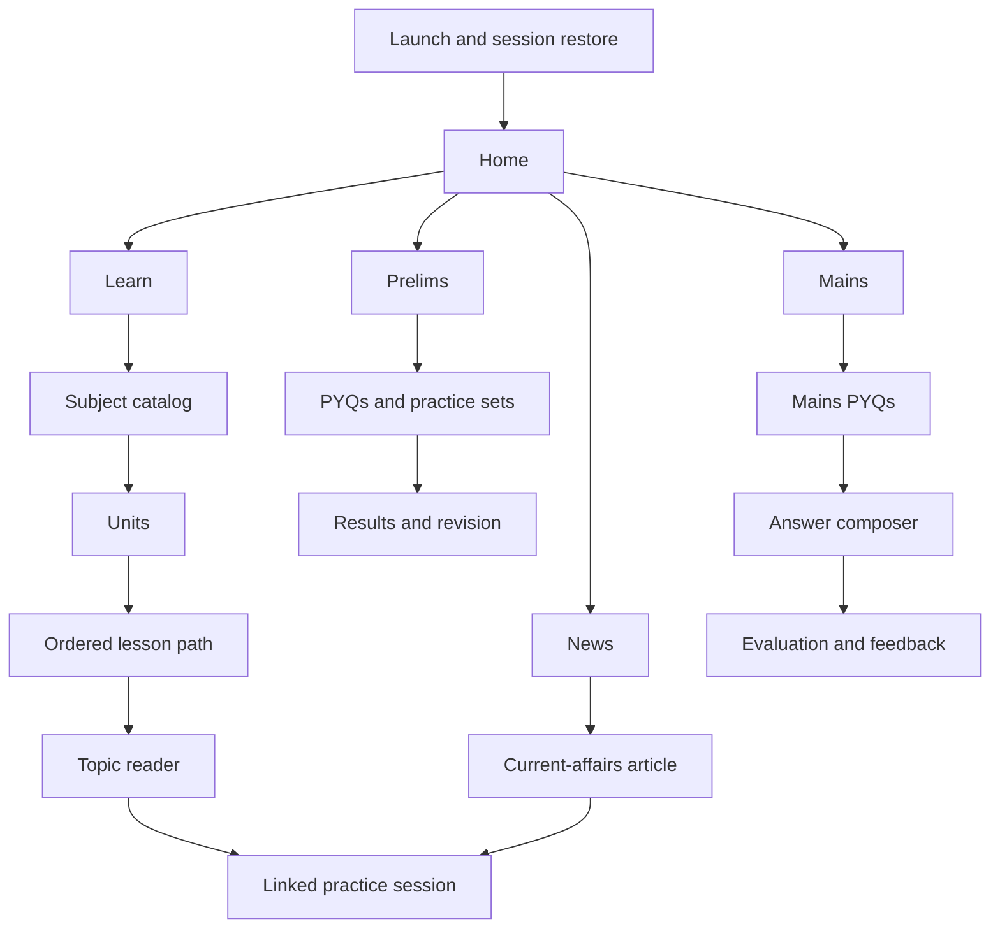
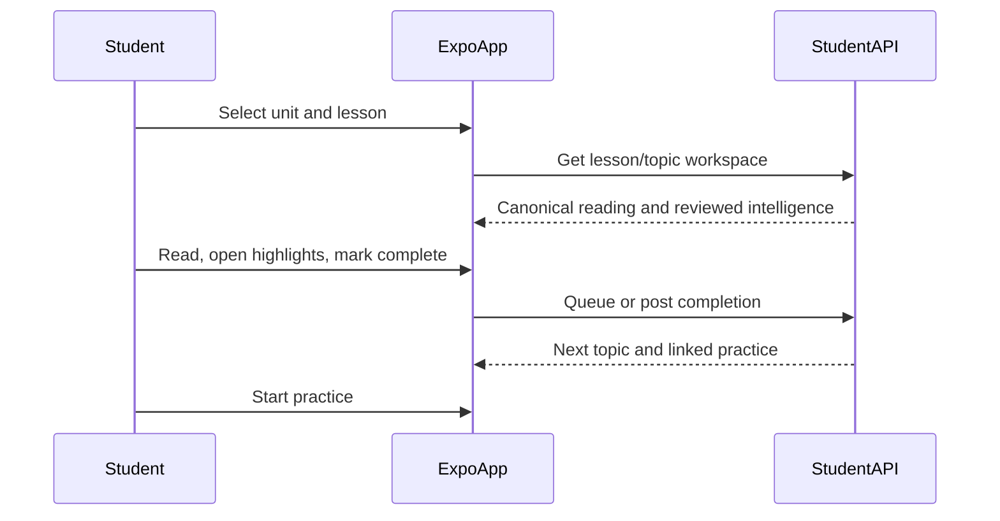

# 01 — Expo UI Architecture

| Field | Value |
|---|---|
| Status | Planning |
| Client | Separate Expo / React Native application |
| Target | iOS and Android |
| API source | SarkariExamsAI Student APIs |

## Architecture principles

1. Build an original, BPSC-first mobile UI; use the supplied screenshots only to understand interaction patterns.
2. Keep one dominant action per screen.
3. Use feature modules and typed API contracts; do not share the web PWA’s Redux/Saga implementation by copying it.
4. Make reading and recently viewed content usable with poor connectivity.
5. Render only human-reviewed or validated exam intelligence.

## Proposed client stack

| Concern | Proposed choice | Rationale |
|---|---|---|
| App shell and routing | Expo Router | File-based navigation and deep links for iOS/Android |
| Server state | TanStack Query | Caching, retries, invalidation, offline-aware data reads |
| Device credentials | Expo SecureStore | OS-backed storage for refresh/session credentials |
| Local content cache | SQLite-backed cache or Expo FileSystem manifest | Persist recently opened reading units and metadata |
| Form state | Local component state + validated form model | Keep answer-writing flow isolated |
| Analytics | Provider selected during implementation | Track learning funnel without logging raw answer text by default |

These are implementation recommendations, not installed dependencies yet.

## Navigation map



## Screen specification

| Screen | Primary action | Required data | Important states |
|---|---|---|---|
| Home | Resume one task | continuation, daily plan, weak topics | first-time, empty plan, stale cache |
| Subject catalog | Choose a subject | books/subjects and progress | loading, unavailable subject |
| Units | Choose a unit | grouped units, progress, search index | search empty, locked/dependency state |
| Lesson path | Start/resume a lesson | lesson ordering, durations, practice checkpoints | incomplete, completed, offline |
| Topic reader | Read and mark complete | canonical paragraphs, figures, highlights, intelligence | step loading, unavailable figures |
| Prelims hub | Start selected practice | PYQs, MCQs, revision areas | no questions for filter |
| Practice session | Answer one question | question, timer policy, attempt state | network interruption, submitted |
| Results/revision | Choose next revision | accuracy, mistakes, related topics | insufficient data |
| Mains hub/PYQs | Select a question | stages, papers, filters | empty filter result |
| Answer composer | Submit structured answer | question, word/mark guidance, draft | offline draft, submit failure |
| Evaluation | Apply feedback | evaluation status, rubric, citations | pending, unavailable |
| News/article | Read current affairs | source, tags, article, exam links | stale content, source unavailable |

## Learn flow

The high-value learning sequence is a mobile translation of the current Topic Learning Workspace, not a raw PDF reader:



## Design system guidance

- Support light and dark themes from the start; do not inherit another product’s colors, icons, or visual brand.
- Use semantic tokens: `surface`, `surfaceRaised`, `textPrimary`, `textMuted`, `accent`, `success`, `warning`, `danger`, and `focus`.
- Use a readable Devanagari-capable font fallback when Hindi is enabled; never use image text for learning content.
- Keep navigation labels stable: Home, Learn, Prelims, Mains, News.
- Provide touch targets of at least 44 × 44 points, visible focus states for external keyboards, and accessible screen-reader labels.
- Do not rely on color alone for correct/incorrect MCQ feedback or practice strength.

## Offline and recovery behavior

| Scenario | Required behavior |
|---|---|
| Recently opened lesson offline | Render cached canonical content with an “offline copy” timestamp |
| Completion action offline | Queue idempotent completion event; reconcile on next connection |
| MCQ submission interrupted | Persist selected option and attempt state locally; prevent duplicate submit |
| Mains draft offline | Save encrypted/local draft, clearly show it is not submitted |
| Cached content changes | Revalidate with version/ETag; invalidate stale content safely |
| API error | Show retry with screen-specific fallback, not a blank application state |

## Recommended feature structure

```text
mobile/
├── app/                  # Expo Router routes and route groups
├── src/
│   ├── features/
│   │   ├── home/
│   │   ├── learn/
│   │   ├── prelims/
│   │   ├── mains/
│   │   ├── news/
│   │   └── profile/
│   ├── api/              # typed client, query keys, transport
│   ├── components/       # shared accessible UI primitives
│   ├── storage/          # cache and queued mutations
│   ├── theme/
│   └── telemetry/
└── tests/
```

## QA acceptance criteria

- A learner can resume a lesson and complete it using only a phone screen.
- Lesson ordering, topic IDs, and next-topic behavior match the API’s canonical hierarchy.
- Prelims questions always show their selected/submitted state correctly after interruption.
- Mains drafts are never silently lost.
- Dynamic font size, screen reader labels, dark theme, and slow-network states are covered by QA.
