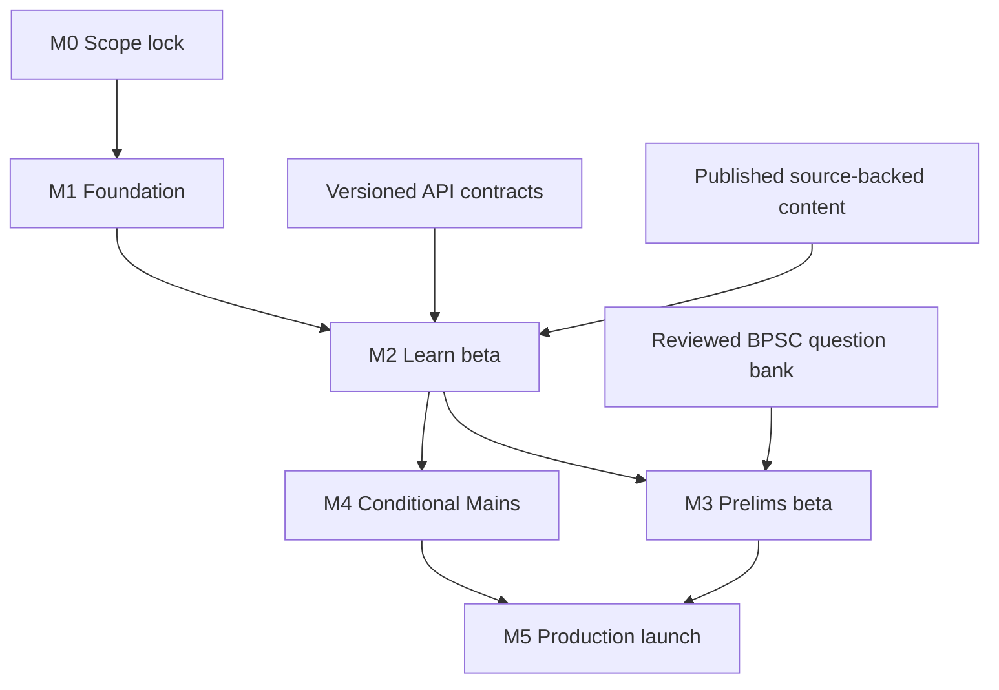
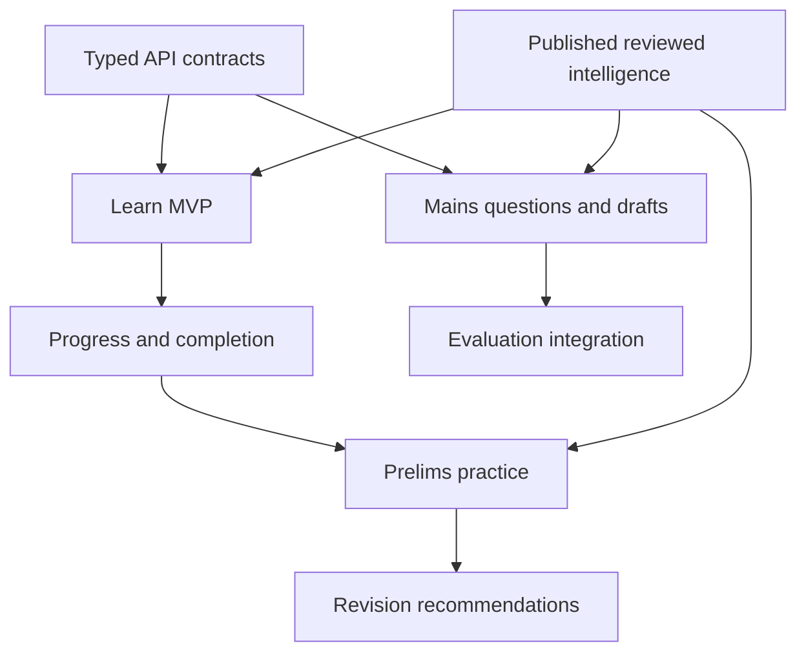

# 02 — Delivery Plan & Reference Inventory

| Field | Value |
|---|---|
| Status | Planning |
| Delivery type | Cross-functional production delivery plan |
| Implementation target | Separate Expo mobile application |
| Reference assets | [`Reference/`](./Reference/) internal UX and licensing-review material |
| Functional source | [Functional Requirements](./01-functional-requirement.md) |

## Reference-screen analysis

The supplied screenshots consistently demonstrate these useful patterns:

| Pattern | Reference examples | SarkariExamsAI interpretation |
|---|---|---|
| Unit and lesson hierarchy | `IMG_0267*`, `IMG_0281*`, `IMG_0291*` | Searchable BPSC subject → unit → ordered lesson navigation |
| Lesson sequencing + practice checkpoints | `IMG_0270*`, `IMG_0271*`, `IMG_0272*` | Reading path with explicit practice after a concept cluster |
| Prelims dashboard + revision | `IMG_0292*`, `IMG_0293*` | One practice CTA plus evidence-based revision topics |
| Mains PYQs, filters and answer action | `IMG_0296*`, `IMG_0297*`, `IMG_0298*`, `IMG_0299*` | BPSC Mains GS-I question bank with stage, paper, subject, year and type |
| Mains daily question | `IMG_0295*` | One daily BPSC Mains prompt, answer composer and review status |
| Current affairs source + article detail | `IMG_0300*`–`IMG_0303*`, `IMG_0332*` | Source-linked BPSC article, reviewed highlights and related practice |
| Home continuation + planning | `IMG_0325*`–`IMG_0327*`, `IMG_0263*`, `IMG_0264*` | Resume one learning item and plan one next action |
| Short-form learning | `IMG_0328*`, `IMG_0329*` | Optional, source-linked revision shorts; not MVP-critical |
| Engagement/leaderboards | `IMG_0304*`–`IMG_0308*` | Optional later feature; never a replacement for learning outcomes |

The copied file names are preserved so their source relationship remains auditable. During app implementation, do not use these images directly as app screenshots, branding, icons, or content assets.

## Recommended delivery phases

| Phase | Scope | Backend dependency | Exit criteria |
|---|---|---|---|
| 0 — Foundation | Expo project, routing, theme, typed transport, SecureStore, analytics policy | Session/config contract | App launches, restores session, reports safe diagnostics |
| 1 — Learn MVP | Home continuation, catalog, units, lesson path, topic reader, offline reading cache | Catalog, workspace, completion APIs | Learner reads a topic, completes it, resumes next topic |
| 2 — Prelims loop | Practice sessions, answers, result, revision queue | Assessment APIs | Learner completes topic-linked MCQs and gets a next revision action |
| 3 — Mains loop | Mains question list, filters, answer drafts, submit/status | Mains questions and attempt APIs | Learner writes, preserves and submits a BPSC GS-I answer |
| 4 — Intelligence and News | Published intelligence rail, current affairs, citations | Intelligence and current-affairs APIs | Every displayed claim/PYQ is source-linked and stage-tagged |
| 5 — Enhancement | Notifications, targets, subscriptions, leaderboard, short revision media | Entitlement, notification, social contracts | Add only when learning-loop metrics justify them |

Production launch requires Phases 0–2. Phase 3 is conditional: it is included only when Mains content and the assessment APIs meet the readiness gate. Phases 4–5 are post-launch increments and must not delay the core BPSC learning loop.

## Production milestones and gates

Calendar dates are assigned only after each accountable team accepts its dependency. The release manager owns the dated plan; this document defines the required gates.

| Milestone | Scope | Entry criteria | Exit criteria | Accountable teams |
|---|---|---|---|---|
| M0 — Scope lock | Release boundary, ownership, API inventory, analytics policy | Functional requirements reviewed | Auth/guest, Mains scope, entitlement, analytics, API owners, and test environments recorded | Product, engineering leads |
| M1 — Foundation | Expo shell, routing, theme, typed transport, SecureStore, remote config, safe telemetry | M0 complete | iOS/Android development build restores session and reports privacy-safe diagnostics | Mobile, Identity, Platform |
| M2 — Learn beta | Home, catalog, units, reader, completion, offline cache | Home/workspace/completion contracts available in test | Learner completes and resumes a canonical topic without a dead end | Mobile, Backend Platform, Content Ops, QA |
| M3 — Prelims beta | Practice sessions, answers, result, minimal revision | Assessment contract and reviewed question bank available | Learner completes linked MCQs after interruption and receives an evidence-based revision action | Mobile, Assessment, Content Ops, QA |
| M4 — Conditional Mains | PYQ browse, drafts, submit/status | Mains APIs and reviewed GS-I content approved | Draft is never silently lost and submission status is visible | Mobile, Assessment, Content Ops, QA |
| M5 — Production launch | Store release, support, monitoring, staged rollout | M3 complete; M4 only when in release scope | Go/no-go passes and a rollback owner is on call | Product, Mobile, QA, Support, Platform |

## Critical dependency order

## Risks and controls

| Risk | Control |
|---|---|
| App becomes a generic coaching clone | Hold every feature against the canonical-learning + BPSC-intelligence value proposition |
| Web and mobile API drift | Generated/schema-validated types plus shared contract tests |
| Offline data corrupts learner history | Idempotent mutations, queue retries and clear conflict rules |
| Mains evaluation appears authoritative without evidence | Show rubric/citations/status and retain human-review policy |
| Unlicensed content or copied reference design | Content/source review and original design tokens/assets |
| Too much scope in v1 | Ship Learn → Prelims → Mains sequence before news/social/shorts |

## Cross-team acceptance criteria

### Product and content

- All top-level navigation labels map to a BPSC job to be done.
- Prelims and Mains content use stage-specific nomenclature and filters.
- Current-affairs, PYQ, tutor-note and model-answer content has provenance.

### Mobile engineering

- Navigation works on both iOS and Android without web-view dependencies.
- UI supports dark mode, dynamic type, screen readers, slow network and offline cache states.
- Lesson completion, answer attempts and Mains drafts are resilient to an interrupted network.

### Backend and assessment

- Blocking endpoints are versioned, authenticated where needed, and idempotent for writes.
- Practice and Mains records expose stable BPSC stage/paper/topic identifiers.
- Mobile receives only published canonical content and reviewed exam intelligence.

## Ownership and operating cadence

| Workstream | Accountable | Responsible | Consulted | Informed |
|---|---|---|---|---|
| Release scope, trade-offs, launch approval | Product lead | Senior PM | Mobile, Backend, Assessment, Content Ops, QA | Leadership, Support |
| Mobile app, cache, retries, accessibility | Mobile engineering lead | Mobile team | Backend Platform, QA | Product |
| Identity, catalog, workspace, API versioning | Backend Platform lead | Platform team | Mobile, Content Ops | Product, QA |
| Practice and Mains attempt lifecycle | Assessment lead | Assessment team | Mobile, Content Ops | Product, QA |
| Source provenance and published content | Content Ops lead | Content Ops | Product, Assessment, Intelligence | Mobile, QA |
| Test strategy and release sign-off | QA lead | QA team | All delivery teams | Leadership |
| Incident response and rollback | Platform lead | Platform and Mobile on-call | Product, Support | Leadership |

- Weekly delivery review: milestone health, API/content readiness, scope changes, and blockers.
- Twice-weekly contract review during M1–M3: schema, error states, idempotency, and fixture parity.
- Beta review: funnel, crash-free sessions, sync errors, content/provenance defects, and support themes.
- 30/60/90-day review: metric outcomes, release debt, and Phase 4 entry decision.

## Launch readiness, rollout, and post-launch

### Go / no-go

**Go only when:**

- All M0 decisions have a recorded owner and resolution.
- Blocking APIs are versioned, authenticated as needed, and validated with mobile contract tests.
- A learner can complete Home → ordered lesson → completion → linked Prelims MCQs → revision action on iOS and Android.
- Interruption QA proves completion, attempts, and included Mains drafts recover safely.
- Published content, PYQs, and explanations are source-backed and stage-tagged.
- Accessibility, slow-network, privacy telemetry, store metadata, support playbook, monitoring, and rollback ownership are approved.
- The agreed beta observation period has reviewed activation, lesson completion, practice conversion, accuracy lift, and D7 retention against the targets in the functional requirements.

**No-go when:**

- A blocking API lacks an owner or test environment.
- Content is unlicensed, unpublished, or lacks provenance.
- Practice can duplicate or lose an answer after interruption.
- Mains evaluation is presented as authoritative without an approved rubric, citations, and review policy.
- Crash, authentication, sync, or security defects exceed the agreed beta threshold.

### Rollout and rollback

| Stage | Audience | Objective | Exit decision |
|---|---|---|---|
| Internal dogfood | Delivery teams and designated content reviewers | Validate contracts, provenance, critical journeys, and support process | Fix all release-critical defects |
| Closed beta | Small, consented BPSC learner cohort | Validate activation, lesson-to-practice loop, offline recovery, and content comprehension | PM and engineering approve staged release |
| Staged store release | Incremental eligible-store cohort | Monitor crash, auth, API, sync, and funnel health | Expand only if launch thresholds hold |
| General availability | Eligible BPSC learners | Operate the production core and measure learning outcomes | Begin Phase 4 assessment |

Rollback disables affected features through remote configuration where possible, pauses cohort expansion, preserves unsynced local mutations, and communicates recovery steps. It must never delete learner progress.

Phase 4 adds reviewed current affairs and published intelligence only after the core loop is safe and stable. Phase 5 additions—notifications, targets, subscriptions, shorts, leaderboards, and broader test modes—require evidence that they strengthen the learning loop.

## Implementation handoff

Before creating the Expo repository, Product and Engineering should approve:

1. Auth provider and guest-mode policy.
2. Whether the first release contains Mains evaluation or only Mains answer submission/status.
3. Content entitlement/free-preview policy.
4. Analytics vendor and privacy retention policy.
5. API delivery ownership and dates for Phase 1 blocking contracts.

The implementation source of truth is the combination of:

- [Mobile Product Brief](./00-mobile-product-brief.md)
- [Functional Requirements](./01-functional-requirement.md)
- [Expo UI Architecture](./04-expo-ui-architecture.md)
- [Mobile Backend Contract](./03-mobile-backend-contract.md)
- [AI Platform Guide](../ai/AI-PLATFORM-GUIDE.md)
