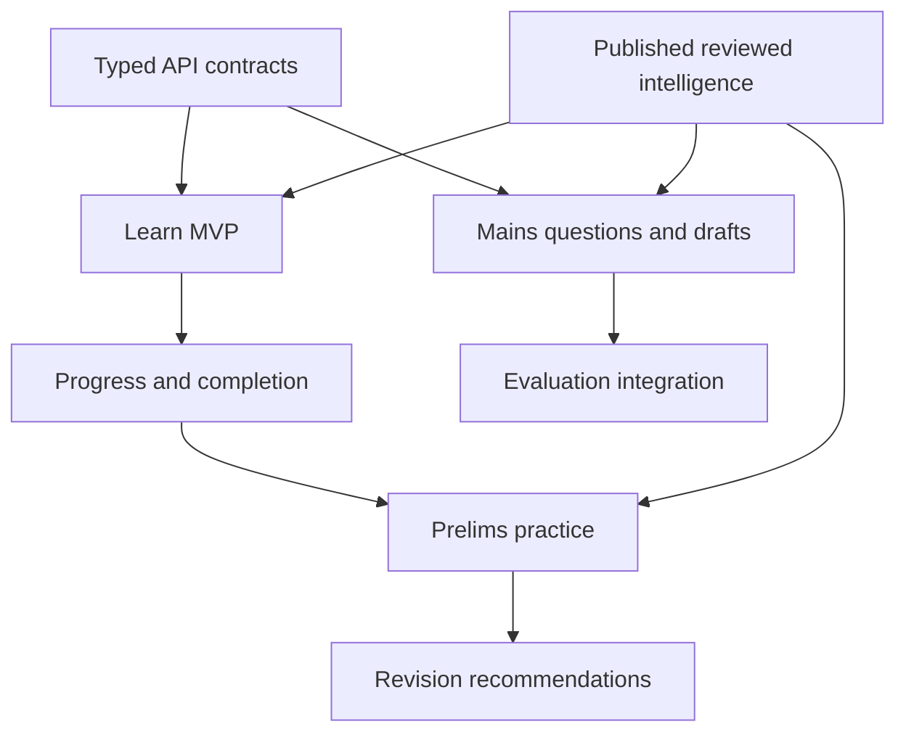

# 03 — Delivery Plan & Reference Inventory

| Field | Value |
|---|---|
| Status | Planning |
| Delivery type | Documentation and product/technical handoff |
| Implementation target | Separate Expo mobile application |
| Reference assets | `reference-screens/` (60 supplied PNG files) |

## Reference-screen analysis

The supplied screenshots consistently demonstrate these useful patterns:

| Pattern | Reference examples | SarkariExamsAI interpretation |
|---|---|---|
| Unit and lesson hierarchy | `IMG_0267*`, `IMG_0281*`, `IMG_0291*` | Searchable BPSC subject → unit → ordered lesson navigation |
| Lesson sequencing + practice checkpoints | `IMG_0270*`, `IMG_0271*`, `IMG_0272*` | Reading path with explicit practice after a concept cluster |
| Prelims dashboard + revision | `IMG_0292*`, `IMG_0293*` | One practice CTA plus evidence-based revision topics |
| Mains PYQs, filters and answer action | `IMG_0296*`, `IMG_0297*`, `IMG_0298*`, `IMG_0299*` | BPSC Mains GS-I question bank with stage, paper, subject, year and type |
| Mains daily question | `IMG_0295*` | One daily BPSC Mains prompt, answer composer and review status |
| Current affairs source + article detail | `IMG_0300*`–`IMG_0303*`, `IMG_0332*` | Source-linked BPSC article, reviewed highlights and related practice |
| Home continuation + planning | `IMG_0325*`–`IMG_0327*`, `IMG_0263*`, `IMG_0264*` | Resume one learning item and plan one next action |
| Short-form learning | `IMG_0328*`, `IMG_0329*` | Optional, source-linked revision shorts; not MVP-critical |
| Engagement/leaderboards | `IMG_0304*`–`IMG_0308*` | Optional later feature; never a replacement for learning outcomes |

The copied file names are preserved so their source relationship remains auditable. During app implementation, do not use these images directly as app screenshots, branding, icons, or content assets.

## Recommended delivery phases

| Phase | Scope | Backend dependency | Exit criteria |
|---|---|---|---|
| 0 — Foundation | Expo project, routing, theme, typed transport, SecureStore, analytics policy | Session/config contract | App launches, restores session, reports safe diagnostics |
| 1 — Learn MVP | Home continuation, catalog, units, lesson path, topic reader, offline reading cache | Catalog, workspace, completion APIs | Learner reads a topic, completes it, resumes next topic |
| 2 — Prelims loop | Practice sessions, answers, result, revision queue | Assessment APIs | Learner completes topic-linked MCQs and gets a next revision action |
| 3 — Mains loop | Mains question list, filters, answer drafts, submit/status | Mains questions and attempt APIs | Learner writes, preserves and submits a BPSC GS-I answer |
| 4 — Intelligence and News | Published intelligence rail, current affairs, citations | Intelligence and current-affairs APIs | Every displayed claim/PYQ is source-linked and stage-tagged |
| 5 — Enhancement | Notifications, targets, subscriptions, leaderboard, short revision media | Entitlement, notification, social contracts | Add only when learning-loop metrics justify them |

## Critical dependency order

## Risks and controls

| Risk | Control |
|---|---|
| App becomes a generic coaching clone | Hold every feature against the canonical-learning + BPSC-intelligence value proposition |
| Web and mobile API drift | Generated/schema-validated types plus shared contract tests |
| Offline data corrupts learner history | Idempotent mutations, queue retries and clear conflict rules |
| Mains evaluation appears authoritative without evidence | Show rubric/citations/status and retain human-review policy |
| Unlicensed content or copied reference design | Content/source review and original design tokens/assets |
| Too much scope in v1 | Ship Learn → Prelims → Mains sequence before news/social/shorts |

## Cross-team acceptance criteria

### Product and content

- All top-level navigation labels map to a BPSC job to be done.
- Prelims and Mains content use stage-specific nomenclature and filters.
- Current-affairs, PYQ, tutor-note and model-answer content has provenance.

### Mobile engineering

- Navigation works on both iOS and Android without web-view dependencies.
- UI supports dark mode, dynamic type, screen readers, slow network and offline cache states.
- Lesson completion, answer attempts and Mains drafts are resilient to an interrupted network.

### Backend and assessment

- Blocking endpoints are versioned, authenticated where needed, and idempotent for writes.
- Practice and Mains records expose stable BPSC stage/paper/topic identifiers.
- Mobile receives only published canonical content and reviewed exam intelligence.

## Implementation handoff

Before creating the Expo repository, Product and Engineering should approve:

1. Auth provider and guest-mode policy.
2. Whether the first release contains Mains evaluation or only Mains answer submission/status.
3. Content entitlement/free-preview policy.
4. Analytics vendor and privacy retention policy.
5. API delivery ownership and dates for Phase 1 blocking contracts.

The implementation source of truth is the combination of:

- [Mobile Product Brief](./00-mobile-product-brief.md)
- [Expo UI Architecture](./01-expo-ui-architecture.md)
- [Mobile Backend Contract](./02-mobile-backend-contract.md)
- [AI Platform Guide](../ai/AI-PLATFORM-GUIDE.md)
