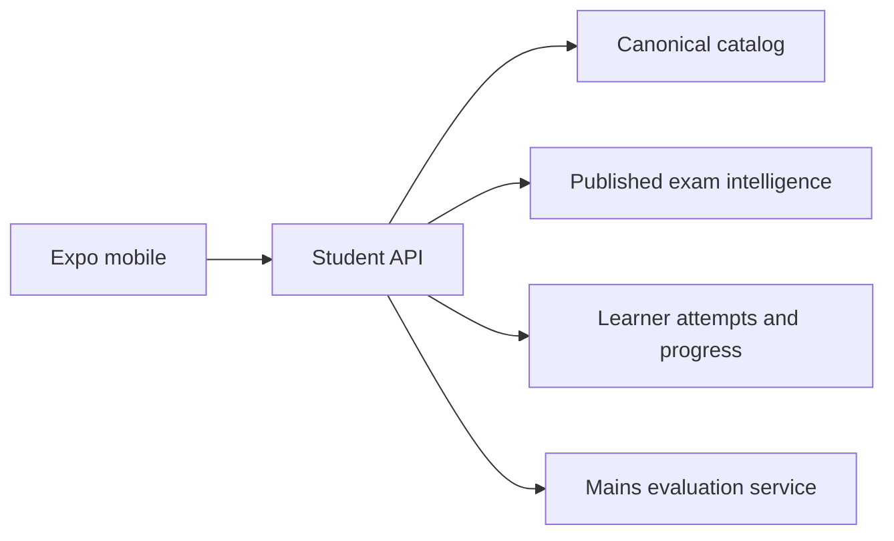
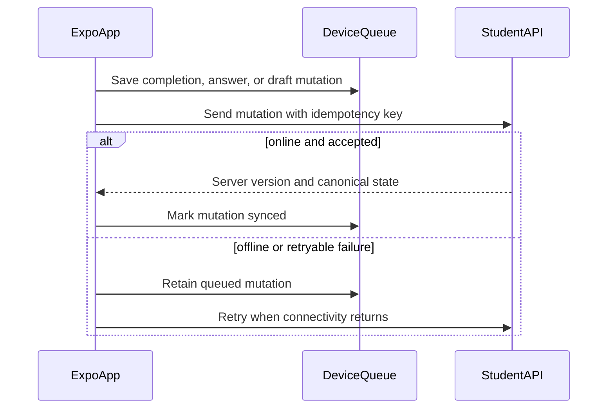

# 02 — Mobile Backend Contract

| Field | Value |
|---|---|
| Status | Planning contract |
| Consumers | Expo mobile app and existing web PWA |
| API principle | Screen-oriented, versioned, source-grounded responses |
| Existing API status | Courses/topic reads are partial; practice and learner workflows are planned |

## Boundary

The Expo app is a client of the same backend and knowledge platform as the web experience. It must not call ingestion, AI-worker, validation, or database internals directly.



## Existing contract to reuse

The following paths are already documented in [Student APIs](../backend/04-student-apis.md). Their response types should be shared through an API schema/OpenAPI-generated mobile package, not manually copied.

| Capability | Contract | Status |
|---|---|---|
| Course/subject catalog | `GET /api/courses` | Implemented/partial |
| Book chapters/topics | `GET /api/courses/{book_id}` | Implemented/partial |
| Topic header | `GET .../topics/{topic_id}/intro` | Implemented/partial |
| Topic reading steps | `GET .../topics/{topic_id}/steps` | Implemented/partial |
| On-demand reading step | `GET .../steps/{step_index}` | Targeted |
| Next canonical topic | `GET .../topics/{topic_id}/next` | Implemented/partial |
| Continue reading | `GET /api/courses/{book_id}/continue` | Placeholder |

## Mobile-required API additions

These are proposed contracts, not yet implemented endpoints.

| Capability | Proposed contract | Backend owner | Mobile dependency |
|---|---|---|---|
| Session and profile | `GET /api/me`, session refresh/logout | Identity platform | Blocking |
| Mobile home | `GET /api/home` | Student API | Blocking |
| Complete topic | `POST /api/topics/{topic_id}/completion` with idempotency key | Student API | Blocking |
| Unified workspace | `GET /api/.../workspace` | Student API | Blocking for low-round-trip reader |
| Prelims session | `POST /api/practice/sessions` | Assessment | Blocking |
| Submit MCQ | `POST /api/practice/sessions/{id}/answers` | Assessment | Blocking |
| Practice results | `GET /api/practice/sessions/{id}/result` | Assessment | Blocking |
| Revision queue | `GET /api/revision/today` | Assessment + intelligence | MVP increment |
| Mains PYQs | `GET /api/mains/questions` | Assessment/content | Blocking for Mains |
| Mains draft/submit | `PUT /api/mains/attempts/{id}/draft`, `POST .../submit` | Assessment | Blocking for Mains |
| Mains evaluation | `GET /api/mains/attempts/{id}/evaluation` | Evaluation service | Increment |
| Current affairs | `GET /api/current-affairs`, `GET /api/current-affairs/{id}` | Content platform | Increment |
| App configuration | `GET /api/mobile/config` | Platform | Blocking before production |

## Functional-requirement coverage and readiness

This contract is the API implementation companion to [Functional Requirements](./01-functional-requirement.md). A proposed endpoint is not production-ready until its versioned schema, authorization, fixtures, error responses, and idempotency behavior are available in a test environment.

| Functional requirements | Required API capability | Accountable owner | Production readiness evidence |
|---|---|---|---|
| FR-01–03 — identity, secure session, profile | `GET /api/me`, refresh/logout, profile context, `GET /api/mobile/config` | Identity Platform + Platform | Auth/expiry/error scenarios, feature-config fallback, and contract fixtures |
| FR-04–06 — Home and next action | `GET /api/home` with continuation and enabled capabilities | Student API | First-time, stale, empty-plan, and unavailable-capability responses |
| FR-07–11 — Learn, reader, completion, offline | Catalog/course reads, unified workspace, completion, next topic | Backend Platform | Stable IDs, content versions, source fields, ETag/version behavior, idempotent completion |
| FR-12–17 — Prelims, results, revision | Practice session, answer, result, revision queue | Assessment + Intelligence | Deterministic session, marking/version metadata, idempotency, immutable submitted answers, explainable revision reason |
| FR-18–19 — conditional Mains browse/draft/submit | Mains questions, draft, submit/status | Assessment + Content Ops | Stage/source fields, revision-safe draft writes, conflict response, submission status |
| FR-20 — evaluation status | Mains evaluation status and reviewed feedback payload | Evaluation Service | Rubric/citation/review fields or explicit `pending`/`unavailable` state |

### Contract delivery rules

- Publish OpenAPI/schema changes before mobile implementation and generate the mobile client from that schema; do not copy web response types manually.
- Supply contract-valid fixtures for normal, empty, unauthorized, stale, validation-failure, and retryable-error responses.
- Return a request ID on error responses so mobile telemetry and support can correlate failures without collecting raw learner content.
- Include a feature/config version in `GET /api/mobile/config` and support a safe disabled state for Mains, News, and other gated features.
- Do not enable a release-critical client feature until its endpoint is present in the test environment and passes consumer contract tests.

## Response contract requirements

Every mobile-facing response must include:

```json
{
  "id": "stable-domain-id",
  "content_version": "published-pack-or-book-version",
  "updated_at": "2026-07-13T00:00:00Z"
}
```

Additional rules:

- Use stable IDs from the canonical/exam-intelligence platform (`book_id`, `chapter_id`, `topic_id`, `exam_concept_id`).
- Include `stage` on every practice/PYQ/Mains item (`PRE`, `MAINS_GS1`).
- Include source/citation information where an explanation, model answer, tip, or fact is displayed.
- Make write operations idempotent with an `Idempotency-Key` header or client-generated mutation ID.
- Return server revision/version information so the local mobile cache can invalidate safely.
- Do not return raw ingestion block IDs, prompt text, model internals, or unpublished intelligence.

## Authentication and device security

- Use short-lived access tokens plus refresh tokens; store device credentials only in Expo SecureStore.
- Do not store raw answer text, personal information, or tokens in analytics events.
- Require authenticated user context for progress, attempts, Mains drafts, subscriptions, and leaderboards.
- Design anonymous reading only if Product explicitly approves it; merge guest progress only through an authenticated conflict-resolution flow.

## Sync model



Conflict rules:

- Completion is monotonic: completed remains completed unless a deliberate reset API exists.
- MCQ answer records are immutable once a session is submitted.
- Mains drafts use server `updated_at`/revision checks; present a conflict prompt before overwriting a newer remote draft.
- Current-affairs and canonical reading are cacheable reads, never device-authored truth.

## Non-functional requirements

| Area | Requirement |
|---|---|
| Performance | Reader initial response supports progressive step loading and avoids fetching an entire book |
| Caching | Immutable reading content supports ETag/version revalidation |
| Reliability | All mutation endpoints safely support retry |
| Observability | Request ID on errors; privacy-safe funnel and failure events |
| Security | Authorization is enforced server-side, never by mobile lock-screen logic |
| Compatibility | Versioned API contract before broad mobile release |

## Ownership and next decision

Backend Platform owns catalog, workspace composition, identity integration, and API versioning. Assessment owns Prelims/Mains attempt lifecycles. Content Ops owns published current-affairs and source provenance. The mobile team owns cache behavior, secure token storage, retry UX, and client contract tests.

The first API implementation decision should be whether mobile and web receive a single `workspace` response. This document recommends **yes**: one topic workspace payload plus paginated reading steps, to reduce mobile round trips without forcing every screen to fetch full content.
