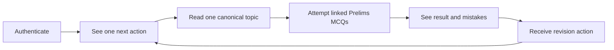
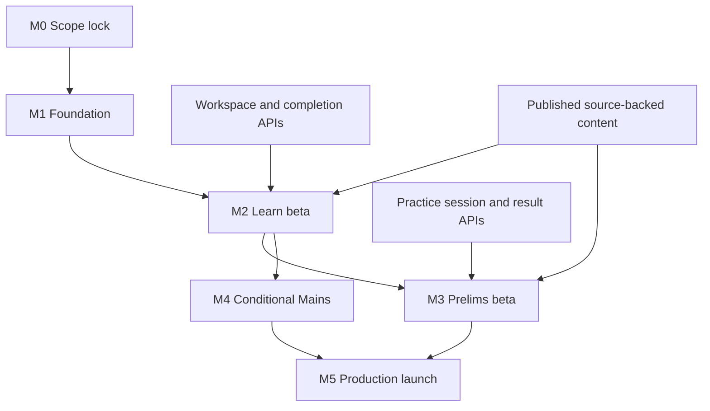

# 04 — Mobile Production Plan

| Field | Value |
|---|---|
| Status | Draft for cross-functional approval |
| Product | SarkariExamsAI mobile |
| Platform | Separate Expo / React Native client for iOS and Android |
| Primary release | BPSC Prelims learning loop; Mains submission is conditional |
| Primary audience | Product, mobile, backend, assessment, content operations, QA, and leadership |
| Source of truth | [00 Product Brief](./00-mobile-product-brief.md), [01 UI Architecture](./01-expo-ui-architecture.md), [02 Backend Contract](./02-mobile-backend-contract.md), [03 Delivery Plan](./03-delivery-plan.md) |

## 1. Production decision

The first production release must prove one valuable, repeatable learner loop:

This is a BPSC preparation product, not a video catalogue, generic chatbot, or visual clone of a reference app. Every student-facing fact, PYQ, explanation, and recommendation must come from published, source-backed content.

### Release definition

| Release tier | Included capability | Decision |
|---|---|---|
| **Production core** | Foundation, authenticated Home, Learn, topic completion, topic-linked Prelims practice, results, minimal revision | Required for launch |
| **Conditional production scope** | Mains GS-I PYQ discovery plus offline-safe draft and submission | Include only if Assessment APIs and content meet the readiness gate |
| **Fast follow** | Mains evaluation, reviewed current affairs, published intelligence rail | Release after core-loop quality is proven |
| **Deferred** | Payments, notifications, targets, short-form media, social leaderboards, full-length mocks, generic chat | Do not block production core |

## 2. Goals, users, and non-goals

### Product goal

Enable a serious BPSC aspirant who primarily studies on a phone to move reliably from canonical reading to stage-specific practice and revision in one session.

### Target learner

| Attribute | Product implication |
|---|---|
| Limited study time | One primary action and a resumable next step |
| Phone-first study | Native mobile reading, touch-first controls, dynamic type, offline recovery |
| Preparing for both stages | Separate `PRE` and `MAINS_GS1` workflows using shared topic identifiers |
| Needs trustworthy guidance | Published sources, citations, content versions, and reviewed intelligence only |

### Measurable outcomes

| Outcome | Initial target | Decision supported |
|---|---:|---|
| Activation | First lesson opened within 3 minutes of install | Onboarding and catalog clarity |
| Learn-loop adoption | 40%+ of weekly learners complete a lesson | Whether the lesson experience is useful |
| Read-to-practice conversion | 30%+ attempt linked practice after a lesson | Whether practice checkpoints create value |
| Learning impact | +15% accuracy lift after related reading | Whether knowledge intelligence improves performance |
| Retention | 30%+ D7 retention | Whether next action and revision form a habit |
| Mains adoption | Track eligible-user submissions | Whether to expand Mains workflow |

### Non-goals for the first production release

- Live classes, creator marketplace, or a copied coaching-course model.
- Generic real-time AI chat or unreviewed AI explanations.
- Payments or a paywall before entitlement and free-preview rules are approved.
- Leaderboards, shorts, or comparative “topper” claims as a core motivation loop.
- Current-affairs publishing before provenance and editorial review are operational.
- Republishing third-party reference PDFs, screenshots, branding, copy, or visual assets.

## 3. Release-critical functional requirements

The reference journey in [Reference/REFERENCE-APP-FLOW.md](./Reference/REFERENCE-APP-FLOW.md) informs interaction patterns only. It does not authorize visual or content replication.

### 3.1 Identity and launch

| ID | Requirement | Priority | Acceptance criteria | Dependency |
|---|---|---|---|---|
| FR-01 | The app restores an existing session on launch and otherwise guides the learner through approved authentication. | Must | No learner progress is shown without the correct user context. Expired sessions lead to a recoverable sign-in state. | Identity: `GET /api/me`, refresh, logout |
| FR-02 | Credentials are stored only with Expo SecureStore. | Must | No access token, refresh token, or raw Mains answer is emitted in analytics or standard logs. | Mobile platform |
| FR-03 | The learner can select BPSC/profile preferences required to personalise Home. | Must | Profile selection produces a stable learner and exam context. | Identity and Student API |

**Product decision required:** confirm phone OTP provider and whether anonymous reading is allowed. If guest reading is approved, progress merging and conflict resolution must be specified before implementation.

### 3.2 Home and next action

| ID | Requirement | Priority | Acceptance criteria | Dependency |
|---|---|---|---|---|
| FR-04 | Home displays one prominent, resumable next action. | Must | A returning learner can continue reading or practice without navigating a catalog first. | `GET /api/home` (proposed) |
| FR-05 | Home presents only valid secondary actions: Learn and Prelims; Mains appears when enabled for the release. | Must | No unavailable destination leads to a dead end. | Mobile configuration |
| FR-06 | Home handles first-use, empty-plan, stale-cache, error, and signed-out states. | Must | Each state provides a specific recovery action rather than an empty screen. | Mobile and Student API |

### 3.3 Learn: catalog, reader, and completion

| ID | Requirement | Priority | Acceptance criteria | Dependency |
|---|---|---|---|---|
| FR-07 | Learners navigate canonical hierarchy: subject → unit → ordered lesson → topic reader. | Must | Topic order and labels match stable `book_id`, `chapter_id`, and `topic_id` values. | Existing course endpoints |
| FR-08 | The reader renders canonical content, reviewed highlights, figures, and source context; it is not a raw PDF viewer. | Must | Each response carries `id`, `content_version`, and `updated_at`; unpublished internal IDs are absent. | Workspace API and content platform |
| FR-09 | Learners can mark a topic complete and receive the next canonical topic. | Must | Completion is idempotent, monotonic, and safely retried after an interruption. | Completion API |
| FR-10 | Recently opened lessons remain readable offline with a visible cache timestamp. | Must | Cached reading is versioned and safely revalidated when connectivity returns. | Local cache and ETag/version support |
| FR-11 | Prerequisite gates are used only when pedagogically necessary. | Should | A gate explains the requirement and never obscures promised core NCERT reading. | Product/content rule |

### 3.4 Prelims practice and revision

| ID | Requirement | Priority | Acceptance criteria | Dependency |
|---|---|---|---|---|
| FR-12 | A learner can start topic-linked BPSC MCQ/PYQ practice from a completed or active learning path. | Must | Session creation records stage `PRE`, selected topic, question source, and deterministic session ID. | Assessment session API |
| FR-13 | Practice configuration supports subject, topic, question count, PYQ window, and attempt-history filters. | Must | Empty filters explain that no questions match; they do not silently substitute unrelated items. | Assessment catalog |
| FR-14 | Practice mode provides immediate explanation; test simulation uses the currently approved BPSC marking scheme. | Must | Marking rules carry source/version metadata and are displayed before a timed test. | Assessment/content |
| FR-15 | One-question-at-a-time attempts preserve selected answer and session state through app restart or network loss. | Must | Submitted answers cannot be duplicated; post-submit answers are immutable. | Device queue and answer API |
| FR-16 | Results show accuracy, mistakes, and at least one next revision action. | Must | Recommendations are explainable from attempt evidence and validated PYQ/topic priority. | Results and revision APIs |
| FR-17 | Overall and subject-level progress distinguish Prelims from Mains data. | Should | No aggregate accuracy merges stages without an explicit learner choice. | Progress service |

### 3.5 Conditional Mains submission

| ID | Requirement | Priority | Acceptance criteria | Dependency |
|---|---|---|---|---|
| FR-18 | Learners can browse BPSC Mains GS-I questions by subject, topic, year, marks, and pattern. | Conditional | All questions show `MAINS_GS1` stage and source/provenance. | Assessment/content |
| FR-19 | Learners can write, save, resume, and submit a structured answer. | Conditional | Offline drafts are clearly marked as local; newer remote drafts create a conflict prompt before overwrite. | Mains draft/submit APIs |
| FR-20 | Evaluation shows status only until the evaluation policy, rubric, source citations, and review model are approved. | Fast follow | The app never presents unreviewed feedback as authoritative. | Evaluation service |

### 3.6 Deferred News and engagement

Current affairs, shorts, rankings, subscriptions, and notifications are not release blockers. When introduced, each current-affairs claim must be reviewed, source-linked, BPSC-tagged, and connected to an eligible practice set.

## 4. API and content readiness

### API delivery matrix

The contract document proposes mobile endpoints; the current Student API document confirms course APIs are partial and practice/progress APIs are planned. Production must not assume a proposed endpoint already exists.

| Capability | Current evidence | Required production state | Accountable team | Release gate |
|---|---|---|---|---|
| Course catalog and topic reading | Partial: `/api/courses`, book, intro, steps, next | Schema-validated mobile response and stable identifiers | Backend Platform | Learn development |
| Unified topic workspace | Proposed; current web client composes multiple calls | Decide and implement one workspace payload plus paginated steps | Backend Platform | Reader performance gate |
| Session/profile and configuration | Proposed | Authenticated profile, refresh/logout, feature configuration | Identity + Platform | Foundation gate |
| Home/continuation | Existing continue is placeholder; mobile Home proposed | Personalised continuation and one next action | Student API | Home gate |
| Topic completion | Planned | Idempotent write with server revision | Student API | Learn completion gate |
| Prelims sessions, answers, results | Planned | Session lifecycle, source/stage fields, idempotent answer submission | Assessment | Practice gate |
| Revision queue | Proposed MVP increment | Explainable next revision action | Assessment + Intelligence | Production launch gate |
| Mains questions/drafts | Planned | Filtered browse, revision-safe draft, submit/status | Assessment | Conditional Mains gate |
| Published intelligence and sources | Partial/future | Published-only content with provenance | Content Ops + Intelligence | Content gate |

### Content minimum bar

| Area | Production minimum |
|---|---|
| Learn catalog | A curated BPSC-relevant subject/unit/topic path with stable IDs and published reading |
| Prelims practice | Topic-linked questions with BPSC stage, answer key, explanation provenance, and source traceability |
| Revision | Enough tagged question/attempt data to return a meaningful next action; otherwise state that more attempts are needed |
| Mains, if enabled | A reviewed GS-I question bank with stage, marks, year/pattern labels, word guidance, and draft/submit policy |
| Rights and provenance | Content Ops confirms permitted use; external PDFs in `Reference/` remain internal licensing/review material unless explicitly cleared |

## 5. Delivery plan, milestones, and gates

Calendar dates are intentionally not invented. The release manager must convert the relative milestones below into dated commitments after each accountable team accepts its dependency.

| Milestone | Scope | Entry criteria | Exit criteria | Accountable teams |
|---|---|---|---|---|
| M0 — Scope lock | Release decision, ownership, API inventory, analytics policy | This document approved | Auth, guest policy, Mains scope, entitlement, analytics, and API owners recorded | Product, engineering leads |
| M1 — Foundation | Expo shell, routing, theme, typed transport, SecureStore, feature config, safe telemetry | M0 complete | App launches on iOS/Android, restores session, and reports privacy-safe diagnostics | Mobile, Identity, Platform |
| M2 — Learn beta | Home, catalog, units, reader, completion, offline cache | Home/workspace/completion contracts available in test | A learner completes and resumes a canonical topic on a phone without dead ends | Mobile, Backend Platform, Content Ops, QA |
| M3 — Prelims beta | Session creation, attempts, result, minimal revision | Assessment contract and reviewed question bank available | Learner completes linked MCQs, survives interruption, and receives an evidence-based next action | Mobile, Assessment, Content Ops, QA |
| M4 — Conditional Mains | PYQ browse, drafts, submit/status | Mains APIs and reviewed GS-I content approved | Draft is never silently lost; submission status is visible | Mobile, Assessment, Content Ops, QA |
| M5 — Production launch | Store release, support/monitoring, staged rollout | M3 complete; M4 only if conditional scope accepted | Go/no-go criteria pass and rollback owner is on call | Product, Mobile, QA, Support, Platform |

### Critical path

## 6. Ownership and operating model

| Workstream | Accountable | Responsible | Consulted | Informed |
|---|---|---|---|---|
| Release scope, trade-offs, launch approval | Product lead | Senior PM | Mobile, Backend, Assessment, Content Ops, QA | Leadership, Support |
| Mobile app, cache, retries, accessibility | Mobile engineering lead | Mobile team | Backend Platform, QA | Product |
| Identity, catalog, workspace, API versioning | Backend Platform lead | Platform team | Mobile, Content Ops | Product, QA |
| Practice and Mains attempt lifecycle | Assessment lead | Assessment team | Mobile, Content Ops | Product, QA |
| Source provenance and published content | Content Ops lead | Content Ops | Product, Assessment, Intelligence | Mobile, QA |
| Test strategy and release sign-off | QA lead | QA team | All delivery teams | Leadership |
| Incident response and rollback | Platform lead | Platform + Mobile on-call | Product, Support | Leadership |

### Required operating cadence

- Weekly delivery review: milestone health, API/content readiness, scope changes, and blockers.
- Twice-weekly contract review while M1–M3 are active: API schema, error states, idempotency, and fixture parity.
- Beta review: funnel, crash-free sessions, sync errors, content/provenance defects, and support themes.
- 30/60/90-day post-launch review: metrics against targets, release debt, and Phase 4 entry decision.

## 7. Quality, safety, and production requirements

### Reliability and offline

| Scenario | Production requirement |
|---|---|
| Opened lesson offline | Render a versioned cache and show its offline timestamp |
| Completion offline | Queue an idempotent mutation and reconcile without double completion |
| MCQ interruption | Persist selected option and session state; prevent duplicate submission |
| Mains draft interruption | Preserve encrypted/local draft; show unsynced state and resolve revisions safely |
| Stale content | Revalidate with ETag/version data before treating cache as current |
| API failure | Provide a screen-specific retry/fallback and a request ID for support |

### Accessibility and compatibility

- iOS and Android navigation must work without web-view dependence.
- Support light/dark mode, dynamic text, screen readers, external keyboard focus, and 44 × 44 point touch targets.
- Use a Devanagari-capable fallback when Hindi is enabled.
- Do not use color alone to communicate correct/incorrect answers, weakness, or submission status.

### Content, privacy, and compliance

- Include source/citation and content version when an explanation, model answer, tip, or factual claim appears.
- Do not expose raw ingestion blocks, model prompts, unpublished intelligence, raw answer text, tokens, or personal data in analytics.
- Enforce authorization server-side; a mobile UI lock is never an entitlement control.
- Maintain original product language, brand, iconography, and layouts.
- Complete content-rights and app-store copy review before external beta.

## 8. Measurement and instrumentation

### Core funnel

| Event | Required properties | Use |
|---|---|---|
| `app_opened` | app version, authenticated state | Diagnose activation and session restore |
| `home_next_action_seen` | action type, content version | Measure Home relevance |
| `lesson_opened` | book/chapter/topic IDs, source version | Measure activation and content reach |
| `lesson_completed` | topic ID, completion source, queued/synced state | Measure Learn loop and sync health |
| `practice_started` | stage, topic ID, mode, question count | Measure read-to-practice conversion |
| `practice_submitted` | session ID, stage, score band, retry count | Measure assessment health without raw responses |
| `revision_action_seen` | reason code, topic ID | Measure recommendation coverage |
| `mains_draft_saved` / `mains_submitted` | question ID, sync state | Measure conditional Mains adoption |

### Launch health thresholds

Launch thresholds must be signed off before external release. At minimum, release cannot proceed if any release-critical journey has a reproducible dead end, unsafely loses a completion/answer/draft, serves unpublished content, or breaches privacy/content-rights policy.

The product team reviews the initial activation, lesson completion, practice conversion, accuracy lift, and D7 targets in Section 2 after an agreed observation period; the metrics are decision inputs, not guaranteed outcomes.

## 9. Go / no-go checklist

### Go criteria

- [ ] All M0 open decisions have an accountable owner and recorded resolution.
- [ ] Blocking contracts are versioned, authenticated where needed, and validated with mobile contract tests.
- [ ] A learner can complete Home → ordered lesson → completion → linked Prelims MCQs → revision action on iOS and Android.
- [ ] Completion, attempt, and draft recovery behavior passes interrupted-network QA.
- [ ] Every displayed fact and PYQ is published, source-backed, and stage-tagged.
- [ ] Accessibility, dark mode, dynamic type, and slow-network tests pass.
- [ ] Analytics events are privacy-reviewed and support request IDs are available.
- [ ] Store listing, privacy disclosure, support playbook, monitoring, and rollback owner are approved.

### No-go triggers

- No owner or test environment exists for a blocking API.
- Content is unlicensed, unpublished, or lacks required provenance.
- Practice session state can duplicate or lose an answer after interruption.
- Mains evaluation is represented as authoritative without approved rubric/citations/review policy.
- Crash, authentication, sync, or security defects exceed the agreed beta threshold.

## 10. Rollout and rollback

| Stage | Audience | Objective | Exit decision |
|---|---|---|---|
| Internal dogfood | Delivery teams and designated content reviewers | Validate contracts, content provenance, critical journeys, and support process | Fix all release-critical defects |
| Closed beta | Small, consented BPSC learner cohort | Validate activation, lesson-to-practice loop, offline recovery, and content comprehension | PM and engineering approve staged release |
| Staged store release | Incremental eligible-store cohort | Monitor crash, auth, API, sync, and funnel health | Expand only if launch thresholds hold |
| General availability | Eligible BPSC learners | Operate production core and measure retention/learning outcomes | Begin Phase 4 assessment |

Rollback means disabling affected capabilities through mobile configuration where possible, pausing cohort expansion, preserving unsynced local mutations, and communicating clear recovery steps. It must not delete learner progress.

## 11. Open decisions and sign-off

| Decision | Default recommendation | Accountable owner | Required before |
|---|---|---|---|
| Authentication and guest access | Phone-based sign-in for progress; guest reading only with explicit merge rules | Product + Identity | M0 |
| Workspace response shape | One workspace payload plus paginated reading steps | Backend Platform | M1 |
| First-release Mains scope | Browse/draft/submit only; evaluation is fast follow | Product + Assessment | M3 |
| Content entitlement | Preserve promised reading access; do not ship payments before policy approval | Product + Content Ops | M5 |
| Analytics and retention | Privacy-safe event schema; vendor and retention approved by Platform/Privacy | Product + Platform | M1 |
| API dates and test environments | Each blocking API has owner, version, test fixture, and delivery date | Backend/Assessment leads | M0 |

## 12. Post-launch direction

Phase 4 can begin only after the production core demonstrates safe, source-backed learning and the launch health review does not identify a critical retention, content, or reliability issue.

Phase 4 adds reviewed current affairs and published intelligence. Phase 5 additions—notifications, targets, subscriptions, shorts, leaderboards, and broader test modes—must each demonstrate that they strengthen the learning loop rather than distract from it.

## Appendix: implementation references

- [Mobile Product Brief](./00-mobile-product-brief.md)
- [Expo UI Architecture](./01-expo-ui-architecture.md)
- [Mobile Backend Contract](./02-mobile-backend-contract.md)
- [Delivery Plan](./03-delivery-plan.md)
- [Reference App Flow](./Reference/REFERENCE-APP-FLOW.md)
- [Student APIs](../backend/04-student-apis.md)
- [AI Platform Guide](../ai/AI-PLATFORM-GUIDE.md)
