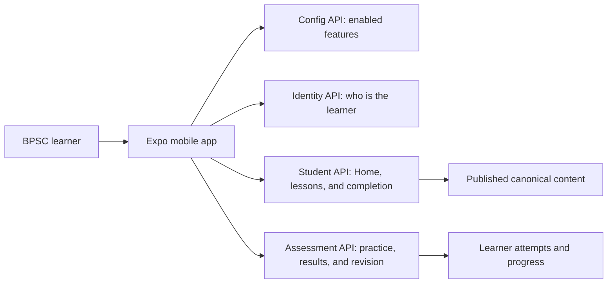
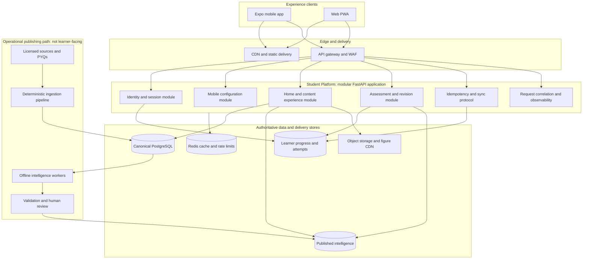
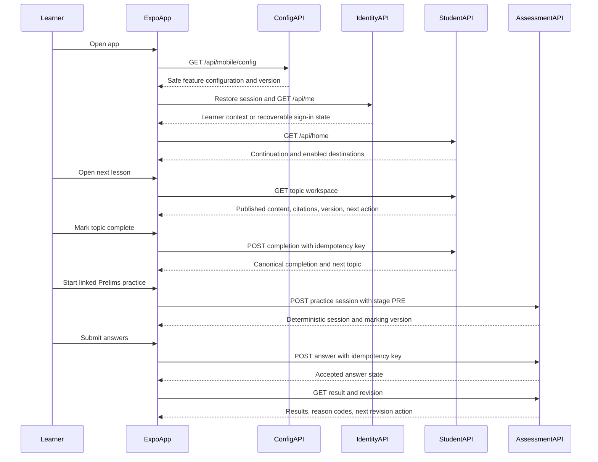
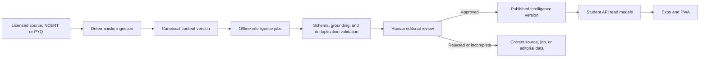
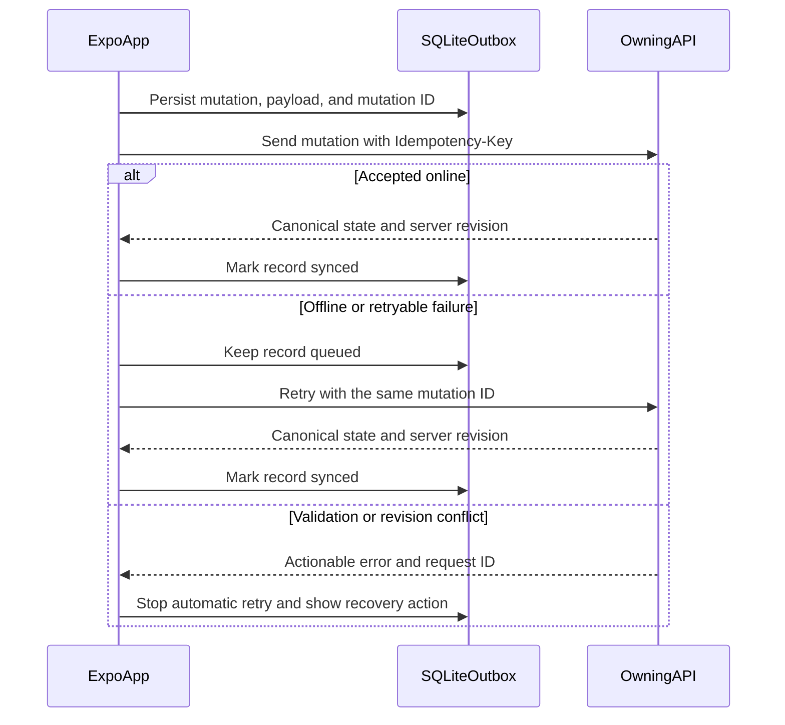
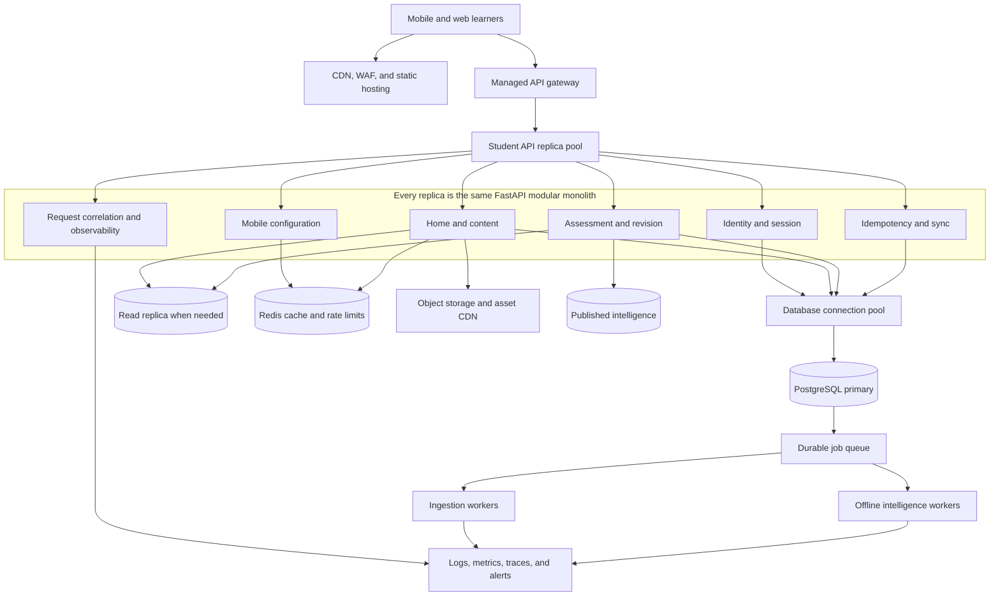

# 05 — Scalable Mobile Platform Architecture

| Field | Value |
|---|---|
| Status | Target architecture decision record |
| Audience | Product, mobile, backend, data, AI, content operations, QA, and platform engineering |
| Scope | Expo mobile, web PWA, Student API, published content, learner state, and production operations |
| Product | SarkariExamsAI — BPSC Prelims and conditional Mains GS-I |
| Companion documents | [Functional Requirements](./01-functional-requirement.md), [Mobile Backend Contract](./03-mobile-backend-contract.md), [Expo UI Architecture](./04-expo-ui-architecture.md) |

## 1. Executive architecture decision

SarkariExamsAI should evolve as a **modular, canonical-truth-first platform**:

1. Expo and the web PWA are independently deployable clients of the same versioned Student API.
2. The Student API is the only learner-facing boundary. Clients never read the database, ingestion artifacts, AI workers, or unpublished intelligence directly.
3. Canonical content is immutable source truth. AI-generated intelligence is served only after validation and human publishing approval.
4. Start with cohesive modules in a FastAPI deployment; extract independently scalable workers and services only when operational load or ownership requires it.
5. Every learner mutation is durable, idempotent, observable, and recoverable across unreliable mobile networks.

This is a target architecture, not a claim that all components already exist. Existing course-reading APIs are partial; identity, Home, practice, revision, configuration, and Mains APIs remain delivery work described in the [Mobile Backend Contract](./03-mobile-backend-contract.md).

### Start here: how the platform works

Read the architecture in this order: **learner → Expo app → the correct API module → trusted data**. The app does not talk directly to the database or AI pipeline.

| Component | Simple responsibility | Example learner moment |
|---|---|---|
| Expo mobile app | Shows the experience and safely stores local offline state | The learner opens a lesson or resumes a question |
| Config API | Decides which approved capabilities are visible | Mains remains hidden until its content and APIs are ready |
| Identity API | Restores login and confirms the learner context | The learner returns to their own Home plan |
| Student API | Serves Home, catalog, reading, and completion | The learner reads a published topic and marks it complete |
| Assessment API | Runs practice, scoring, results, and revision | The learner answers a Prelims question and sees a revision action |

The detailed sequence in Section 4 expands this same flow. It is read from top to bottom: the app checks configuration, restores identity, loads learning content, then starts and records practice.

## 2. Current state and target state

| Area | Current documented state | Production target |
|---|---|---|
| Learner clients | Web PWA is the current experience; Expo is planned | PWA and Expo consume one versioned Student API contract |
| Student API | FastAPI course APIs are implemented/partial; PWA may use mocks | Screen-oriented APIs for identity, Home, content, practice, revision, and config |
| Content | Deterministic PDF pipeline loads canonical PostgreSQL data | Published canonical content with versioning, CDN-served figures, and cache revalidation |
| Intelligence | Offline AI architecture and review gate are defined | Only validated, human-published intelligence is queryable by learner APIs |
| Learner state | Progress/practice flows are planned | Authenticated, idempotent progress and assessment state with offline-safe sync |
| Runtime | API is not yet the primary production student path | Stateless API deployment behind a gateway, managed data services, monitoring, and staged rollout |

## 3. Logical system architecture

### Boundary rules

- The **Student Platform** may read only canonical and published intelligence data. It must never expose staging rows, raw source blocks, prompts, model internals, or unpublished recommendations.
- **Assessment** owns practice-session lifecycle, answer immutability, results, and Mains submission state. It reads published questions and intelligence but does not run AI workers.
- **Identity** owns user-to-provider identity mapping, token validation, refresh/logout, and authorization middleware. Client token storage remains a mobile responsibility.
- **Sync** is a cross-cutting protocol, not a separate service initially. It is implemented by the owning write module and the Expo SQLite outbox using the same idempotency and conflict rules.
- Ingestion, AI orchestration, validation, and publishing are operational paths. They require privileged access and are never callable from Expo or the PWA.

## 4. Release-critical learner flow

The first release must make the authenticated reading-to-practice loop reliable before enabling conditional Mains or engagement features.

### Functional-requirement coverage

| Capability | Architecture owner | Functional requirements |
|---|---|---|
| Identity, session, learner profile | Identity module | FR-01–03 |
| Home continuation and feature visibility | Experience + Config modules | FR-04–06 |
| Catalog, topic workspace, reading, completion | Experience module + canonical content | FR-07–11 |
| Practice session, answer, results, revision | Assessment module | FR-12–17 |
| Mains discovery, draft, and submit | Assessment module + Sync protocol | FR-18–19 |
| Reviewed evaluation status | Evaluation module, introduced only when approved | FR-20 |

## 5. Content and intelligence publishing flow

The content pipeline protects factual correctness and provenance. It is intentionally separate from learner request handling.

Required publishing controls:

- Every content and intelligence response includes stable identifiers, `content_version`, and `updated_at`.
- Explanations, factual claims, model answers, and recommendations carry source or citation metadata.
- A source change creates a new published version; clients revalidate cached content with ETags or versions.
- Only a reviewed publish operation can make intelligence eligible for student APIs.
- Rollback means serving the last known-good published version, not reconstructing learner-visible data at request time.

## 6. Offline writes, idempotency, and conflict handling

The device outbox makes progress durable before a network request. The server is authoritative for accepted learner state.

| Mutation | Server rule | Client behavior |
|---|---|---|
| Topic completion | Idempotent and monotonic | Queue offline and reconcile without duplicate completion |
| MCQ answer | Same idempotency key returns same accepted outcome; submitted answers are immutable | Persist selection before send; do not invent a local final score |
| Mains draft | Conditional write against server revision; a newer revision returns a conflict | Preserve local encrypted draft and require learner choice before overwrite |
| Mains submit | Idempotent submit; validation failures are not auto-retried | Retain the draft and show explicit correction or retry action |

## 7. Target deployment topology

`Student API replica pool` means multiple identical deployments of one FastAPI application behind the gateway. It does **not** mean Identity, Config, Content, Assessment, and Sync are separate production services. Every replica contains all six modules; requests can land on any replica because durable state is held in shared platform stores, not in process memory.

### Deployment decisions

- Use a **stateless API** runtime behind an API gateway. This allows independent horizontal scaling and avoids sticky mobile sessions.
- Keep PostgreSQL as the system of record. Introduce a read replica only after measured read pressure justifies replication lag and operating cost.
- Store figures and source assets in object storage behind a CDN. Prefer signed access for non-public assets; do not serve binaries from database rows or API processes.
- Use Redis for short-lived response caching, rate limits, and optional session coordination. Redis must not become the durable record of learner progress or assessment results.
- Run ingestion and intelligence workloads through a durable queue or managed batch service. They must not execute on API request workers.
- Treat service extraction as a strangler-fig evolution: extract ingestion workers first, then assessment or evaluation only when their scale, release cadence, or ownership diverges from Student API needs.

## 8. API, cache, and contract standards

### API contract

- Publish OpenAPI before mobile implementation. Generate client types and validate critical responses at runtime.
- Version externally consumed contracts. Use a documented compatibility policy; a mobile binary must remain safe when it receives an older supported response.
- Return a request ID on every error response and preserve it in privacy-safe client diagnostics.
- Use resource authorization on the server for every learner-owned record; client navigation or feature visibility is never an authorization control.
- Standardize endpoint naming before implementation. The mobile contract is the intended source for completion and practice write paths.

### Cache policy

| Data | Authoritative source | Cache behavior |
|---|---|---|
| Mobile configuration | Config module | Short TTL; use last known safe configuration, then default to a conservative disabled set |
| Catalog and reading | Canonical published content | Versioned cache with ETag or content-version revalidation |
| Figures | Object storage/CDN | Immutable URL or versioned path; cache aggressively |
| Home and progress | Learner-state read model | Short-lived cache; label stale data and never fabricate progress |
| Practice sessions and results | Assessment state | Server authoritative; local state supports resumption but not local scoring |
| Revision recommendations | Assessment plus published intelligence | Cache results briefly; always expose the reason code and source version |

## 9. Security, privacy, and operations

### Security and privacy

- Use short-lived access tokens and refresh credentials. Expo stores credentials only in SecureStore; never in SQLite, analytics, logs, or screenshots.
- Keep provider secrets, service-role credentials, database credentials, model keys, and signing keys server-side.
- Apply explicit CORS allowlists, WAF/rate limits, input validation, and least-privilege database roles.
- Encrypt sensitive local Mains drafts where platform support allows, clear protected device state on sign-out, and redact raw answers, phone numbers, and tokens from diagnostics.
- Maintain audit records for content publish/unpublish actions, contract changes, entitlement changes, and privileged administrative access.

### Observability and reliability

| Signal | Why it matters | Initial operational action |
|---|---|---|
| API availability and latency | Protect reading and assessment access | Alert on sustained error or latency budget breach |
| Authentication refresh failures | Detect provider, device, or token regressions | Correlate with app version and identity provider status |
| Contract-validation failures | Prevent malformed or unpublished learner content | Disable affected feature when safe and investigate request IDs |
| Outbox age and retry exhaustion | Detect lost or delayed learner writes | Surface recoverable retry state and investigate server/client failures |
| Assessment submission failures | Protect high-value learner work | Halt staged rollout if failures materially increase |
| Publish validation failures | Protect source trust and editorial quality | Block publish and route to Content Ops or AI Platform |

Recommended initial service objectives are a topic-workspace p95 below two seconds, 99.5% monthly Student API availability, and a rollback or feature-disable action available within five minutes. These are operating targets to validate with traffic and cost data, not guarantees before production measurement.

## 10. Scale-out roadmap

| Stage | Architecture posture | Trigger to advance |
|---|---|---|
| Foundation | Modular FastAPI application, PostgreSQL, object storage, OpenAPI, mobile outbox, staged content | Core APIs pass contract and offline-recovery tests |
| Production core | Gateway, horizontal API scale, CDN assets, Redis, telemetry, backups, feature flags | Real learner traffic demonstrates stable Home → Learn → Prelims loop |
| Read scale | Read replicas, query profiling, cache tuning, precomputed Home/revision read models | Sustained database read pressure or p95 regressions |
| Workload isolation | Separate ingestion and AI workers using a durable queue | Publishing load competes with learner API capacity or needs distinct deployment cadence |
| Domain extraction | Assess assessment/evaluation service extraction | Independent scaling, data ownership, compliance, or release needs justify the operational cost |
| Multi-region resilience | Standby recovery, regional routing, tested restoration | Product commitments require an RTO/RPO beyond a single-region design |

## 11. Architecture guardrails

1. Do not turn a modular monolith into microservices before operational evidence requires it.
2. Do not let an LLM, raw ingestion artifact, staging table, or client-side calculation become learner-facing source truth.
3. Do not release a mobile capability before its API schema, authorization, errors, idempotency behavior, fixtures, and observability are tested.
4. Do not expose Mains, News, or evaluation as an active route until configuration and content readiness gates approve it.
5. Do not use device cache as a source of truth for content publishing, assessment scoring, or entitlement.

## 12. Related sources

- [Mobile Product Brief](./00-mobile-product-brief.md)
- [Functional Requirements](./01-functional-requirement.md)
- [Delivery Plan](./02-delivery-plan.md)
- [Mobile Backend Contract](./03-mobile-backend-contract.md)
- [Expo UI Architecture](./04-expo-ui-architecture.md)
- [Backend System Architecture](../backend/01-system-architecture.md)
- [Student APIs](../backend/04-student-apis.md)
- [AI Platform Guide](../ai/AI-PLATFORM-GUIDE.md)
