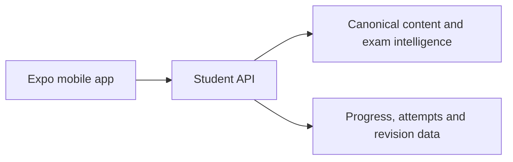

# Mobile Experience Documentation

This folder is the implementation blueprint for a separate **Expo / React Native** BPSC mobile client. It is documentation only; it does not modify the existing web PWA or the knowledge-compiler backend.

## Documents

| # | Document | Audience | Purpose |
|---|---|---|---|
| 00 | [Mobile Product Brief](./00-mobile-product-brief.md) | Product, Content Ops, leadership | Product scope, user value, BPSC experience, business boundaries |
| 01 | [Functional Requirements](./01-functional-requirement.md) | Product, engineering, content ops, QA | Product scope, functional/non-functional requirements, acceptance criteria, and measurement |
| 02 | [Delivery Plan & Reference Inventory](./02-delivery-plan.md) | Delivery leads, all teams | MVP phases, milestones, ownership, launch gates, rollout, and reference inventory |
| 03 | [Mobile Backend Contract](./03-mobile-backend-contract.md) | Backend, mobile engineering | Existing API reuse, API readiness, required mobile contracts, sync, and ownership |
| 04 | [Expo UI Architecture](./04-expo-ui-architecture.md) | Mobile engineering, UX, QA | Production client architecture, navigation, state, design, offline behavior, and quality requirements |
| 05 | [Scalable Mobile Platform Architecture](./05-scalable-platform-architecture.md) | Product, mobile, backend, data, AI, content ops, QA | Cross-stack architecture, data flows, operational controls, and scale-out decisions |

## Reference screenshots

`Reference/` contains the supplied product-reference material. It is retained for internal UX analysis and licensing review only.

For the business-facing flow, see [`Reference/REFERENCE-APP-FLOW.md`](./Reference/REFERENCE-APP-FLOW.md). The supplied reference PDFs are stored in [`Reference/UnaccademyPdf/`](./Reference/UnaccademyPdf/).

- They illustrate patterns such as unit/lesson navigation, exam-mode separation, practice, Mains questions, performance, current affairs, and short-form learning.
- They must **not** be copied as a branded product, source of content, or visual specification.
- The Expo app will use SarkariExamsAI’s own BPSC content model, terminology, assets, and design system.

## Product boundary

The mobile app is a new client of the same knowledge platform:

See the [existing web frontend documentation](../frontend/README.md) for the deployed PWA. The mobile client should share API contracts, not implementation files or web state management.
