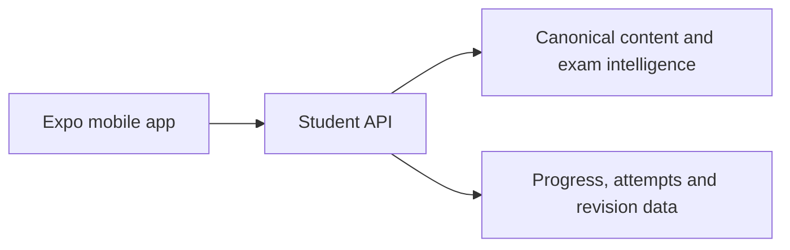

# Mobile Experience Documentation

This folder is the implementation blueprint for a separate **Expo / React Native** BPSC mobile client. It is documentation only; it does not modify the existing web PWA or the knowledge-compiler backend.

## Documents

| # | Document | Audience | Purpose |
|---|---|---|---|
| 00 | [Mobile Product Brief](./00-mobile-product-brief.md) | Product, Content Ops, leadership | Product scope, user value, BPSC experience, business boundaries |
| 01 | [Expo UI Architecture](./01-expo-ui-architecture.md) | Mobile engineering, UX, QA | Navigation, screens, state, design and accessibility requirements |
| 02 | [Mobile Backend Contract](./02-mobile-backend-contract.md) | Backend, mobile engineering | Existing API reuse, required mobile contracts, sync and ownership |
| 03 | [Delivery Plan & Reference Inventory](./03-delivery-plan.md) | Delivery leads, all teams | MVP phases, dependencies, acceptance criteria, screenshot reference inventory |

## Reference screenshots

`reference-screens/` contains the supplied product-reference screenshots. They are retained for internal UX analysis only.

- They illustrate patterns such as unit/lesson navigation, exam-mode separation, practice, Mains questions, performance, current affairs, and short-form learning.
- They must **not** be copied as a branded product, source of content, or visual specification.
- The Expo app will use SarkariExamsAI’s own BPSC content model, terminology, assets, and design system.

## Product boundary

The mobile app is a new client of the same knowledge platform:

See the [existing web frontend documentation](../frontend/README.md) for the deployed PWA. The mobile client should share API contracts, not implementation files or web state management.
