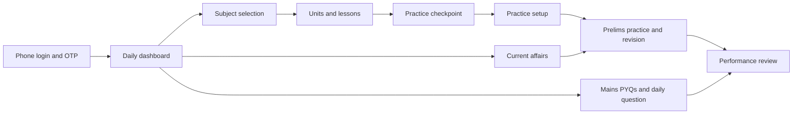
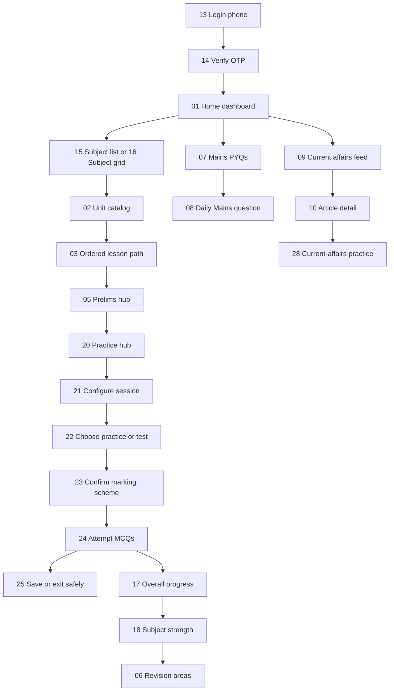
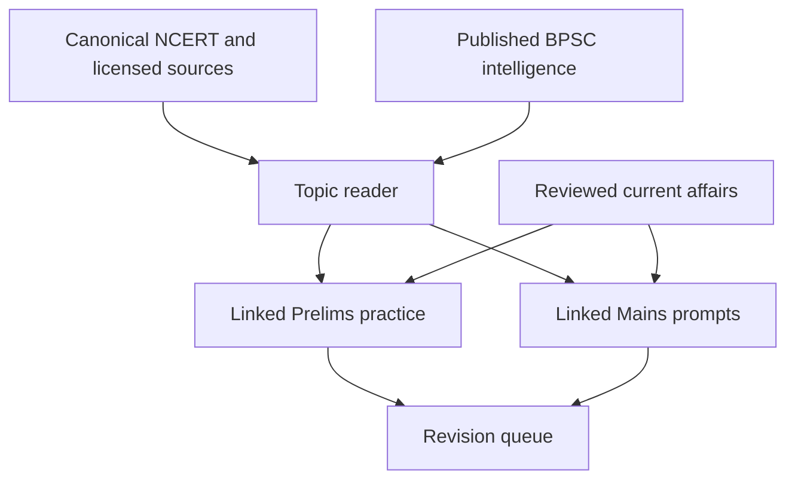

# Reference App Flow — Business Summary

| Field | Value |
|---|---|
| Purpose | Summarise the supplied reference screens for business discussion |
| Scope | Interaction patterns only — not brand, copy, content, or UI replication |
| Source set | 96 supplied screenshots reduced to 28 representative screens |
| Target product | SarkariExamsAI BPSC mobile app |

## Executive summary

The reference product is built around a clear exam-preparation loop:

Its strongest idea is not any individual screen. It is the way the app makes a student repeatedly choose the next small action: resume a lesson, attempt a question, revise a weak topic, or write a Mains answer.

SarkariExamsAI should retain this behaviour, while differentiating through canonical NCERT/reference reading, BPSC-specific exam intelligence, source-backed PYQs, and reviewed guidance.

## Representative flow

| Step | Representative screen | What the reference demonstrates | SarkariExamsAI decision |
|---|---|---|---|
| 1 | `01-home-dashboard.png` | A dashboard offers several entry points: daily work, current affairs, practice, and learning continuation. | One primary “continue/next action” plus secondary BPSC utilities. |
| 2 | `02-subject-units.png` | Units make a large syllabus navigable and show completion. | Keep subject → unit → lesson hierarchy based on canonical IDs. |
| 3 | `03-ordered-lesson-path.png` | Lessons are sequenced and a practice sheet appears at the appropriate learning checkpoint. | Link reading sections to BPSC Prelims practice, rather than generic sheets. |
| 4 | `04-lesson-lock-gate.png` | Progression gates encourage sequence. | Use prerequisites only when educationally necessary; never obscure core NCERT access. |
| 5 | `05-prelims-home.png` | Prelims gets a dedicated destination and daily action. | Separate Prelims workspace using `PRE` PYQs, timed practice, and revision. |
| 6 | `06-revision-areas.png` | Revision is based on strength/weakness and high-repeat topics. | Combine learner accuracy with validated BPSC PYQ frequency and revision priority. |
| 7 | `07-mains-pyq-list.png` | Mains questions are searchable/filterable, with marks and subject labels. | BPSC Mains GS-I filters: subject, topic, year, marks, and question pattern. |
| 8 | `08-daily-mains-question.png` | A single daily Mains prompt reduces choice overload. | One BPSC daily question with word limit, cited framework, saved drafts, and evaluation status. |
| 9 | `09-current-affairs-feed.png` | Current affairs are grouped into exam-relevant themes and lead to MCQs. | Source-linked Bihar/India/world feed with reviewed tags, highlights, and practice links. |
| 10 | `10-current-affairs-article.png` | An article expands to highlights and detail. | Preserve citations and mark reviewed explanatory content; avoid unaudited “why it matters” prose. |
| 11 | `11-shorts-feed.png` | Short media supports discovery and quick revision. | Later feature; any short must be linked to a source/topic, not a substitute for reading. |
| 12 | `12-leaderboard.png` | Ranking can provide motivation. | Optional after learning-loop metrics are healthy; show fair, explainable scoring. |
| 13 | `13-login-phone.png` | Phone-number login introduces identity before personalized progress. | Use a BPSC-branded OTP flow with privacy consent and no mandatory marketing opt-in. |
| 14 | `14-login-otp.png` | OTP verification completes the login journey. | Securely store session credentials and explain retry/error states. |
| 15 | `15-subject-list.png` | Subjects are grouped into syllabus domains with unit counts. | Use BPSC syllabus groups and canonical subject IDs. |
| 16 | `16-subject-grid.png` | A visual card alternative makes broad subjects easier to scan. | Offer a compact/list accessibility mode; original artwork only. |
| 17 | `17-overall-progress.png` | One screen combines completion, accuracy, MCQs and Mains activity. | Show source-backed progress metrics, separated by Prelims and Mains. |
| 18 | `18-subject-performance.png` | Subject-level strength analysis identifies revision need. | Derive strength from attempts, accuracy, recency and verified topic priority. |
| 19 | `19-progress-comparison.png` | Comparative trends can motivate more practice. | Optional and carefully worded; never shame learners or make unverifiable topper claims. |
| 20 | `20-practice-hub.png` | Practice is split into sectional, current-affairs and full-length paths. | Start with topic/PYQ practice; add full tests only with a valid BPSC blueprint. |
| 21 | `21-practice-configuration.png` | Learners choose subject, topic, question count and bank before starting. | Use BPSC stage, subject, topic, PYQ years and attempt history as filters. |
| 22 | `22-practice-test-modes.png` | Practice and timed-test modes set different learning expectations. | Support learning mode and BPSC test simulation with transparent scoring. |
| 23 | `23-marking-scheme.png` | The exam marking rule is shown before the test begins. | Display the current official BPSC marking rule with source/version metadata. |
| 24 | `24-mcq-question.png` | A focused question screen supports one response at a time. | Include question source, stage, accessibility support and recoverable progress. |
| 25 | `25-exit-practice-confirmation.png` | An exit safeguard prevents accidental abandonment. | Save a resumable attempt locally/server-side; never trap a learner. |
| 26 | `26-question-generation.png` | Loading state communicates session preparation. | Say “Preparing practice set”; use deterministic/session-backed selection, not opaque live generation. |
| 27 | `27-pyq-filter.png` | PYQs are filtered by year, topic and attempt history. | Support BPSC cycle/year, stage, subject, topic, bookmarks and incorrect-only filters. |
| 28 | `28-news-practice.png` | Current-affairs practice can be narrowed by subject and month. | Link reviewed articles to a BPSC practice set with source citations. |

## Serial user journey

## Screens intentionally removed from the representative pack

The source set contains multiple near-duplicate views of:

- Unit listings across different History/Art & Culture sections
- The same lesson path at different scroll positions
- Mains PYQ filters for type, subject, and year
- Leaderboards split by MCQ, daily Mains question, and daily Prelims question
- Article detail screens split between highlights and long-form content
- Login variants, loading variants, and progress views that expose the same interaction state

The retained 28 screens now cover the complete mobile journey in serial order: login → subject selection → learning → practice setup → attempts → progress/revision → Mains/current affairs.

## What to replicate vs not replicate

| Retain as a product pattern | Do not copy |
|---|---|
| Ordered syllabus path and visible progress | Reference brand, colors, iconography, wording, or screenshots |
| Separate Prelims and Mains journeys | Generic course/video-first information architecture |
| Practice at learning checkpoints | Paywall/lock pattern without approved entitlement policy |
| Revision based on performance | Unverifiable rankings or engagement mechanics as the core loop |
| Current affairs → explanation → practice path | Unreviewed AI-written facts or model answers |
| Filters for large PYQ collections | Third-party content, images, or publisher material |

## Product implication for SarkariExamsAI

The reference design is strongest as a model for **mobile habit formation**. SarkariExamsAI’s defensible advantage must be **truthful, source-backed exam intelligence**, not visual similarity.

## Source PDF

The supplied reference file is stored as [`Economy-NCERT_v8.pdf`](./Economy-NCERT_v8.pdf).

It is reference material only and must not be republished as SarkariExamsAI content without confirming its licensing and permitted use.
