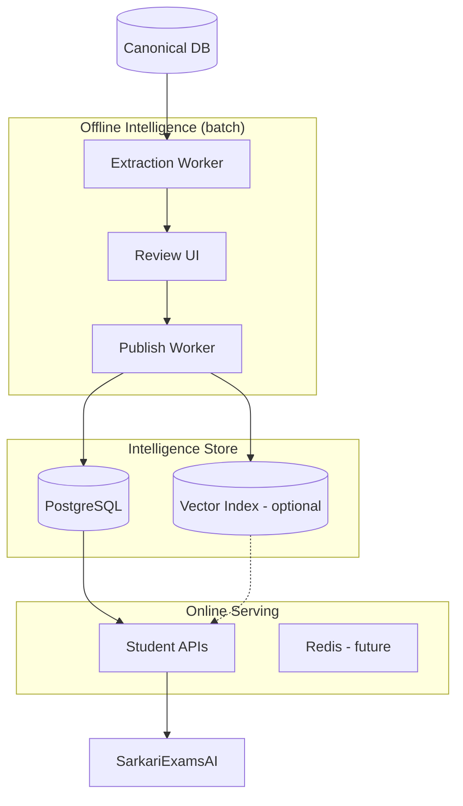
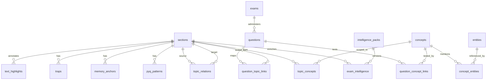

# 06 — Knowledge Graph & Question Intelligence

| Field | Value |
|-------|-------|
| **Document ID** | WIKI-06 |
| **Owner** | AI Platform Engineering |
| **Reviewers** | Data Platform, Backend, Product |
| **Status** | Planned (schema design v1) |
| **Last updated** | 2026-07-10 |
| **Depends on** | WIKI-03 (Canonical DB), WIKI-09 (Offline AI Extraction) |
| **Blocks** | Practice engine, Navigator, Online AI Tutor |

---

## Overview

The **Knowledge Graph (KG)** and **Question Intelligence (QI)** layers sit between the canonical content store and the student experience. They answer questions the canonical DB alone cannot:

- *How does Topic A relate to Topic B across books?*
- *Which PYQ patterns map to this section?*
- *What MCQs test this concept at BPSC Prelims difficulty?*
- *Where do students consistently fail on this topic?*

**This is not an AI chatbot layer.** KG/QI are **structured, reviewable intelligence** produced offline, versioned, and served through Student APIs. The Online AI Tutor (future) may *read* the graph — it does not *become* the graph.

### Position in the platform

```
Canonical DB (truth)
        ↓
Offline AI Extraction (WIKI-09) → concepts, entities, relations (draft)
        ↓
Human Review Gate (Content Ops)
        ↓
Knowledge Graph (approved edges + nodes)
        ↓
Question Intelligence (MCQ/PYQ linkage + generation metadata)
        ↓
Student APIs (/api/practice, /api/courses/.../workspace)
        ↓
Reader UI + Practice UI
```

---

## Business Goal

### Primary goal
Enable **exam-pattern-aware learning** — students practice what BPSC actually asks, grounded in what they just read.

### Success metrics (18-month horizon)

| Metric | Target | Why |
|--------|--------|-----|
| PYQ coverage per flagship topic | ≥ 80% | Credibility of "How BPSC tests it" rail |
| MCQ-to-topic linkage accuracy | ≥ 95% (human-audited sample) | Wrong linkage destroys trust |
| Practice completion after topic read | ≥ 40% | Validates read → practice loop |
| Avg time to generate 10 MCQs/topic | < 30 min (semi-automated) | Content Ops throughput |
| Cross-book linkage precision | ≥ 90% on audit set | Graph utility for Mains answer writing |

### Non-goals
- Real-time graph mutation from student chat
- LLM-only MCQ generation without human review gate
- Replacing canonical paragraphs with generated summaries in the Reader

---

## Architecture

### Logical components



### Why PostgreSQL-first (not Neo4j on day one)

| Factor | Decision | Rationale |
|--------|----------|-----------|
| Team familiarity | PG relational + JSONB | Same ops stack as canonical store |
| Query patterns | Topic-scoped traversals 1–2 hops | Most student queries are `topic_id → PYQs → related topics` |
| Joins with canonical | Frequent | MCQs must join `sections.section_id` |
| Scale | < 10M edges in 2 years | PG with proper indexes is sufficient |
| Evolution | PG + `pgvector` or export to graph DB | Extract graph service if 3-hop queries dominate |

**Future extraction trigger:** p95 graph query latency > 200ms at 3+ hops, or Graph Analytics team needs native algorithms.

### Node and edge taxonomy

| Node type | Source ID | Example | Purpose |
|-----------|-----------|---------|---------|
| `Topic` | `sections.section_id` | `SEC_2_1` | Anchor for all intelligence |
| `Concept` | `concepts.concept_id` | `CONCEPT_swadeshi` | Fine-grained exam unit |
| `Entity` | `entities.entity_id` | `ENT_gandhi` | Person, place, event, institution |
| `Exam` | `exams.exam_id` | `BPSC_PRE_2024` | Exam metadata |
| `Question` | `questions.question_id` | `Q_bpsc_2022_42` | MCQ / descriptive stem |
| `Trap` | `traps.trap_id` | `TRAP_rowlatt_jallianwala_date` | Common mistake pattern |

| Edge type | From → To | Example | Purpose |
|-----------|-----------|---------|---------|
| `HAS_CONCEPT` | Topic → Concept | SEC_2_1 → swadeshi | Scope concepts to topic |
| `MENTIONS` | Paragraph → Entity | P00042 → Gandhi | Grounding for tutor |
| `RELATED_TO` | Topic → Topic | SEC_2_1 → SEC_3_4 | Cross-chapter linkage |
| `PREREQUISITE` | Topic → Topic | SEC_1_1 → SEC_2_1 | Learning path |
| `ASKED_IN` | Question → Topic | Q_… → SEC_2_1 | PYQ mapping |
| `TESTS` | Question → Concept | Q_… → CONCEPT_… | MCQ skill tagging |
| `CONFUSED_WITH` | Trap → Concept pair | date mix-up | "Avoid these traps" rail |
| `SIMILAR_PATTERN` | Question → Question | PYQ clustering | Practice variety |

---

## Data Flow

### Offline publish pipeline

```
1. Canonical book loaded (book_versions.active = true)
2. Extraction job reads paragraphs + glossary for book_id
3. LLM/rule pipeline proposes:
   - concepts[], entities[], edges[], question_candidates[]
4. Artifacts written to intelligence_staging.* (not student-visible)
5. Content Ops reviews in Admin Review UI:
   - approve / edit / reject per row
6. Publish worker:
   - INSERT into intelligence.* tables
   - SET intelligence_packs.version += 1
   - INVALIDATE API cache keys for affected topic_ids
7. Student API reads only `status = published` rows
```

### Online read path (practice session)

```
GET /api/practice/sessions?topic_id=SEC_2_1&exam=BPSC&count=10
        ↓
Resolve topic_id → concept_ids (HAS_CONCEPT)
        ↓
Select questions WHERE TESTS concept_id IN (...)
        AND difficulty IN (...)
        AND status = published
        ORDER BY pyq_weight DESC, last_served_at ASC
        ↓
Return PracticeSessionResponse
```

### Online read path (exam intelligence rail)

```
GET /api/courses/.../topics/{topic_id}/workspace
        ↓
JOIN exam_intelligence ON section_id = topic_id
JOIN pyq_patterns ON topic_id
JOIN memory_anchors ON topic_id
JOIN traps ON topic_id
        ↓
TopicWorkspaceResponse.intelligence
```

**Current state:** Intelligence is mock-authored in `mockCourses.ts` or client-derived from takeaways. Target: `exam_intelligence` table (see schema below).

---

## ER Diagram



---

## Table reference (planned)

All tables live in schema `intelligence` (separate from `public` canonical tables). **Why separate schema:** Clear ownership boundary; student APIs join across schemas; easier to grant read-only to analytics.

---

### `intelligence.concepts`

| Attribute | Detail |
|-----------|--------|
| **Purpose** | Atomic exam-learnable unit finer than a topic |
| **Responsibilities** | Name, definition, difficulty, source paragraph refs |
| **PK** | `concept_id` VARCHAR(128) — e.g. `CONCEPT_{book}_{slug}` |
| **Relationships** | M:N with `sections` via `topic_concepts`; M:N with `questions` |
| **Indexes** | `ix_concepts_book_id`, GIN on `aliases` JSONB |
| **Future scalability** | ~50–200 concepts per book; partition by `book_id` if needed |
| **Versioning** | Tied to `intelligence_packs`; soft-delete via `status` |
| **Constraints** | `UNIQUE(book_id, slug)`; FK `book_id → books` |
| **Team ownership** | AI Platform (schema), Content Ops (curation) |

**Example record:**
```json
{
  "concept_id": "CONCEPT_hist10_non_cooperation",
  "book_id": "hist_class10",
  "slug": "non_cooperation",
  "label": "Non-Cooperation Movement (1920–22)",
  "definition": "Mass movement led by Gandhi: boycott of British institutions and goods.",
  "source_paragraph_ids": ["P00312", "P00318"],
  "difficulty": 2,
  "status": "published",
  "pack_version": 3
}
```

---

### `intelligence.exam_intelligence`

| Attribute | Detail |
|-----------|--------|
| **Purpose** | Topic-level exam briefing for Reader intelligence rail |
| **Responsibilities** | `why_it_matters`, `exam_focus[]`, `key_points[]` |
| **PK** | `id` BIGSERIAL |
| **Relationships** | FK `section_id → sections.section_id` (1:1 per pack version) |
| **Indexes** | `UNIQUE(section_id, pack_version)`; `ix_exam_intel_exam_code` |
| **Future scalability** | One row per topic per exam pack (BPSC, UPSC variants) |
| **Versioning** | `pack_version` FK → `intelligence_packs` |
| **Constraints** | `exam_code` ENUM or VARCHAR; `status IN (draft, published, archived)` |
| **API reference** | Composed into `TopicWorkspaceResponse.intelligence` |

**Example record:**
```json
{
  "section_id": "SEC_2_1",
  "exam_code": "BPSC",
  "why_it_matters": "Links Gandhian mass movements to Bihar's freedom struggle — frequent Prelims MCQ.",
  "exam_focus": ["Rowlatt Act → Jallianwala Bagh chain", "Khilafat merger"],
  "key_points": ["1920 launch", "Boycott pillars: schools, courts, goods"],
  "pack_version": 3,
  "status": "published"
}
```

---

### `intelligence.pyq_patterns`

| Attribute | Detail |
|-----------|--------|
| **Purpose** | Representative PYQ stems / patterns per topic |
| **Responsibilities** | Question text, exam, year, type, examiner tip |
| **PK** | `pattern_id` VARCHAR(128) |
| **Relationships** | FK `section_id`; optional FK `question_id` when sourced from real PYQ |
| **Indexes** | `ix_pyq_section_id`, `ix_pyq_exam_year` |
| **Future scalability** | Thousands per exam; paginate in API |
| **Versioning** | Immutable once published; supersede via new pack |
| **Constraints** | `type IN (fact_mcq, analytical, map, chronology)` |

---

### `intelligence.memory_anchors`

| Attribute | Detail |
|-----------|--------|
| **Purpose** | Mnemonics and hooks for "Remember this" rail |
| **Responsibilities** | `label`, `hook`, optional `kind` (date, acronym, sequence) |
| **PK** | `anchor_id` VARCHAR(128) |
| **Relationships** | FK `section_id`; optional FK `concept_id` |
| **Indexes** | `ix_anchors_section_id` |

---

### `intelligence.traps`

| Attribute | Detail |
|-----------|--------|
| **Purpose** | "Avoid these traps" content |
| **Responsibilities** | Trap description, confused concepts/dates |
| **PK** | `trap_id` VARCHAR(128) |
| **Relationships** | FK `section_id`; optional `CONFUSED_WITH` edges |
| **Indexes** | `ix_traps_section_id` |

---

### `intelligence.text_highlights`

| Attribute | Detail |
|-----------|--------|
| **Purpose** | Server-driven smart highlights (replaces client glossary) |
| **Responsibilities** | `term`, `note`, `kind`, `paragraph_id`, char offsets |
| **PK** | `highlight_id` VARCHAR(128) |
| **Relationships** | FK `section_id`, FK `paragraph_id` |
| **Indexes** | `ix_highlights_section_paragraph` |
| **Migration strategy** | Import from `mockCourses.ts` GLOSSARY as seed; Content Ops edits in admin |
| **API reference** | Embedded in `ReadingStep.highlights[]` |

**Example record:**
```json
{
  "highlight_id": "HL_SEC_2_1_rowlatt",
  "section_id": "SEC_2_1",
  "paragraph_id": "P00312",
  "term": "Rowlatt Act",
  "note": "1919 law allowing detention without trial; triggered Gandhi's satyagraha.",
  "kind": "fact",
  "start_offset": 142,
  "end_offset": 153
}
```

---

### `intelligence.questions`

| Attribute | Detail |
|-----------|--------|
| **Purpose** | MCQ bank (PYQ imports + generated) |
| **Responsibilities** | Stem, options, correct answer, explanation, difficulty, source |
| **PK** | `question_id` VARCHAR(128) |
| **Relationships** | M:N topics and concepts; FK `exam_id` optional |
| **Indexes** | `ix_questions_difficulty`, GIN `tags`, `ix_questions_status` |
| **Future scalability** | 500K+ questions — partition by `exam_code`; read replicas |
| **Versioning** | `status`: draft → in_review → published → retired |
| **Constraints** | Exactly one correct option; `explanation` required for published |
| **Team ownership** | Question Intelligence squad |

**Example record:**
```json
{
  "question_id": "Q_bpsc_hist_rowlatt_001",
  "stem": "The Rowlatt Act of 1919 was opposed because it:",
  "options": [
    {"id": "A", "text": "Allowed detention without trial"},
    {"id": "B", "text": "Introduced dyarchy"},
    {"id": "C", "text": "Partitioned Bengal"},
    {"id": "D", "text": "Banned the Congress"}
  ],
  "correct_option_id": "A",
  "explanation": "Rowlatt Act (Black Acts) permitted incarceration without trial.",
  "difficulty": 2,
  "source": "generated",
  "exam_code": "BPSC",
  "status": "published"
}
```

---

### `intelligence.topic_relations`

| Attribute | Detail |
|-----------|--------|
| **Purpose** | Knowledge graph edges between topics |
| **Responsibilities** | `relation_type`, `weight`, `evidence` |
| **PK** | `id` BIGSERIAL |
| **Relationships** | FK `source_section_id`, FK `target_section_id` |
| **Indexes** | `ix_relations_source`, `ix_relations_target`, `ix_relations_type` |
| **Constraints** | `relation_type IN (RELATED_TO, PREREQUISITE, PART_OF, CONTRASTS)`; no self-loops |
| **Validation** | Both topics must exist; cross-book edges require both books published |

---

### `intelligence.intelligence_packs`

| Attribute | Detail |
|-----------|--------|
| **Purpose** | Version bundle for rollback |
| **Responsibilities** | `book_id`, `version`, `published_at`, `published_by` |
| **PK** | `pack_id` UUID |
| **Relationships** | Parent to all `pack_version` FKs |
| **Indexes** | `UNIQUE(book_id, version)` |
| **Migration strategy** | Alembic `003_intelligence_schema.py` |

---

## Folder Structure

```
knowledge-compiler/
├── backend/
│   ├── intelligence/              # NEW — planned
│   │   ├── models.py              # SQLAlchemy intelligence schema
│   │   ├── repository.py          # Graph + question queries
│   │   ├── publish.py             # Staging → published promotion
│   │   └── validators.py          # MCQ integrity checks
│   ├── routers/
│   │   ├── practice.py            # NEW — /api/practice/*
│   │   └── intelligence_admin.py  # NEW — review/publish APIs
│   └── jobs/
│       ├── extract_intelligence.py
│       └── link_pyqs.py
├── alembic/versions/
│   └── 003_intelligence_schema.py # Planned
└── frontend/src/
    └── pages/IntelligenceReviewPage.tsx  # Planned

sarkariexamsAI/
├── src/data/api/
│   ├── practiceApi.ts             # Planned
│   └── coursesTypes.ts            # ExamIntelligence types (exists)
└── src/features/practice/         # UI exists; wire to real API
```

---

## Naming Standards

| Entity | Pattern | Example |
|--------|---------|---------|
| Concept ID | `CONCEPT_{book_slug}_{slug}` | `CONCEPT_hist10_satyagraha` |
| Question ID | `Q_{exam}_{subject}_{slug}_{seq}` | `Q_bpsc_hist_rowlatt_001` |
| Trap ID | `TRAP_{section_id}_{slug}` | `TRAP_SEC_2_1_date_mix` |
| Highlight ID | `HL_{section_id}_{slug}` | `HL_SEC_2_1_rowlatt` |
| Pack ID | UUID v4 | `a1b2c3d4-…` |
| Relation type | SCREAMING_SNAKE | `PREREQUISITE` |

---

## Validation Rules

| Rule | Enforcement | Why |
|------|-------------|-----|
| No published MCQ without explanation | DB check + API 422 | Students must learn from mistakes |
| Topic must exist in canonical `sections` | FK | No orphan intelligence |
| PYQ pattern must cite exam + year OR `source=generated` | App validator | Audit trail |
| `PREREQUISITE` graph must be DAG | Publish-time cycle detection | Learning path integrity |
| Cross-book `RELATED_TO` weight ∈ [0, 1] | Schema | Ranking stability |
| Highlight `term` must appear in `paragraph_id` text | Publish validator | Prevents broken AnnotatedText |
| Max 12 highlights per section | Config | UX signal-to-noise (see WIKI-05) |

---

## API references (planned)

### Practice

| Method | Route | Purpose | Owner |
|--------|-------|---------|-------|
| POST | `/api/practice/sessions` | Start session for topic(s) | Backend |
| GET | `/api/practice/sessions/{id}` | Session state | Backend |
| POST | `/api/practice/sessions/{id}/submit` | Grade answers | Backend |
| GET | `/api/practice/topics/{topic_id}/stats` | Accuracy / weakness | Backend |

### Intelligence (student read)

| Method | Route | Purpose |
|--------|-------|---------|
| GET | `/api/courses/.../topics/{id}/workspace` | Composite payload incl. intelligence |
| GET | `/api/courses/.../topics/{id}/related` | Graph neighbors (1-hop) |

### Intelligence (admin)

| Method | Route | Purpose |
|--------|-------|---------|
| GET | `/api/admin/intelligence/staging/{book_id}` | Review queue |
| POST | `/api/admin/intelligence/publish` | Promote pack |
| POST | `/api/admin/intelligence/pyq/import` | Bulk PYQ CSV |

**TypeScript contracts:** Mirror in `sarkariexamsAI/src/data/api/practiceTypes.ts` (planned).

---

## Team ownership

| Area | Primary | Secondary |
|------|---------|-----------|
| KG schema & migrations | Data Platform | AI Platform |
| Extraction jobs | AI Platform | Content Ops |
| Review UI | Content Platform (admin FE) | Product |
| Question bank quality | Content Ops | AI Platform |
| Practice API | Backend Platform | Frontend |
| Practice UI integration | Frontend | Backend |
| PYQ sourcing | Content Ops | Legal (copyright) |

---

## Testing strategy

| Layer | Tests | Tools |
|-------|-------|-------|
| MCQ validators | Unit: exactly one correct option, explanation present | pytest |
| Graph cycle detection | Unit: DAG enforcement on `PREREQUISITE` | pytest |
| Publish worker | Integration: staging → published, idempotent | pytest + test DB |
| API contracts | Contract: OpenAPI ↔ TypeScript types | openapi-typescript |
| Highlight offset | Unit: term found at offset in paragraph | pytest |
| Practice session | E2E: start → answer → score | Playwright |
| Intelligence rail | Visual regression: TopicWorkspace | Chromatic (future) |
| Load test | 100 RPS on `/workspace` with intelligence joins | k6 |

**Quality gates before publish:**
1. Content Ops sign-off on ≥ 10% random sample
2. Automated FK + validation pass
3. No drop in canonical `validation_passed` for book

---

## Migration strategy

### Phase 0 — Current (2026 Q3)
- Intelligence in `mockCourses.ts` + client `GLOSSARY`
- `ExamIntelligence` TypeScript types defined
- UI rails and `AnnotatedText` consume mock highlights

### Phase 1 — Schema + seed (2026 Q3–Q4)
- Alembic `003_intelligence_schema.py`
- Import mock data into `intelligence.*` for `hist_class10`
- Add `GET /workspace` composite endpoint
- Flip highlights to server-driven for one book

### Phase 2 — PYQ + practice (2026 Q4–2027 Q1)
- PYQ CSV import for BPSC 2018–2024
- `/api/practice/sessions` MVP (10 MCQs per topic)
- Wire `practiceSaga` to real API

### Phase 3 — Graph + cross-book (2027 Q1+)
- `topic_relations` for History Class 10 ↔ Civics linkages
- Navigator uses 1-hop graph for "what to read next"

### Rollback
- `intelligence_packs.version` decrement + repoint `active_pack_id` on book
- Student API reads only active pack — instant rollback without redeploy

---

## Future Enhancements

| Enhancement | Value | Complexity |
|-------------|-------|------------|
| `pgvector` embeddings on concepts | Semantic tutor retrieval | Medium |
| Adaptive difficulty (IRT) | Personalized practice | High |
| Crowdsourced trap reports | Student-flagged confusion | Medium |
| Multi-exam packs (UPSC + BPSC) | Market expansion | Medium |
| Graph visualization in Navigator | Mains answer linkages | Medium |
| Spaced repetition scheduling | Retention | High |

---

## Risks

| Risk | Impact | Mitigation |
|------|--------|------------|
| Wrong PYQ-topic linkage | High — student distrust | Human review + audit sampling |
| LLM-generated fake PYQs | Critical | `source` field; ban unpublished LLM PYQs in prod |
| Graph noise (too many edges) | Medium — confusing Navigator | Min weight threshold; max 5 related topics |
| Copyright on PYQ stems | Legal | License agreements; paraphrase where required |
| Highlight offset drift on re-ingest | Medium | Recompute offsets on publish from canonical text |
| Practice without reading | Low retention | UI nudge: "Complete topic first" |

---

## Open Questions

1. **PYQ source of truth:** Licensed vendor vs in-house digitization vs user-contributed?
2. **Generated MCQ ratio:** What % of bank can be LLM-generated vs must be human-written?
3. **Per-exam packs:** Separate `exam_intelligence` per BPSC/UPSC or unified with exam_code column?
4. **Graph storage:** Stay in PG through 2027 or plan Neo4j extraction now?
5. **Student weakness model:** Store per-user concept mastery in `user_concept_mastery` or derive from practice events?
6. **Highlight authorship:** Content Ops only, or allow AI proposal with mandatory review?

---

## Related documents

- [WIKI-03 Canonical Database Schema](./03-canonical-database-schema.md)
- [WIKI-04 Student APIs](./04-student-apis.md)
- [WIKI-05 Reader UI Architecture](./05-reader-ui-architecture.md)
- [WIKI-09 Offline AI Knowledge Extraction](./09-offline-ai-knowledge-extraction.md)
- [ADR-001 Deterministic Ingestion First](./adr/001-deterministic-ingestion-first.md)
