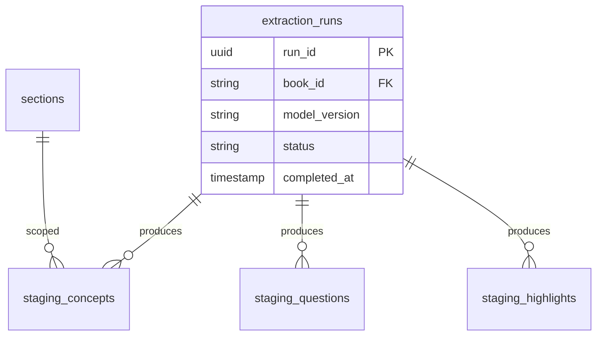

# 09 — Offline AI Knowledge Extraction

| Field | Value |
|-------|-------|
| **Document ID** | WIKI-09 |
| **Owner** | AI Platform Engineering |
| **Reviewers** | Platform Architecture, Content Ops, Data Platform |
| **Status** | Planned (architecture v1) |
| **Last updated** | 2026-07-10 |
| **Depends on** | WIKI-02 (Pipeline), WIKI-03 (Canonical DB) |
| **Feeds** | WIKI-06 (Knowledge Graph & Question Intelligence) |

---

## Overview

**Offline AI Knowledge Extraction** is the bridge between deterministic canonical truth and exam intelligence. It runs **after** a book is loaded into PostgreSQL, **never during** PDF ingestion. All outputs land in **staging tables** for human review before students see them.

**Why offline:**
- LLMs are probabilistic — unsuitable for canonical paragraph text
- Batch jobs are cheaper and auditable than per-request generation
- Content Ops can reject hallucinated concepts before publish
- Same input + model version → reproducible drafts (with temperature 0)

**This is NOT the Online AI Tutor.** Extraction produces structured records (concepts, entities, edges, MCQ drafts). The tutor (future) retrieves published records — it does not invent syllabus content at runtime.

---

## Business Goal

Automate 70% of the work to produce, per topic:
- 5–10 key concepts with definitions
- 3–5 PYQ-style patterns
- 3 memory anchors
- 2–4 common traps
- 10 MCQ drafts
- 8–12 smart highlight candidates

…while keeping **human approval** as the final gate for every published artifact.

### Success metrics

| Metric | Target |
|--------|--------|
| Extraction job time per book | < 2 hours |
| Human review time per topic | < 15 minutes |
| Hallucination rate in staging (audited) | < 5% |
| Concept grounding rate (cited paragraph exists) | 100% |

---

## Architecture

```mermaid
flowchart TB
    subgraph Trigger
        LOAD[Canonical Load Complete]
        CRON[Scheduled re-extract]
        MANUAL[Admin: Re-run extraction]
    end

    subgraph Worker["Extraction Worker (batch)"]
        FETCH[Fetch paragraphs + glossary]
        CHUNK[Chunk by section_id]
        LLM[LLM calls - structured output]
        RULE[Rule-based enrichers]
        VAL[Grounding validator]
    end

    subgraph Output
        STG[(intelligence_staging.*)]
        ART[artifacts/{book_id}/extract/]
    end

    subgraph Human
        REV[Review UI]
        PUB[Publish Worker]
    end

    LOAD --> FETCH
    CRON --> FETCH
    MANUAL --> FETCH
    FETCH --> CHUNK --> LLM --> RULE --> VAL --> STG
    VAL --> ART
    STG --> REV --> PUB
    PUB --> INT[(intelligence.* published)]
```

### Separation from legacy AI path

| Path | Location | Status | Use |
|------|----------|--------|-----|
| **Legacy OCR/AI compiler** | `backend/services/compiler.py`, `ocr.py`, `ai_worker.py` | Deprecated | Do not extend |
| **Deterministic pipeline** | `backend/pipeline/step01–10` | Production | Canonical truth |
| **Offline extraction (this doc)** | `backend/jobs/extract_intelligence.py` | Planned | Intelligence staging |

**Migration:** Do not wire legacy `chapter_schema.json` outputs directly to student APIs. Re-use useful prompts only after adapting to canonical `section_id` anchors.

---

## Data Flow

### Per-topic extraction pipeline

```
Input:
  section_id, title
  paragraphs[] (text, paragraph_id)
  glossary_entries[] (optional)
  exam_profile (BPSC, UPSC)

Steps:
  1. Build context window (max tokens) from paragraphs only
  2. LLM structured JSON output (schema-enforced):
     - concepts[], entities[], traps[], anchors[]
     - pyq_patterns[], question_candidates[]
     - highlights[] (term, note, kind, paragraph_id)
  3. Grounding validator:
     - Every concept cites ≥1 paragraph_id from input
     - Every highlight term is substring of cited paragraph
     - No dates/names not present in source text (regex audit)
  4. Rule enrichers:
     - Year detector → kind=date highlights
     - Glossary fuzzy match → merge with LLM highlights
  5. Write to intelligence_staging.* + artifact JSON
  6. Emit metrics: tokens_used, validation_failures
```

### Publish handoff (to WIKI-06)

```
Content Ops approves rows in Review UI
        ↓
Publish Worker promotes staging → intelligence.*
        ↓
Increments intelligence_packs.version
        ↓
Invalidates cache for affected topic_ids
```

---

## ER Diagram (staging schema)



---

## Table reference (planned — `intelligence_staging` schema)

### `extraction_runs`

| Attribute | Detail |
|-----------|--------|
| **Purpose** | Lineage for each batch extraction |
| **PK** | `run_id` UUID |
| **Indexes** | `ix_extract_runs_book_id`, `ix_extract_runs_status` |
| **Fields** | `book_id`, `model_name`, `model_version`, `prompt_version`, `status`, `token_count`, `error_log` |
| **Team ownership** | AI Platform |

### `staging_concepts` (and siblings)

| Attribute | Detail |
|-----------|--------|
| **Purpose** | LLM-proposed concept before review |
| **PK** | `id` BIGSERIAL |
| **Relationships** | FK `extraction_run_id`, FK `section_id` |
| **Review fields** | `review_status` (pending/approved/rejected/edited), `reviewer_id`, `reviewed_at` |
| **Grounding** | `source_paragraph_ids` JSONB — required |
| **Constraints** | Cannot publish without `review_status = approved` |

---

## Folder Structure

```
knowledge-compiler/
├── backend/
│   ├── jobs/
│   │   ├── extract_intelligence.py    # Main batch entry
│   │   ├── extract_section.py         # Per-topic unit
│   │   └── grounding_validator.py
│   ├── prompts/
│   │   ├── extract_concepts_v1.txt
│   │   ├── extract_questions_v1.txt
│   │   └── extract_highlights_v1.txt
│   └── intelligence/
│       ├── staging_models.py
│       └── publish.py
├── artifacts/
│   └── {book_id}/extract/{run_id}/    # Debuggable JSON output
└── tests/
    └── test_grounding_validator.py
```

---

## Naming Standards

| Artifact | Pattern |
|----------|---------|
| Extraction run | UUID |
| Prompt file | `{task}_v{N}.txt` |
| Artifact path | `artifacts/{book_id}/extract/{run_id}/section_{section_id}.json` |
| Model version pin | `gpt-4.1-2026-04-14` recorded in `extraction_runs` |

---

## Validation Rules

| Rule | Enforcement |
|------|-------------|
| LLM temperature = 0 for extraction | Worker config |
| JSON Schema validation on LLM output | `jsonschema` before DB write |
| Concept must cite paragraph_id in same section | `grounding_validator.py` |
| Highlight term ∈ paragraph text | Substring check |
| Question options must not introduce new facts | Option text ⊆ concept closure of stem |
| Max tokens per section | 12K input cap — split section if exceeded |
| PII scrubbing | No student data in prompts |

---

## Example Records

### Extraction artifact (`section_SEC_2_1.json`)

```json
{
  "section_id": "SEC_2_1",
  "extraction_run_id": "c9bf9e57-1685-4c89-bafb-ff5af1b7e21c",
  "model": "gpt-4.1",
  "prompt_version": "extract_concepts_v1",
  "concepts": [
    {
      "proposed_id": "CONCEPT_hist10_rowlatt",
      "label": "Rowlatt Act (1919)",
      "definition": "Legislation permitting detention without trial.",
      "source_paragraph_ids": ["P00312"],
      "confidence": 0.94
    }
  ],
  "highlights": [
    {
      "term": "Rowlatt Act",
      "note": "1919 law allowing detention without trial.",
      "kind": "fact",
      "paragraph_id": "P00312"
    }
  ],
  "validation": {
    "passed": true,
    "errors": []
  }
}
```

---

## API references

### Admin / worker (planned)

| Method | Route | Purpose |
|--------|-------|---------|
| POST | `/api/admin/extraction/run` | Start book extraction |
| GET | `/api/admin/extraction/runs/{run_id}` | Status + metrics |
| GET | `/api/admin/extraction/staging/{book_id}` | Review queue |
| PATCH | `/api/admin/extraction/staging/{id}` | Approve/reject/edit |
| POST | `/api/admin/intelligence/publish` | Promote to published (WIKI-06) |

### CLI (batch)

```bash
python -m backend.jobs.extract_intelligence \
  --book-id hist_class10 \
  --exam BPSC \
  --model gpt-4.1 \
  --dry-run
```

---

## Team ownership

| Role | Responsibility |
|------|----------------|
| AI Platform | Worker, prompts, validators, model pins |
| Content Ops | Review UI, approval SLA, quality audits |
| Data Platform | Staging schema, migrations |
| Platform Architecture | Cost controls, model vendor selection |

---

## Testing strategy

| Test | Type | Description |
|------|------|-------------|
| Grounding validator | Unit | Reject concept without paragraph cite |
| Golden section | Integration | Fixed input paragraphs → snapshot JSON |
| Hallucination audit | Manual quarterly | 50 random staging rows |
| Cost cap | Integration | Job aborts if token budget exceeded |
| Prompt regression | CI | Hash prompt files; require review on change |
| Model pin change | ADR required | Document behavior diff |

---

## Migration strategy

### Phase 1 — Manual assist (2026 Q3)
- Content Ops authors intelligence in spreadsheet template
- Import script → `intelligence.*` (skip LLM)
- Mock frontend glossary migrated to DB (see WIKI-06 Phase 1)

### Phase 2 — LLM draft + review (2026 Q4)
- Extraction worker for `hist_class10` flagship chapters only
- Review UI MVP (approve/reject)
- No auto-publish

### Phase 3 — Scale (2027)
- Full book batch extraction
- Question candidate generation with duplicate detection
- Re-extract on canonical version bump (diff-aware)

### Deprecate legacy path
- Freeze `compiler.py` feature development
- Archive `schema/chapter_schema.json` outputs not mapped to `section_id`

---

## Future Enhancements

| Enhancement | Description |
|-------------|-------------|
| Multi-model ensemble | Claude + GPT cross-check for concepts |
| Active learning | Prioritize review for low-confidence rows |
| PYQ ingestion LLM | Parse PDF → structured questions (human review) |
| Hindi extraction | Separate prompt pack for Hindi-medium books |
| Embedding pre-compute | Store concept vectors at publish time |
| Diff-aware re-extract | Only re-run changed sections on re-ingest |

---

## Risks

| Risk | Impact | Mitigation |
|------|--------|------------|
| LLM hallucination | High | Grounding validator + human review |
| Cost overrun | Medium | Per-book token budget; batch off-peak |
| Prompt injection via PDF text | Medium | Sanitize text; treat PDF as untrusted |
| Model behavior drift | Medium | Pin versions; regression golden files |
| Review bottleneck | Medium | Prioritize flagship topics; AI confidence routing |
| Legacy path confusion | Low | Clear deprecation in WIKI-02 |

---

## Open Questions

1. **Model vendor:** OpenAI vs Azure OpenAI vs Anthropic for India data residency?
2. **Auto-approve high confidence:** Allow `confidence > 0.98` auto-publish for highlights only?
3. **Re-extraction trigger:** Automatic on every canonical reload or manual only?
4. **Human review tooling:** Build in admin UI vs Retool/Airtable for v1?
5. **Copyright:** Can LLM paraphrase PYQ stems for generated MCQs?

---

## Related documents

- [WIKI-02 Deterministic Ingestion Pipeline](./02-deterministic-ingestion-pipeline.md)
- [WIKI-06 Knowledge Graph & Question Intelligence](./06-knowledge-graph-and-question-intelligence.md)
- [WIKI-07 Naming Standards & Data Governance](./07-naming-standards-and-governance.md)
- [ADR-001 Deterministic Ingestion First](./adr/001-deterministic-ingestion-first.md)
- [ADR-002 Offline Extraction Gate](./adr/002-offline-extraction-human-review-gate.md)
