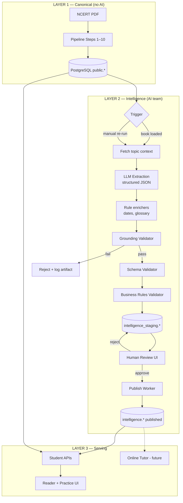
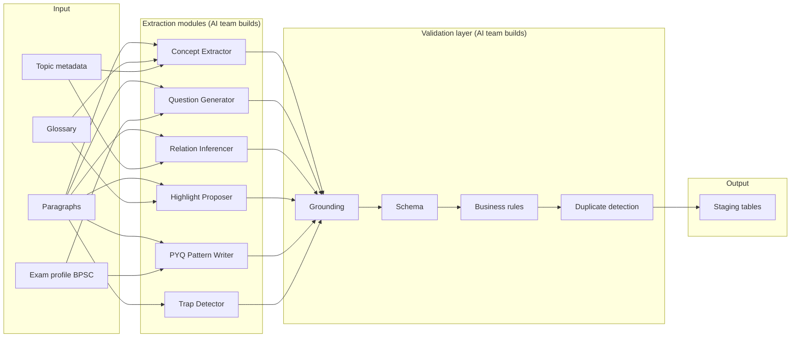
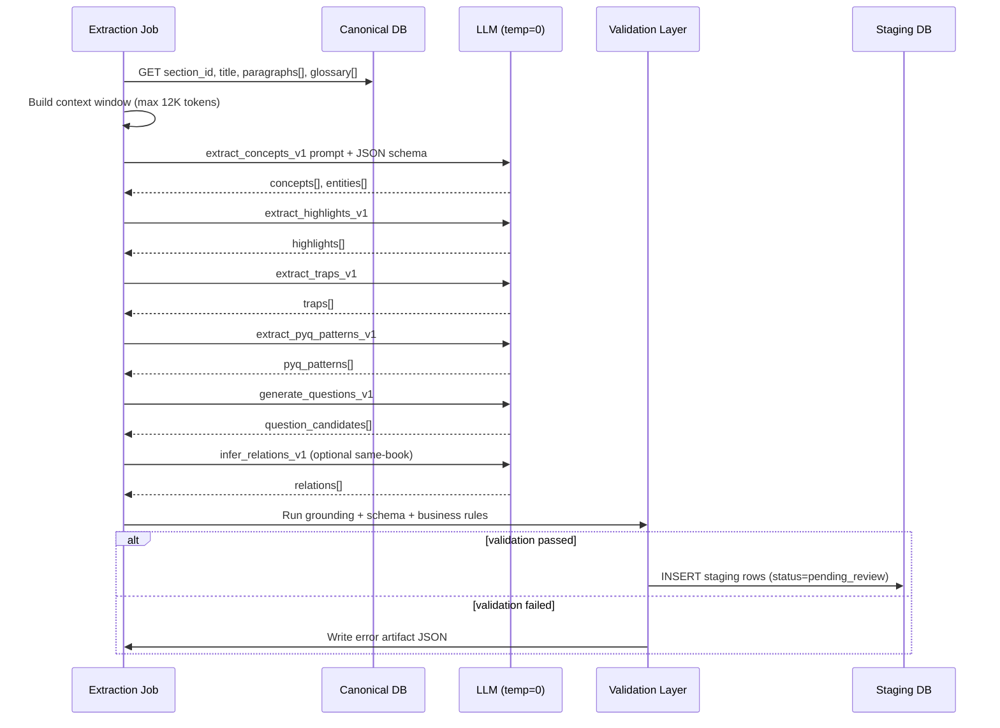
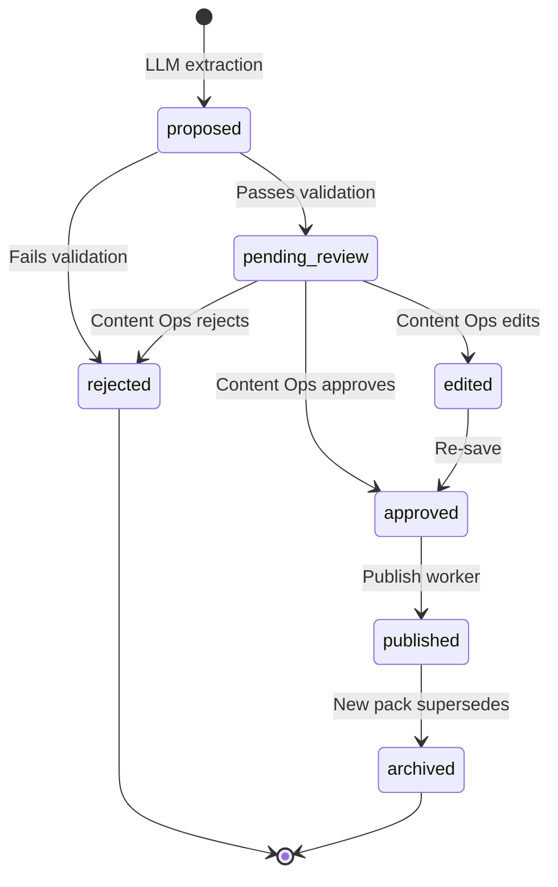
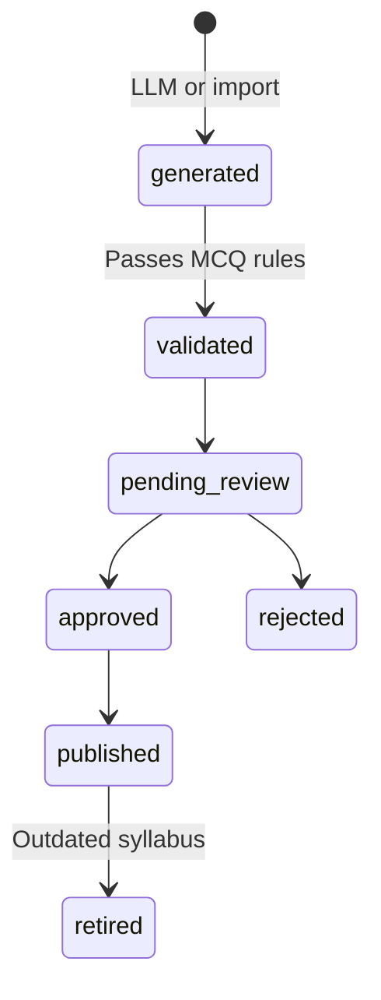
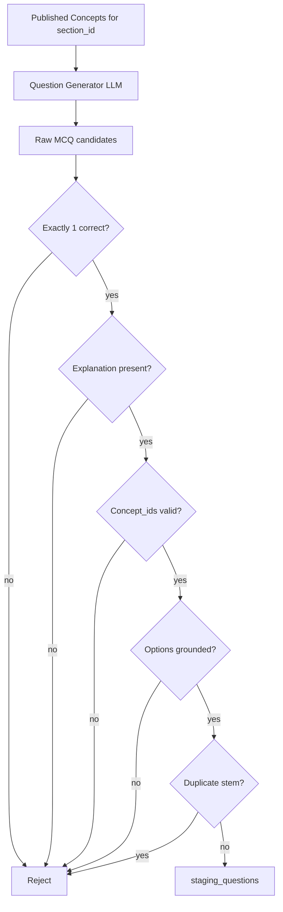
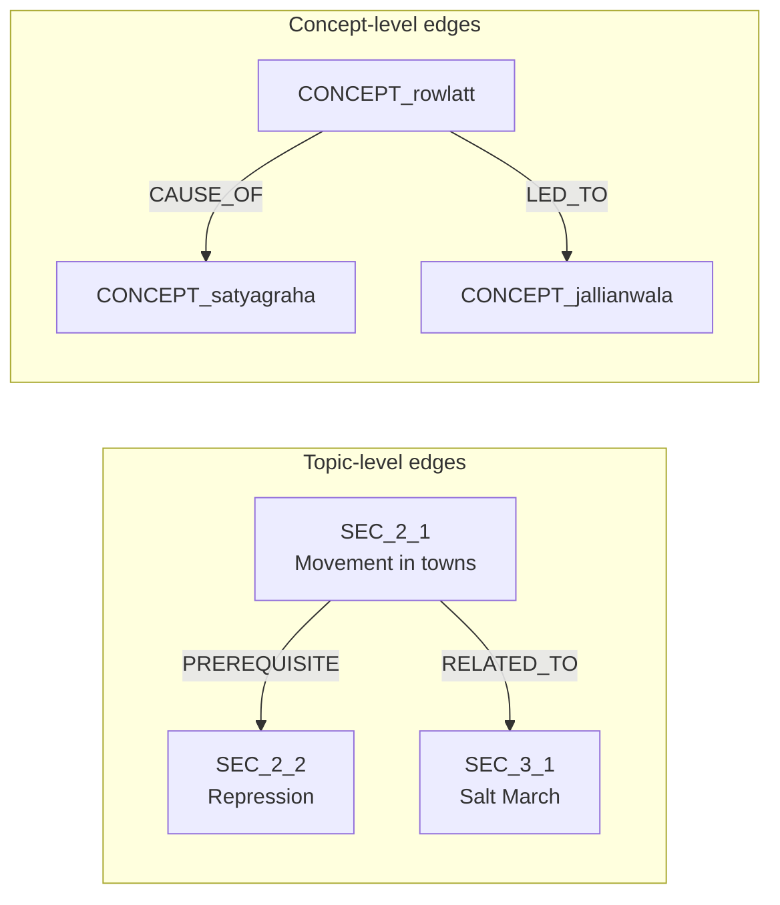
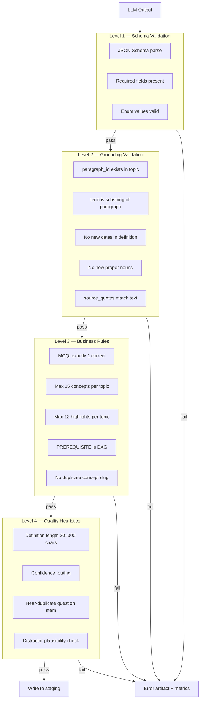
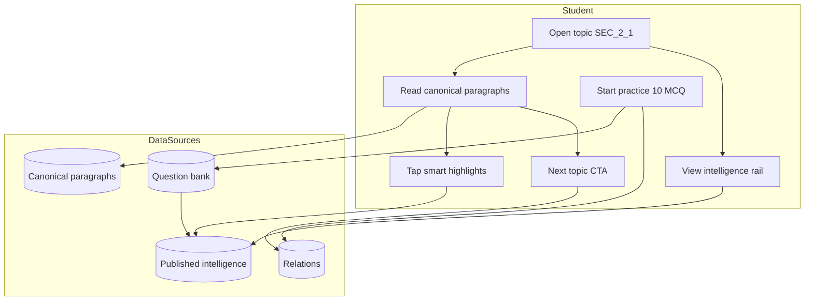

# 10 — AI Platform Intelligence Model (AI Team Briefing)

| Field | Value |
|-------|-------|
| **Document ID** | WIKI-10 |
| **Audience** | **AI Platform team** (primary), Content Ops, Backend, Product |
| **Owner** | Principal Architect + AI Platform Lead |
| **Status** | Draft v1 — shareable briefing |
| **Last updated** | 2026-07-11 |
| **Related** | [WIKI-06](./06-knowledge-graph-and-question-intelligence.md), [WIKI-09](./09-offline-ai-knowledge-extraction.md), [ADR-002](./adr/002-offline-extraction-human-review-gate.md) |

---

## Purpose of this document

This is the **single briefing** for the AI team. It answers:

1. Where does AI sit in the platform — and where does it **not**?
2. What are **Concepts**, **Questions**, and **Relations** — with every field defined?
3. What does the **Validation Layer** check before anything reaches students?
4. What does the AI team **build**, **own**, and **not own**?

**Read this before writing prompts, workers, or models.**

---

## 1. Mental model — three layers of truth

```
┌─────────────────────────────────────────────────────────────────────────┐
│  LAYER 1 — CANONICAL TRUTH (no AI)                                      │
│  NCERT paragraphs, figures, hierarchy                                   │
│  Source: Deterministic pipeline Steps 1–10 → PostgreSQL `public.*`      │
│  Rule: NEVER modify with LLM. NEVER serve LLM paraphrase as reading.    │
└─────────────────────────────────────────────────────────────────────────┘
                                    │
                                    ▼
┌─────────────────────────────────────────────────────────────────────────┐
│  LAYER 2 — INTELLIGENCE (offline AI + human review)                     │
│  Concepts, Questions, Relations, Traps, Highlights, PYQ patterns        │
│  Source: Extraction worker → `intelligence_staging.*` → review → publish│
│  Rule: Every fact must GROUND to Layer 1 paragraph IDs.                 │
└─────────────────────────────────────────────────────────────────────────┘
                                    │
                                    ▼
┌─────────────────────────────────────────────────────────────────────────┐
│  LAYER 3 — ONLINE AI (future — Online Tutor)                            │
│  Conversational help, doubt resolution, explanation on demand           │
│  Source: Retrieves Layer 1 + Layer 2 only. Does not invent syllabus.    │
│  Rule: RAG over published intelligence. No free-form fact generation.    │
└─────────────────────────────────────────────────────────────────────────┘
```

**AI team owns Layer 2 extraction + validation.** Layer 3 is a separate future workstream.

---

## 2. End-to-end flow diagram



---

## 3. AI layer breakdown — what each sub-system does



### Module ownership

| Module | AI team delivers | Input | Output artifact |
|--------|------------------|-------|-----------------|
| **Concept Extractor** | Prompt + schema + post-processor | `section_id`, paragraphs[] | `staging_concepts[]` |
| **Relation Inferencer** | Prompt + DAG checker | concepts[], cross-topic context | `staging_relations[]` |
| **Question Generator** | Prompt + MCQ validator | concepts[], exam_profile | `staging_questions[]` |
| **PYQ Pattern Writer** | Prompt + template library | concepts[], exam_profile | `staging_pyq_patterns[]` |
| **Trap Detector** | Prompt + confusion pairs | concepts[], paragraphs[] | `staging_traps[]` |
| **Highlight Proposer** | Prompt + offset finder | paragraphs[], glossary | `staging_highlights[]` |
| **Grounding Validator** | Pure code (no LLM) | all artifacts + paragraphs | pass/fail + errors[] |
| **Publish Worker** | Backend job | approved staging rows | `intelligence.*` |

---

## 4. Per-topic extraction flow (unit of work)

Every extraction job processes **one topic** (`section_id`) at a time. This is the atomic unit.



### Topic context package (input contract)

Every extractor receives this **TopicContext** object:

```json
{
  "book_id": "hist_class10",
  "chapter_id": "CH_2",
  "section_id": "SEC_2_1",
  "section_title": "The movement in the towns",
  "exam_profile": {
    "primary_exam": "BPSC",
    "secondary_exams": ["UPSC"],
    "stage": ["PRE", "MAINS_GS1"]
  },
  "paragraphs": [
    {
      "paragraph_id": "P00312",
      "text": "In April 1919, Gandhiji organised a satyagraha...",
      "page": 32
    }
  ],
  "glossary_entries": [
    { "term": "satyagraha", "meaning": "Non-violent resistance" }
  ],
  "neighbour_topics": [
    { "section_id": "SEC_2_2", "title": "Repression and resolve" }
  ]
}
```

**AI team must not** assume access to full book PDF at extraction time — only canonical text for the topic (+ optional neighbour metadata).

---

## 5. CONCEPT — complete specification

### What is a Concept?

A **Concept** is the **smallest exam-testable unit of understanding** inside a topic.

| Analogy | SarkariExamsAI |
|---------|----------------|
| Wikipedia article | Topic (`section_id`) |
| Wikipedia section | **Concept** |
| Sentence in NCERT | Paragraph (`paragraph_id`) |

**One topic has 5–15 concepts.** One concept maps to 1–3 MCQs. One concept may link to multiple entities (Gandhi, Rowlatt Act).

### Concept lifecycle



### Concept — every field explained

| Field | Type | Required | Who sets | Description | Example |
|-------|------|----------|----------|-------------|---------|
| `concept_id` | string | ✅ | System (on publish) | Stable ID. Pattern: `CONCEPT_{book}_{slug}` | `CONCEPT_hist10_rowlatt_act` |
| `book_id` | string | ✅ | From context | Parent book | `hist_class10` |
| `section_id` | string | ✅ | From context | Parent topic — **primary anchor** | `SEC_2_1` |
| `slug` | string | ✅ | LLM → human | URL-safe short name | `rowlatt_act` |
| `label` | string | ✅ | LLM → human | Student-facing short title | `Rowlatt Act (1919)` |
| `definition` | string | ✅ | LLM → human | 1–2 sentence definition. **Must be derivable from source text** | `Law allowing detention without trial; triggered 1919 satyagraha.` |
| `definition_hi` | string | ⬜ | Human | Hindi definition (future) | — |
| `kind` | enum | ✅ | LLM → human | Concept category (see below) | `event` |
| `difficulty` | int 1–5 | ✅ | LLM → human | 1=fact recall, 5=analytical linkage | `2` |
| `importance` | enum | ✅ | LLM → human | `core` / `supporting` / `background` | `core` |
| `source_paragraph_ids` | string[] | ✅ | LLM (validated) | **Grounding proof.** Every ID must exist in topic paragraphs | `["P00312"]` |
| `source_quotes` | object[] | ⬜ | LLM (validated) | Optional verbatim spans for audit | `[{"paragraph_id":"P00312","start":0,"end":42}]` |
| `entity_ids` | string[] | ⬜ | LLM + entity linker | Linked entities (person, place, date) | `["ENT_gandhi"]` |
| `aliases` | string[] | ⬜ | LLM → human | Alternate names for search/matching | `["Anarchical Laws", "Black Acts"]` |
| `exam_focus` | string[] | ⬜ | LLM → human | Why BPSC asks this | `["Prelims date MCQ", "Cause-effect chain"]` |
| `confidence` | float 0–1 | ✅ | LLM | Model self-score. Routes review priority | `0.91` |
| `extraction_run_id` | uuid | ✅ | System | Lineage | `c9bf9e57-…` |
| `model_version` | string | ✅ | System | Pinned model | `gpt-4.1-2026-04-14` |
| `prompt_version` | string | ✅ | System | Prompt file version | `extract_concepts_v1` |
| `review_status` | enum | ✅ | System → human | `pending` / `approved` / `rejected` / `edited` | `pending` |
| `reviewer_id` | string | ⬜ | Human | Content Ops user | `ops_priya` |
| `reviewed_at` | timestamp | ⬜ | Human | — | — |
| `status` | enum | ✅ | System | `draft` / `published` / `archived` | `draft` |
| `pack_version` | int | ⬜ | System (publish) | Intelligence pack version | `3` |

### Concept `kind` enum

| Kind | When to use | Example |
|------|-------------|---------|
| `definition` | Term meaning | `satyagraha` |
| `event` | Historical happening | `Jallianwala Bagh massacre` |
| `person` | Individual role | `Gandhi as satyagraha leader` |
| `institution` | Body, law, organisation | `Rowlatt Act`, `Congress` |
| `process` | Sequence of steps | `Non-Cooperation programme pillars` |
| `cause_effect` | Causal chain | `Rowlatt Act → satyagraha → nationwide protest` |
| `comparison` | Contrast two things | `Non-Cooperation vs Civil Disobedience` |
| `geographic` | Place significance | `Amritsar in 1919 protests` |

### Concept quality rubric (AI team + Content Ops)

| Score | Criteria |
|-------|----------|
| ✅ **Publishable** | Definition accurate; ≥1 valid `source_paragraph_id`; kind correct; no new facts |
| ⚠️ **Needs edit** | Vague definition; missing exam_focus; confidence < 0.85 |
| ❌ **Reject** | Date/name not in source text; duplicate of existing concept; orphan (no paragraph cite) |

### Concept — example (full record)

```json
{
  "concept_id": "CONCEPT_hist10_rowlatt_act",
  "book_id": "hist_class10",
  "section_id": "SEC_2_1",
  "slug": "rowlatt_act",
  "label": "Rowlatt Act (1919)",
  "definition": "Legislation that allowed the British government to imprison people without trial. It provoked nationwide satyagraha led by Gandhi.",
  "kind": "institution",
  "difficulty": 2,
  "importance": "core",
  "source_paragraph_ids": ["P00312", "P00314"],
  "source_quotes": [
    {
      "paragraph_id": "P00312",
      "text": "This Act allowed the government to imprison any person without trial."
    }
  ],
  "entity_ids": ["ENT_rowlatt_act", "ENT_1919"],
  "aliases": ["Anarchical and Revolutionary Crimes Act"],
  "exam_focus": [
    "BPSC Prelims: match Act with provision",
    "Often paired with Jallianwala Bagh chronology"
  ],
  "confidence": 0.93,
  "review_status": "approved",
  "status": "published",
  "pack_version": 3
}
```

### What AI team must deliver for Concepts

| Deliverable | Description |
|-------------|-------------|
| `prompts/extract_concepts_v1.txt` | System + user prompt with few-shot examples |
| `schemas/concept.schema.json` | JSON Schema for LLM structured output |
| `extractors/concept_extractor.py` | Calls LLM, parses response |
| `validators/concept_grounding.py` | Verifies paragraph IDs + no hallucinated facts |
| Golden tests | 10 topics with expected concept counts + sample IDs |
| Confidence calibration doc | What 0.9 vs 0.7 means; review routing rules |

---

## 6. QUESTION — complete specification

### What is a Question?

A **Question** is a practice or PYQ item — primarily MCQ for Prelims — **linked to concepts and topics**.

Questions are **never** served from LLM at runtime. They are **generated offline**, validated, reviewed, and published.

### Question types

| Type | `question_type` | Source | Review |
|------|-----------------|--------|--------|
| PYQ import | `pyq` | Licensed CSV / manual entry | Content Ops |
| AI-generated MCQ | `generated` | Question Generator | **Mandatory** review |
| Human-authored | `manual` | Content Ops | Self-approved |
| Paraphrased PYQ | `pyq_paraphrase` | LLM + PYQ source | Legal + Content Ops |

### Question lifecycle



### Question — every field explained

| Field | Type | Required | Description | Example |
|-------|------|----------|-------------|---------|
| `question_id` | string | ✅ | `Q_{exam}_{subject}_{slug}_{seq}` | `Q_bpsc_hist_rowlatt_001` |
| `question_type` | enum | ✅ | `pyq` / `generated` / `manual` / `pyq_paraphrase` | `generated` |
| `stem` | string | ✅ | Question text. No trick grammar. | `The Rowlatt Act of 1919 allowed the government to:` |
| `options` | object[] | ✅ | Exactly 4 options for Prelims MCQ | See below |
| `correct_option_id` | string | ✅ | One of `A`–`D` | `A` |
| `explanation` | string | ✅ | **Required for publish.** Why correct + why others wrong | `Rowlatt Act permitted detention without trial...` |
| `explanation_short` | string | ⬜ | One line for mobile | `No trial needed under Rowlatt Act` |
| `difficulty` | int 1–5 | ✅ | 1=direct fact, 5=multi-concept | `2` |
| `cognitive_level` | enum | ✅ | `recall` / `understand` / `apply` / `analyze` | `recall` |
| `concept_ids` | string[] | ✅ | **What this question tests** | `["CONCEPT_hist10_rowlatt_act"]` |
| `section_ids` | string[] | ✅ | Topics this question belongs to | `["SEC_2_1"]` |
| `exam_code` | string | ✅ | Target exam | `BPSC` |
| `exam_stage` | enum | ✅ | `PRE` / `MAINS_GS1` / `MAINS_GS2` | `PRE` |
| `year` | int | ⬜ | For PYQ | `2022` |
| `source_ref` | string | ⬜ | PYQ paper reference | `BPSC Pre 2022 Q42` |
| `source_paragraph_ids` | string[] | ✅ for `generated` | Grounding for generated questions | `["P00312"]` |
| `distractor_rationale` | object | ⬜ | Why each wrong option is plausible | `{"B": "Dyarchy is 1919 Act diff feature"}` |
| `tags` | string[] | ⬜ | `chronology`, `match-the-following` | `["fact_mcq"]` |
| `status` | enum | ✅ | `draft` → `published` | `published` |
| `confidence` | float | ✅ | LLM self-score | `0.88` |
| `review_status` | enum | ✅ | Human gate | `approved` |

### Options sub-schema

```json
{
  "options": [
    { "id": "A", "text": "Detain persons without trial" },
    { "id": "B", "text": "Introduce dyarchy in provinces" },
    { "id": "C", "text": "Partition Bengal" },
    { "id": "D", "text": "Ban the Indian National Congress" }
  ]
}
```

**Rules:**
- Exactly **one** correct option
- All distractors must be **plausible** (real exam concepts, not nonsense)
- Distractors must **not introduce new facts** not in concept closure
- Option text length within ±30% of correct option (avoid "longest = correct")

### Question generation flow



### What AI team must deliver for Questions

| Deliverable | Description |
|-------------|-------------|
| `prompts/generate_questions_v1.txt` | Per-concept MCQ generation |
| `schemas/question.schema.json` | Strict JSON Schema |
| `validators/mcq_integrity.py` | 1 correct, 4 options, explanation |
| `validators/distractor_grounding.py` | Distractors ⊆ concept facts |
| `dedup/similarity.py` | Embedding or n-gram dedup vs existing bank |
| Target | **10 MCQs per topic**, 3 difficulty bands (easy/med/hard) |

---

## 7. RELATIONS — complete specification

### What is a Relation?

A **Relation** is a **directed edge** between two nodes (usually topics or concepts) expressing how knowledge connects.

Relations power:
- "Related topics" in Navigator
- Learning path ordering (`PREREQUISITE`)
- Mains answer writing (linkages across chapters)
- Question selection (test related concept clusters)

### Relation types



| `relation_type` | From → To | Meaning | Example |
|-----------------|-----------|---------|---------|
| `HAS_CONCEPT` | Topic → Concept | Scoping (join table) | SEC_2_1 → CONCEPT_rowlatt |
| `PREREQUISITE` | Topic → Topic | Must read first | SEC_1_1 → SEC_2_1 |
| `RELATED_TO` | Topic → Topic | Thematic link | SEC_2_1 → SEC_3_1 |
| `PART_OF` | Concept → Concept | Sub-concept | broader → narrower |
| `CONTRASTS` | Concept → Concept | Compare / distinguish | Non-Coop vs Civil Disob |
| `CAUSE_OF` | Concept → Concept | Causal | Rowlatt → satyagraha |
| `LED_TO` | Concept → Concept | Chronological chain | Rowlatt → Jallianwala |
| `MENTIONS` | Paragraph → Entity | Grounding edge | P00312 → ENT_gandhi |
| `TESTS` | Question → Concept | MCQ linkage | Q_001 → CONCEPT_rowlatt |
| `ASKED_IN` | Question → Topic | PYQ mapping | Q_001 → SEC_2_1 |
| `CONFUSED_WITH` | Trap → Concept pair | Common mistake | 1919 vs 1920 dates |

### Relation — every field explained

| Field | Type | Required | Description |
|-------|------|----------|-------------|
| `relation_id` | string | ✅ | Unique edge ID |
| `relation_type` | enum | ✅ | From table above |
| `source_id` | string | ✅ | From node ID |
| `source_type` | enum | ✅ | `topic` / `concept` / `entity` / `question` |
| `target_id` | string | ✅ | To node ID |
| `target_type` | enum | ✅ | Target node type |
| `weight` | float 0–1 | ⬜ | Strength for ranking (default 0.7) |
| `evidence` | string | ✅ | **Why this edge exists** — human readable |
| `source_paragraph_ids` | string[] | ⬜ | Grounding for inferred edges |
| `exam_relevance` | string | ⬜ | Why it matters for BPSC |
| `bidirectional` | bool | ⬜ | Default false; `RELATED_TO` may be true |
| `confidence` | float | ✅ | LLM score for inferred edges |
| `review_status` | enum | ✅ | Human gate for inferred edges |
| `status` | enum | ✅ | `draft` / `published` |

### Relation inference rules (AI team)

| Rule | Description |
|------|-------------|
| **DAG** | `PREREQUISITE` edges must form a Directed Acyclic Graph — no cycles |
| **Same-book default** | Phase 1: infer within book only |
| **Cross-book** | Phase 2: requires both books published + higher review bar |
| **Max out-degree** | Max 5 `RELATED_TO` per topic (avoid noise) |
| **Evidence required** | No edge without `evidence` string ≥ 20 chars |
| **Grounding** | Concept-level causal edges should cite paragraph when possible |

### Relation example

```json
{
  "relation_id": "REL_SEC_2_1_SEC_3_1",
  "relation_type": "RELATED_TO",
  "source_id": "SEC_2_1",
  "source_type": "topic",
  "target_id": "SEC_3_1",
  "target_type": "topic",
  "weight": 0.8,
  "evidence": "Both cover Gandhian mass movements; Non-Cooperation (1920) precedes Civil Disobedience (1930).",
  "exam_relevance": "BPSC Mains may ask to compare movement phases.",
  "confidence": 0.86,
  "review_status": "approved",
  "status": "published"
}
```

---

## 8. VALIDATION LAYER — complete specification

The validation layer is **the most critical code AI team owns**. It is the firewall between LLM creativity and student trust.



### Level 1 — Schema validation

| Check | Implementation |
|-------|----------------|
| Valid JSON | `json.loads` + JSON Schema |
| Required fields | Per-entity schema files |
| ID format | Regex from WIKI-07 |
| Enum values | `kind`, `relation_type`, `question_type` |

**On failure:** Reject entire extractor response for that topic. Do not partial-write.

### Level 2 — Grounding validation (anti-hallucination)

This is **non-negotiable**. Every published fact must trace to canonical text.

| Check ID | Rule | Example failure |
|----------|------|-----------------|
| `G-001` | `source_paragraph_ids` ⊆ topic paragraphs | Cites `P99999` |
| `G-002` | Highlight `term` appears in cited paragraph | Term "Dyarchy" not in text |
| `G-003` | Years in definition ⊆ years in source paragraphs | LLM adds "1920" when only "1919" in text |
| `G-004` | Proper nouns audit — new capitalized tokens flagged | Invents "Smith Commission" |
| `G-005` | `source_quotes` fuzzy-match paragraph (≥90%) | Quote fabricated |
| `G-006` | Generated MCQ stem facts ⊆ union(concept definitions) | Option cites unmentioned treaty |

**Implementation approach:**

```python
# Pseudocode — AI team implements
def validate_grounding(concept, paragraphs_by_id):
    for pid in concept.source_paragraph_ids:
        assert pid in paragraphs_by_id
    years_in_def = extract_years(concept.definition)
    years_in_source = extract_years_from_paragraphs(concept.source_paragraph_ids)
    assert years_in_def <= years_in_source
    new_proper_nouns = find_unknown_proper_nouns(concept.definition, paragraphs_by_id)
    assert len(new_proper_nouns) == 0
```

### Level 3 — Business rules

| Check ID | Entity | Rule |
|----------|--------|------|
| `B-001` | Question | Exactly 4 options, 1 correct |
| `B-002` | Question | `explanation` length ≥ 50 chars |
| `B-003` | Concept | 3 ≤ concepts per topic ≤ 15 |
| `B-004` | Highlight | ≤ 12 per topic |
| `B-005` | Relation | `PREREQUISITE` graph is DAG |
| `B-006` | Relation | No self-loops |
| `B-007` | Concept | `slug` unique per book |
| `B-008` | Question | `concept_ids` all exist in same topic staging batch |
| `B-009` | PYQ pattern | Must have `exam_code` + (`year` OR `source=generated`) |

### Level 4 — Quality heuristics (warnings vs hard fails)

| Check | Hard fail? | Action |
|-------|------------|--------|
| Confidence < 0.70 | No | Route to priority review queue |
| Duplicate stem (cosine > 0.92) | Yes | Reject question |
| Definition < 20 chars | Yes | Reject concept |
| Definition > 300 chars | No | Flag for edit |
| All distractors same length | No | Flag for edit |
| > 5 `RELATED_TO` from one topic | Yes | Reject lowest-weight edges |

### Validation output contract

Every validation run produces:

```json
{
  "section_id": "SEC_2_1",
  "extraction_run_id": "c9bf9e57-…",
  "passed": false,
  "errors": [
    {
      "level": "grounding",
      "check_id": "G-003",
      "entity_type": "concept",
      "entity_label": "Rowlatt Act",
      "message": "Year 1920 in definition not found in source paragraphs"
    }
  ],
  "warnings": [
    {
      "level": "quality",
      "check_id": "Q-001",
      "message": "Concept confidence 0.72 — priority review"
    }
  ],
  "metrics": {
    "concepts_proposed": 8,
    "concepts_passed": 7,
    "questions_proposed": 10,
    "questions_passed": 9,
    "token_count": 14200
  }
}
```

---

## 9. Supporting artifacts (AI team scope)

Beyond Concepts, Questions, and Relations, the same extraction job produces:

| Artifact | Table | Count per topic | Student surface |
|----------|-------|-----------------|-----------------|
| **Highlight** | `staging_highlights` | 8–12 | `AnnotatedText` popover |
| **Trap** | `staging_traps` | 2–4 | "Avoid these traps" rail |
| **Memory anchor** | `staging_memory_anchors` | 3–5 | "Remember this" rail |
| **PYQ pattern** | `staging_pyq_patterns` | 3–5 | "How BPSC tests it" rail |
| **Entity** | `staging_entities` | 5–20 | Graph + tutor grounding |
| **Exam intelligence** | `staging_exam_intelligence` | 1 per exam | Topic workspace header |

All follow the same pattern: **LLM propose → validate → stage → review → publish**.

---

## 10. Full platform flow — student journey overlay



| Student action | Data consumed | AI layer involved |
|----------------|---------------|-------------------|
| Read text | `paragraphs` (Layer 1) | None |
| Tap highlight | `text_highlights` (Layer 2) | Extraction + validation |
| See "How BPSC tests it" | `pyq_patterns` (Layer 2) | Extraction + review |
| See traps / remember | `traps`, `memory_anchors` (Layer 2) | Extraction + review |
| Practice MCQ | `questions` + `TESTS` edges (Layer 2) | Generation + validation |
| "What to read next" | `PREREQUISITE` / `RELATED_TO` (Layer 2) | Relation inferencer |

---

## 11. AI team — responsibilities & boundaries

### AI team OWNS

| Area | Deliverable |
|------|-------------|
| Extraction prompts | Versioned `.txt` files in `prompts/` |
| JSON schemas | Per-entity structured output schemas |
| Extraction workers | `backend/jobs/extract_*.py` |
| Validation layer | `backend/intelligence/validators/` |
| Model pinning | `extraction_runs.model_version` |
| Golden test fixtures | 10+ topics with expected outputs |
| Confidence calibration | Review routing thresholds |
| Dedup / similarity | Question stem near-duplicate detection |
| Metrics | Token cost, pass rate, hallucination rate |

### AI team does NOT own

| Area | Owner |
|------|-------|
| Canonical PDF pipeline | Content Platform |
| PostgreSQL canonical schema | Data Platform |
| Student API routes | Backend (Student squad) |
| Reader UI components | Frontend |
| Human review UI (v1 can be Retool) | Content Ops + Admin FE |
| PYQ licensing | Product + Legal |
| Online Tutor (Layer 3) | Future AI squad |

### Phase 1 MVP (AI team — 8 weeks target)

| Week | Milestone |
|------|-----------|
| 1–2 | `TopicContext` fetcher + `extract_concepts_v1` + grounding validator |
| 3 | `extract_highlights_v1` + offset finder |
| 4 | `generate_questions_v1` + MCQ integrity validator |
| 5 | `extract_traps_v1` + `extract_pyq_patterns_v1` |
| 6 | `infer_relations_v1` + DAG validator |
| 7 | End-to-end job for `hist_class10` CH_2 (3 topics) |
| 8 | Golden tests + metrics dashboard + Content Ops review session |

---

## 12. Open questions for AI team workshop

1. **Model selection:** GPT-4.1 vs Claude vs local — cost/quality tradeoff for Hindi later?
2. **Single vs multi-call:** One mega-prompt per topic vs 6 specialist calls (current design)?
3. **Entity linking:** Separate NER step or inline in concept extraction?
4. **Confidence calibration:** Human labels on 100 concepts to tune thresholds?
5. **Paraphrased PYQ:** Legal approval before building generator?
6. **Re-extraction:** Full topic re-run on canonical reload, or diff-only?
7. **Embedding model:** Which model for question dedup + future tutor RAG?

---

## 13. Related documents

| Doc | Use when |
|-----|----------|
| [WIKI-06 Knowledge Graph & Question Intelligence](./06-knowledge-graph-and-question-intelligence.md) | Full DB schema, API refs, migration phases |
| [WIKI-09 Offline AI Knowledge Extraction](./09-offline-ai-knowledge-extraction.md) | Worker architecture, staging tables, CLI |
| [WIKI-07 Naming Standards](./07-naming-standards-and-governance.md) | ID patterns, validation rule IDs |
| [ADR-002 Human Review Gate](./adr/002-offline-extraction-human-review-gate.md) | Why nothing ships without review |
| [WIKI-05 Reader UI](./05-reader-ui-architecture.md) | Where intelligence surfaces in UI |

---

## Appendix A — Entity relationship diagram (intelligence domain)

```mermaid
erDiagram
    sections ||--o{ topic_concepts : scopes
    concepts ||--o{ topic_concepts : belongs
    concepts ||--o{ concept_relations : source
    concepts ||--o{ concept_relations : target
    sections ||--o{ topic_relations : source
    sections ||--o{ topic_relations : target
    concepts ||--o{ question_concept_links : tested_by
    questions ||--o{ question_concept_links : tests
    sections ||--o{ question_topic_links : contains
    questions ||--o{ question_topic_links : maps
    sections ||--o{ text_highlights : annotated
    paragraphs ||--o{ text_highlights : spans
    sections ||--o{ traps : has
    sections ||--o{ pyq_patterns : has
    sections ||--o{ memory_anchors : has
    sections ||--o{ exam_intelligence : briefing
    extraction_runs ||--o{ staging_concepts : produces
    extraction_runs ||--o{ staging_questions : produces
```



---

## Appendix B — Glossary for AI team

| Term | Definition |
|------|------------|
| **Topic** | Same as `section_id`. The student-facing unit of learning. |
| **Canonical** | Deterministic pipeline output. Source of truth. |
| **Grounding** | Proof that an intelligence fact appears in canonical text. |
| **Staging** | Pre-review draft tables. Never served to students. |
| **Pack** | Versioned bundle of published intelligence for one book. |
| **Hallucination** | LLM-invented fact not in source paragraphs. |
| **PYQ** | Previous Year Question. |
| **Workspace** | Topic Learning Workspace UI screen. |
